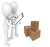
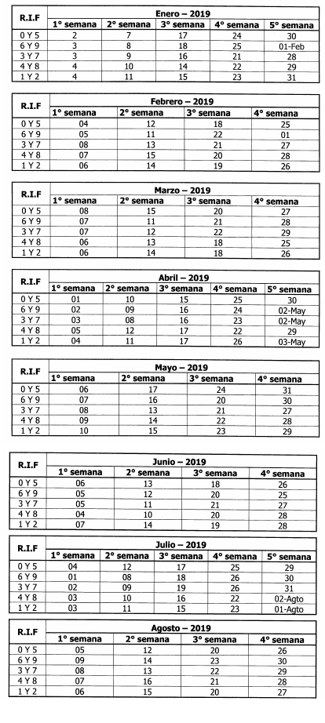
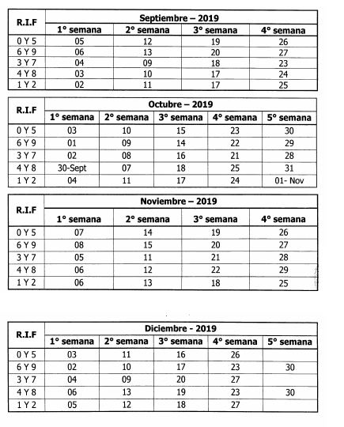
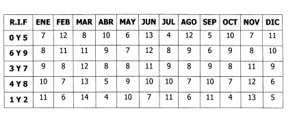

.. _ERPyA: http://erpya.com

.. _documento/tipo-documento:

**Tipo de Documento**
=====================

En ADempiere los tipos de documentos definen el comportamiento de los documentos que generan transacciones administrativas y contables de una empresa, adicional a ello permite personalizar el proceder fiscal y contable de cada uno.

Son creados con base en los procesos que gestiona ADempiere, en otras palabras, son utilizados durante todo el ciclo de vida de una empresa, contemplando múltiples procesos que van desde el proceso de manufactura, iniciando desde compra, recursos humanos y pasando por ventas, finanzas y control de gastos, hasta llegar a los resultados generados como asientos contables.

El presente material es elaborado por `ERPyA`_, explicará de forma eficiente al usuario la utilidad que representa la configuración de los tipos de documentos para nuestra localización Venezuela.

**Orden de Calidad** |Orden de Calidad|
---------------------------------------

Es un documento donde se establecen los requisitos con los que deben cumplir los productos y servicios, es utilizado para organizar, dirigir y controlar la producción de una determinada empresa, asegurando así la calidad de los productos y servicios a los clientes.

El objetivo de la elaboración de este documento radica en asegurar la calidad de los productos y servicios en tres (3) fases llevadas a cabo en las empresas, en la planificación de la producción, en la producción y en la distribución de los productos, para entregar a los clientes productos y servicios que satisfagan sus necesidades.

**Tipo de Documento Orden de Calidad**
**************************************

En ADempiere una orden de calidad refleja los lineamientos que debe cumplir el departamento de producción en cuanto a los productos y servicios elaborados para el consumo de los socios de negocios tipo clientes.

**Orden de Calidad**
~~~~~~~~~~~~~~~~~~~~

**Definición**

    Una orden de calidad se elabora previo a la planificación de lo que la empresa requiere que se produzca, sin embargo, se debe tomar en cuenta al momento de elaborar una orden de producción o de manufactura ya que se requiere que los materiales a utilizar sean de calidad para que la producción cumpla con lo establecido en el documento orden de calidad.

.. warning::

    Los productos realizados deben cumplir con los requerimientos de los clientes y satisfacer sus necesidades.

**Comportamiento**

    En ADempiere la orden de calidad se define según su comportamiento, a continuación se explica el proceder de una **Orden de Calidad**:

    +------------------------+-----------------+--------------------------------------------------+
    |         **Campo**      |    **Valor**    | **Comportamiento en ADempiere**                  |
    +========================+=================+==================================================+
    | Tipo de Documento Base:|Orden de Calidad | Genera una **Orden de Calidad** a una empresa.   |
    +------------------------+-----------------+--------------------------------------------------+
    | Documento Controlado:  |Si               | Mantiene una **Secuencia de Control**.           |
    +------------------------+-----------------+--------------------------------------------------+
    |Secuencia del Documento:|Orden de Calidad |Genera el número de secuencia establecido para el |
    |                        |                 |orden de los tipos de documentos de ADempiere,    |
    |                        |                 |configurado en la secuencia de documentos y es    |
    |                        |                 |incrementable en 1, en este caso la secuencia     |
    |                        |                 |comienza en 1 y su prefijo esta compuesto por las |
    |                        |                 |iniciales de su nombre "**ORC-**".                |
    +------------------------+-----------------+--------------------------------------------------+
    | Copias del Documento:  |1                | Establece el número de copias a imprimir.        |
    +------------------------+-----------------+--------------------------------------------------+

**Implicación en ADempiere**

    - Genera al departamento de producción una planificación de procesos a aplicar.
    - Garantiza productos de calidad cuando se cumple el documento en todas sus especificaciones.

**Implicación Fiscal**

Basado en la Norma Internacional ISO 9000:2015, Sistemas de gestión de la calidad — Fundamentos y vocabulario, donde indica en el items seis (6) referente a la planificación, lo siguiente:

**6.1 Acciones para abordar riesgos y oportunidades**

    6.1.1 Al planificar el sistema de gestión de la calidad, la organización debe considerar las cuestiones referidas en el apartado 4.1 y los requisitos referidos en el apartado 4.2, y determinar los riesgos y oportunidades que es necesario abordar con el fin de:

        - asegurar que el sistema de gestión de la calidad pueda lograr sus resultados previstos;
        - aumentar los efectos deseables;
        - prevenir o reducir efectos no deseados;
        - lograr la mejora.

    6.1.2 La organización debe planificar:

        - las acciones para abordar estos riesgos y oportunidades;
        - la manera de:
        - integrar e implementar las acciones en sus procesos del sistema de gestión de la calidad (véase 4.4.);
        - evaluar la eficacia de estas acciones.

        Las acciones tomadas para abordar los riesgos y oportunidades deben ser proporcionales al impacto potencial en la conformidad de los productos y los servicios.

        NOTA 1 Las opciones para abordar los riesgos pueden incluir: evitar riesgos, asumir riesgos para perseguir una oportunidad, eliminar la fuente de riesgo, cambiar la probabilidad o las consecuencias, compartir el riesgo o mantener riesgos mediante decisiones informadas.

        NOTA 2 Las oportunidades pueden conducir a la adopción de nuevas prácticas, lanzamiento de nuevos productos, apertura de nuevos mercados, acercamiento a nuevos clientes, establecimiento de asociaciones, utilización de nuevas tecnologías y otras posibilidades deseables y viables para abordar las necesidades de la organización o las de sus clientes.

**6.2 Objetivos de la calidad y planificación para lograrlos**

    6.2.1 La organización debe establecer objetivos de la calidad para las funciones y niveles pertinentes y los procesos necesarios para el sistema de gestión de la calidad.

    Los objetivos de la calidad deben:

        - ser coherentes con la política de la calidad;
        - ser medibles;
        - tener en cuenta los requisitos aplicables;
        - ser pertinentes para la conformidad de los productos y servicios y para el aumento de la satisfacción del cliente;
        - ser objeto de seguimiento;
        - comunicarse;
        - actualizarse, según corresponda.

    La organización debe mantener información documentada sobre los objetivos de la calidad.

    6.2.2 Al planificar cómo lograr sus objetivos de la calidad, la organización debe determinar:

        - qué se va a hacer;
        - qué recursos se requerirán;
        - quién será responsable;
        - cuándo se finalizará;
        - cómo se evaluarán los resultados.

**6.3 Planificación de los cambios**

    Cuando la organización determine la necesidad de cambios en el sistema de gestión de la calidad, estos cambios se deben llevar a cabo de manera planificada (véase 4.4).

    La organización debe considerar:

        - el propósito de los cambios y sus consecuencias potenciales;
        - la integridad del sistema de gestión de la calidad;
        - la disponibilidad de recursos;
        - la asignación o reasignación de responsabilidades y autoridades.

**Insumo de Proyecto** |Insumo del Proyecto| 
---------------------------------------------

Es el documento donde se detallan todos los materiales que el departamento de producción vaya a utilizar para elaborar un determinado proyecto, es decir, los materiales fundamentales para logar una producción.

Los insumos varían dependiendo del producto que la empresa vaya a producir y la cantidad total planificada del mismo.

**Tipo de Documento Insumo de Proyecto**
****************************************

En ADempiere el documento permite ayudar al departamento de producción de la empresa en cuanto al control y la organización necesaria para la producción, el mismo es definido según su comportamiento y especificado a continuación.

**Insumo de Proyecto**
~~~~~~~~~~~~~~~~~~~~~~

**Definición**

    Es un documento necesario para la elaboración de la orden de producción o de manufactura, considerándose la base para la planificación de las mismas, dando inicio al proceso de producción que se realiza en una determinada empresa.

.. warning:: 

    El documento de insumos del proyecto contiene de manera detallada la cantidad de insumos de calidad con los que cuenta la empresa para iniciar el proceso de producción. 

**Comportamiento**

    En ADempiere el insumo de proyecto se define según su comportamiento, a continuación se explica el proceder del **Insumo de Proyecto**:

    +------------------------+------------------+--------------------------------------------------+
    |         **Campo**      |     **Valor**    | **Comportamiento en ADempiere**                  |
    +========================+==================+==================================================+
    | Tipo de Documento Base:|Insumo de Proyecto|Genera un documento de **Insumo de Proyecto** a   |
    |                        |                  |una empresa.                                      |
    +------------------------+------------------+--------------------------------------------------+
    | Copias del Documento:  |1                 | Establece el número de copias a imprimir.        |
    +------------------------+------------------+--------------------------------------------------+

**Implicación en ADempiere**

    - Genera la información necesaria sobre los insumos disponibles para un proyecto.
    - Permite la elaboración de una orden de producción planeada.
    - Permite la elaboración de una orden de manufactura.

**Implicación Fiscal**

    No posee implicación fiscal por no ser un documento legal.

**Orden de Producción Planeada** |Orden de Producción Planeada| 
---------------------------------------------------------------

Una orden de producción parte del proceso de planificación de producción de una determinada empresa, es elaborada basandose en los materiales o insumos de producción con los que cuenta la misma. Una vez ya planificada la producción se procede a realizar la autorización, o bien, la orden de producción.

Por medio de este documento se lleva un control de los materiales, gastos, y el tiempo empleado por los trabajadores o maquinarias. Adicional a ello, indica los productos y la cantidad que se debe producir en un tiempo estimado.

**Tipo de Documento Orden de Producción Planeada**
**************************************************

En ADempiere este tipo de documento permite generar al departamento de producción la información necesaria para que sea distribuido correctamente el trabajo y puedan comenzar con el proceso de producción.

**Orden de Producción Planeada**
~~~~~~~~~~~~~~~~~~~~~~~~~~~~~~~~

**Definición**

    Es un tipo de documento que representa la autorización que realiza el jefe de producción de una empresa, el mismo se basa en los materiales adquiridos para indicar a los trabajadores el estimado de productos manufacturados que se debe cumplir en el día o en el mes.

.. warning:: 

    Es un documento utilizado por las empresas al comenzar su producción, autorizando por medio de este el inicio de la misma.

**Comportamiento**

    En ADempiere la orden de producción planeada se define según su comportamiento, a continuación se explica el proceder de una **Orden de Producción Planeada**:

    +------------------------+------------------+--------------------------------------------------+
    |         **Campo**      |    **Valor**     | **Comportamiento en ADempiere**                  |
    +========================+==================+==================================================+
    |Tipo de Documento Base: |Manufacturing     |Genera un documento de **Orden de Producción**    |
    |                        |Planned Order     |**Planeada** a la empresa.                        |
    +------------------------+------------------+--------------------------------------------------+
    |Secuencia del Documento:|Orden de          |Genera el número de secuencia establecido para el |
    |                        |Producción        |orden de los tipos de documentos de ADempiere,    |
    |                        |Planeada          |configurado en la secuencia de documentos y es    |
    |                        |                  |incrementable en 1, en este caso la secuencia     |
    |                        |                  |comienza en 1 y su prefijo esta compuesto por las |
    |                        |                  |iniciales de su nombre "**OPP-**".                |
    +------------------------+------------------+--------------------------------------------------+
    |Documento Controlado:   |Si                |Mantiene una **Secuencia de Control**.            |
    +------------------------+------------------+--------------------------------------------------+
    |Copias del Documento:   |1                 |Establece el número de copias a imprimir.         |
    +------------------------+------------------+--------------------------------------------------+

**Implicación en ADempiere**

    - Autoriza una producción determinada.
    - Controla la cantidad de materiales, gastos y tiempo invertido para la producción.
    - Garantiza una buena distribución de la producción.

**Implicación Fiscal**

    No posee implicación fiscal por no ser un documento legal.

**Orden de Manufactura** |Orden de Manufactura| 
-----------------------------------------------

Es un documento en el que se especifican los productos o servicios a realizar, así como la cantidad de los mismos. En una orden de manufactura se establecen los materiales necesarios y las fechas de comienzo y fin de la producción, de igual manera la fecha de entrega del mismo.

**Tipo de Documento Orden de Manufactura**
******************************************

En ADempiere una orden de manufactura autoriza la producción en planta y específica cada detalle necesario para la misma. Es definido según su comportamiento y explicado a continuación.

**Orden de Manufactura**
~~~~~~~~~~~~~~~~~~~~~~~~

**Definición**

    Es un documento utilizado por la empresa para controlar y dar seguimiento a todo el proceso de manufactura que realiza la misma a la hora de elaborar sus productos y servicios.

.. warning:: 

    Es un documento utilizado por las empresas al comenzar su producción, autorizando por medio de este el inicio de la misma.

**Comportamiento**

    En ADempiere la orden de manufactura se define según su comportamiento, a continuación se explica el proceder de una **Orden de Manufactura**:

    +------------------------+------------------+--------------------------------------------------+
    |         **Campo**      |    **Valor**     | **Comportamiento en ADempiere**                  |
    +========================+==================+==================================================+
    |Tipo de Documento Base: |Orden de          |Genera un documento de **Orden de Manufactura** a |
    |                        |Manufactura       |la empresa.                                       |
    +------------------------+------------------+--------------------------------------------------+
    | Documento Controlado:  |Si                |Mantiene una **Secuencia de Control**.            |
    +------------------------+------------------+--------------------------------------------------+
    |Secuencia del Documento:|Orden de          |Genera el número de secuencia establecido para el |
    |                        |Manufactura       |orden de los tipo de documentos de ADempiere,     |
    |                        |                  |configurado en la secuencia de documentos y es    |
    |                        |                  |incrementable en 1, en este caso la secuencia     |
    |                        |                  |comienza en 1 y su prefijo esta compuesto por las |
    |                        |                  |iniciales de su nombre "**OM-**".                 |
    +------------------------+------------------+--------------------------------------------------+
    | Copias del Documento:  |1                 |Establece el número de copias a imprimir.         |
    +------------------------+------------------+--------------------------------------------------+

**Implicación en ADempiere**

    - Autoriza una producción determinada.
    - Controla la cantidad de materiales, gastos y tiempo invertido para la producción.
    - Garantiza una buena distribución de la producción.

**Implicación Fiscal**

    No posee implicación fiscal por no ser un documento legal.

**Producción de Material** |Producción|
---------------------------------------

Es el resultado de varias fases de trabajo que se llevan a cabo en una determinada empresa, también es llamado proceso de manufactura, esta es la base o el recurso principal para el ingreso monetario.

Todos los procesos que se llevan a cabo en una empresa estan relacionados directa o indirectamente con el mismo, en tal sentido, la mano de obra puede ser considerada como directa o indirecta dentro del proceso.

La manufactura es originada desde una planificación previa, estimando metas u objetivos de producción que serán producto de control dentro de los turnos que conforman la producción, el resultado de los mismos determinan la estabilidad de una empresa y la disponibilidad de los productos terminados para la venta.

**Tipo de Documento Producción de Material**
********************************************

En ADempiere una producción de material define los productos o servicios elaborados por una determinada empresa, y su proceder es único en cada documento generado por el mismo.

**Producción de Material**
~~~~~~~~~~~~~~~~~~~~~~~~~~

**Definición**

    Es el documento que refleja el resultado obtenido de la producción realizada por la empresa, los productos o servicios producidos son la base para el ingreso monetario, los mismos deben pasar por control de calidad antes de ser expuestos al cliente, cuando la producción se trata de alimentos para el consumo humano, el cuidado y tratado del producto debe ser mayor.

    En Venezuela, el ente encargado de regir el proceso de producción en el caso de los alimentos es el ministerio del poder popular para la alimentación.

.. warning:: 

    La producción de material no puede ser expuesta hasta que el departamento de control de calidad indique que es un producto o servicio competente para salir de la empresa en la cual fue producido.

**Comportamiento**

    En ADempiere la producción de material se define según su comportamiento, a continuación se explica el proceder de **Producción de Material**:

    +------------------------+------------------+--------------------------------------------------+
    |         **Campo**      |    **Valor**     | **Comportamiento en ADempiere**                  |
    +========================+==================+==================================================+
    |Tipo de Documento Base: |Producción de     |Genera un documento de **Producción de Material** |
    |                        |Material          |a la empresa.                                     |
    +------------------------+------------------+--------------------------------------------------+
    | Documento Controlado:  |Si                |Mantiene una **Secuencia de Control**.            |
    +------------------------+------------------+--------------------------------------------------+
    |Secuencia del Documento:|Material          |Genera el número de secuencia establecido para el |
    |                        |Production        |orden de los tipo de documentos de ADempiere,     |
    |                        |                  |configurado en la secuencia de documentos y es    |
    |                        |                  |incrementable en 1, en este caso la secuencia     |
    |                        |                  |comienza en 630.000                               |
    +------------------------+------------------+--------------------------------------------------+
    |Copiar Número de        |                  |**Copia el número de documento en el reverso** en |
    |Documento en Reverso:   |Si                |lugar de generar un nuevo número agregándole el   |
    |                        |                  |símbolo **^** al final del número de documento,   |
    |                        |                  |además el monto del documento pasa a **negativo**.|
    +------------------------+------------------+--------------------------------------------------+
    |Copias del Documento:   |1                 |Establece el número de copias a imprimir.         |
    +------------------------+------------------+--------------------------------------------------+

**Implicación en ADempiere**

    - Refleja en ADempiere la cantidad producida como producto en existencia.
    - Permite un ingreso monetario a cambio de este por medio de ventas.
    - Se encuentra disponible automaticamente para las ventas de la empresa.

**Implicación Fiscal**

Basado en el decreto N° 5.246 publicado en la gaceta oficial N° 38.654 con fecha del 28 de marzo del 2007 donde estipula en su artículo 26 lo siguiente:

    **Artículo 26:** Son competencias del ministerio del poder popular para la alimentación:

    - La regulación, formulación, seguimiento y evaluación de políticas, planificación y realización de las actividades del Ejecutivo Nacional en materia de comercio, industria, mercadeo y distribución de alimentos. 

    - La regulación, formulación, seguimiento y evaluación de políticas, planificación y realización de las actividades del Ejecutivo Nacional en materia de seguridad alimentaria, en coordinación con los Ministerios del Poder Popular para la Agricultura y Tierras y del Poder Popular para el Comercio. 

    - La regulación, formulación, seguimiento y evaluación de políticas, la planificación y realización de las actividades del Ejecutivo Nacional, en materia de seguridad alimentaria, en coordinación con los Ministerios del Poder Popular para la Agricultura y Tierras y del Poder Popular para las Industrias Ligeras y Comercio; 

    - La regulación, formulación, seguimiento y evaluación de políticas, planificación y realización de las actividades del Ejecutivo Nacional en materia de recepción, almacenamiento, depósito, conservación, transporte, distribución, entrega, colocación y consumo de alimentos. 

    - La planificación, coordinación, seguimiento y evaluación de las actividades empresariales del Estado en el sector de los alimentos, de la alimentación. 

    - La participación en las negociaciones internacionales en materia de alimentos, en coordinación con los Ministerios del Poder Popular para la Agricultura y Tierras, del Poder Popular para el Comercio, y del Poder Popular para Relaciones Exteriores. 

    - Dirigir la política de comercio exterior en materia de alimentos, alimentación, en coordinación con los Ministerios del Poder Popular para la Agricultura y Tierras, del Poder Popular para el Comercio, y del Poder Popular para Relaciones Exteriores. 

    - La planificación, formulación, seguimiento y evaluación de políticas, en materia de calidad de alimentos, de alimentación, en coordinación con el Ministerio del Poder Popular para la Salud. 

    - La regulación, formulación y promoción de estrategias, conjuntamente con los Ministerios del Poder Popular para la Agricultura y Tierras, y del Poder Popular para el Comercio, para equilibrar la oferta y la demanda de los circuitos agroalimentarios; así como la regulación de los productos alimenticios, completando los ciclos de producción y comercialización. 

    - La formulación, planificación, coordinación, seguimiento y realización de Planes Especiales de Alimentación, de carácter excepcional. 

    - La concertación, análisis y la fijación de precios y tarifas, de productos y servicios alimenticios y nutricionales, en coordinación con los órganos y entes competentes en la materia. 

    - Ejercer la rectoría en materia de inspección, vigilancia, fiscalización y sanción sobre actividades de almacenamiento agrícola y sus actividades conexas, a través del órgano competente. 

    - Lo relativo a la administración, operación, explotación silos, frigoríficos, almacenes y depósitos agrícolas, propiedad del Estado de conformidad con la Ley. 

    - La regulación expedición de permisos, autorizaciones, licencias, certificados y demás trámites y actos necesarios en materia de exportación e importación en el sector de alimentos, alimentación y nutrición. 

    - Lo relativo al almacenamiento, oferta, transporte y comercio de vegetales o animales o sus partes. 

    - Coordinar con los organismos competentes, la formulación, coordinación, seguimiento y evaluación de las políticas para la adquisición, instalación y administración de maquinarias y equipos necesarios para la producción y comercialización de alimentos. 

    - La dirección, administración y manejo de programas de compensaciones para el desarrollo competitivo para el sector alimentos. 

    - La planificación, coordinación, seguimiento y evaluación de políticas de financiamiento en el sector de producción y comercio de alimentos.

    - La inspección y vigilancia del ejercicio de toda profesión y actividad relacionada con los alimentos, la alimentación. 

    - Formular, planificar y hacer seguimiento a la política comunicacional en materia de calidad y consumo de alimentos, su publicidad y divulgación a la población venezolana, en coordinación con la planificación y políticas de comunicación e información dictadas por el Ministerio del Poder Popular para la Comunicación e Información, y sin perjuicio de las competencias que le corresponden a este Ministerio, de conformidad con el artículo 24 del presente Decreto. 

    - Las demás que le atribuyan las Leyes y otros actos normativos. 

**Inventario Físico de Material** |Inventario| 
----------------------------------------------

Es la comparación de la cantidad de productos en existencia que posee una determinada empresa en almacén con la cantidad de productos reflejados en ADempiere.

ERPyA no recomienda crear un inventario físico puesto que no es necesario, cuando una producción de material culmina, la cantidad producida queda en inventario.

**Tipos de Documentos de Inventario**
*************************************

En ADempiere, cada inventario realizado es utilizado para controlar y dar seguimiento a la existencia de los productos. A continuación se definen los cuatro (4) documentos de inventarios según su comportamiento.

**Inventario Físico de Material**
~~~~~~~~~~~~~~~~~~~~~~~~~~~~~~~~~

**Definición**

    Es un documento que permite cambiar la cantidad de productos en existencia que se encuentran reflejados en ADempiere de forma facil y sencilla, que solo debe ser utilizado en casos mayores, cuando de verdad la situación lo amerite porque no es un proceso recomendable.

.. warning:: 

    Este proceso sirve para modificar la cantidad de productos en existencia o la inconsistencia de productos de la empresa.

**Comportamiento**

    En ADempiere el inventario físico de material se define según su comportamiento, a continuación se explica el proceder de **Inventario Físico de Material**:

    +------------------------+------------------+--------------------------------------------------+
    |         **Campo**      |    **Valor**     | **Comportamiento en ADempiere**                  |
    +========================+==================+==================================================+
    |Tipo de Documento Base: |Inventario Físico |Genera un documento de **Inventario Físico de**   |
    |                        |del Material      |**Material** a la empresa.                        |
    +------------------------+------------------+--------------------------------------------------+
    |Documento Controlado:   |Si                |Mantiene una **Secuencia de Control**.            |
    +------------------------+------------------+--------------------------------------------------+
    |Secuencia del Documento:|Inventario Físico |Genera el número de secuencia establecida para el |
    |                        |de Material       |orden de los tipos de documentos de ADempiere,    |
    |                        |                  |configurado en la secuencia de documentos y es    |
    |                        |                  |incrementable en 1, en este caso la secuencia     |
    |                        |                  |comienza en 1 y su prefijo esta compuesto por las |
    |                        |                  |iniciales de su nombre "**IFM-**".                |
    +------------------------+------------------+--------------------------------------------------+
    |Copias del Documento:   |1                 |Establece el número de copias a imprimir.         |
    +------------------------+------------------+--------------------------------------------------+

**Implicación en ADempiere**

    - Reemplaza las cantidades de productos o servicios en existencia que ADempiere contempla.
    - Permite su contabilización a traves de la existencia de los productos o servicios en almacén.
    - Permite reflejar en los reportes de ADempiere los inventarios realizados.

**Implicación Fiscal**

    No posee implicación fiscal por no ser un documento legal.

**Inventario de Uso Interno Obsequio**
~~~~~~~~~~~~~~~~~~~~~~~~~~~~~~~~~~~~~~

**Definición**

    Es un documento que permite reflejar el egreso de los productos o servicios que la empresa le regala a sus trabajadores para que sean usados dentro o fuera de la misma, por lo tanto pertenecen a consumos realizados internamente en la empresa, algunas veces son realizados con la intención de agradecer a los trabajadores por servicios prestados.

.. warning:: 

    El obsequio puede ser cualquier cosa que la empresa considere que el trabajador necesite y sea accesible.

**Comportamiento**

    En ADempiere el inventario de uso interno obsequio se define según su comportamiento, a continuación se explica el proceder de **Inventario de Uso Interno Obsequio**:

    +------------------------+------------------+--------------------------------------------------+
    |         **Campo**      |    **Valor**     | **Comportamiento en ADempiere**                  |
    +========================+==================+==================================================+
    |Tipo de Documento Base: |Inventario Físico |Genera un documento de **Inventario de Uso**      |
    |                        |del Material      |**Interno Obsequio** a la empresa.                |
    +------------------------+------------------+--------------------------------------------------+
    |Documento Controlado:   |Si                |Mantiene una **Secuencia de Control**.            |
    +------------------------+------------------+--------------------------------------------------+
    |Secuencia del Documento:|Inventario de Uso |Genera el número de secuencia establecida para el |
    |                        |Interno Obsequio  |orden de los tipos de documentos de ADempiere,    |
    |                        |                  |configurado en la secuencia de documentos y es    |
    |                        |                  |incrementable en 1, en este caso la secuencia     |
    |                        |                  |comienza en 1.000.000 y su prefijo esta compuesto |
    |                        |                  |por las iniciales de su nombre "**IUIO-**".       |
    +------------------------+------------------+--------------------------------------------------+
    |Copias del Documento:   |1                 |Establece el número de copias a imprimir.         |
    +------------------------+------------------+--------------------------------------------------+
    | Interno:               |Si                |Pertenece a consumos realizados internamente en la|
    |                        |                  |empresa.                                          |
    +------------------------+------------------+--------------------------------------------------+

**Implicación en ADempiere**

    - Permite reflejar en ADempiere el egreso físico de los productos o servicios que se encuentran en un determinado almacén.
    - Permite su contabilización a traves de la existencia de los productos o servicios en almacén.
    - Permite reflejar en los reportes de ADempiere los inventarios realizados.

**Implicación Fiscal**

    No posee implicación fiscal por no ser un documento legal.

**Inventario de Uso Interno Dotación**
~~~~~~~~~~~~~~~~~~~~~~~~~~~~~~~~~~~~~~

**Definición**

    Es un documento que permite reflejar el egreso de los productos o servicios que la empresa le asigna a sus departamentos o trabajadores y pertenecen a consumos realizados internamente por la misma, para que sirvan como herramienta para un mejor desarrollo y producción.

.. warning:: 

    La dotación puede ser maquinaria, muebles, equipos, uniformes, entre otros.

**Comportamiento**

    En ADempiere el inventario de uso interno dotación se define según su comportamiento, a continuación se explica el proceder de **Inventario de Uso Interno Dotación**:

    +------------------------+------------------+--------------------------------------------------+
    |         **Campo**      |    **Valor**     | **Comportamiento en ADempiere**                  |
    +========================+==================+==================================================+
    |Tipo de Documento Base: |Inventario Físico |Genera un documento de **Inventario de Uso**      |
    |                        |del Material      |**Interno Dotación** a la empresa.                |
    +------------------------+------------------+--------------------------------------------------+
    |Documento Controlado:   |Si                |Mantiene una **Secuencia de Control**.            |
    +------------------------+------------------+--------------------------------------------------+
    |Secuencia del Documento:|Inventario de Uso |Genera el número de secuencia establecida para el |
    |                        |Interno Dotación  |orden de los tipos de documentos de ADempiere,    |
    |                        |                  |configurado en la secuencia de documentos y es    |
    |                        |                  |incrementable en 1, en este caso la secuencia     |
    |                        |                  |comienza en 1.000.000 y su prefijo esta compuesto |
    |                        |                  |por las iniciales de su nombre "**IUID-**".       |
    +------------------------+------------------+--------------------------------------------------+
    |Copias del Documento:   |1                 |Establece el número de copias a imprimir.         |
    +------------------------+------------------+--------------------------------------------------+
    | Interno:               |Si                |Pertenece a consumos realizados internamente en la|
    |                        |                  |empresa.                                          |
    +------------------------+------------------+--------------------------------------------------+

**Implicación en ADempiere**

    - Permite reflejar en ADempiere el egreso físico de los productos o servicios que se encuentran en un determinado almacén.
    - Permite su contabilización a traves de la existencia de los productos o servicios en almacén.
    - Permite reflejar en los reportes de ADempiere los inventarios realizados.

**Implicación Fiscal**

    No posee implicación fiscal por no ser un documento legal.

**Inventario de Uso Interno Suministros de Oficina**
~~~~~~~~~~~~~~~~~~~~~~~~~~~~~~~~~~~~~~~~~~~~~~~~~~~~

**Definición**

    Es un documento que permite reflejar el egreso de los suministros de oficina que la empresa le asigna a sus departamentos y pertenecen a consumos realizados internamente por la misma, con la intención de que estos sirvan como herramienta para un mejor desarrollo y producción.

.. warning:: 

    Los suministros de oficina pueden ser hojas, papel, bolígrafo, grapadoras, entre otros artículos que se consideren necesarios para un mejor rendimiento.

**Comportamiento**

    En ADempiere el inventario de uso interno suministros de oficina se define según su comportamiento, a continuación se explica el proceder de **Inventario de Uso Interno Suministros de Oficina**:

    +------------------------+-------------------+--------------------------------------------------+
    |         **Campo**      |    **Valor**      | **Comportamiento en ADempiere**                  |
    +========================+===================+==================================================+
    |Tipo de Documento Base: |Inventario Físico  |Genera un documento de **Inventario de Uso**      |
    |                        |del Material       |**Interno Suministros de Oficina** a la empresa.  |
    +------------------------+-------------------+--------------------------------------------------+
    |Documento Controlado:   |Si                 |Mantiene una **Secuencia de Control**.            |
    +------------------------+-------------------+--------------------------------------------------+
    |Secuencia del Documento:|Inventario de Uso  |Genera el número de secuencia establecida para el |
    |                        |Interno Suministros|orden de los tipos de documentos de ADempiere,    |
    |                        |de Oficina         |configurado en la secuencia de documentos y es    |
    |                        |                   |incrementable en 1, en este caso la secuencia     |
    |                        |                   |comienza en 1.000.000 y su prefijo esta compuesto |
    |                        |                   |por las iniciales de su nombre "**IUISO-**".      |
    +------------------------+-------------------+--------------------------------------------------+
    |Copias del Documento:   |1                  |Establece el número de copias a imprimir.         |
    +------------------------+-------------------+--------------------------------------------------+
    | Interno:               |Si                 |Pertenece a consumos realizados internamente en la|
    |                        |                   |empresa.                                          |
    +------------------------+-------------------+--------------------------------------------------+

**Implicación en ADempiere**

    - Permite reflejar en ADempiere el egreso físico de los productos o servicios que se encuentran en un determinado almacén.
    - Permite su contabilización a traves de la existencia de los productos o servicios en almacén.
    - Permite reflejar en los reportes de ADempiere los inventarios realizados.

**Implicación Fiscal**

    No posee implicación fiscal por no ser un documento legal.

**Orden de Distribución** |Orden de Distribución|
-------------------------------------------------

Es un documento donde se autoriza la distribución interna o externa de los productos o servicios elaborados por la empresa, en el cual se específica la distribución de la producción. Para una orden de distribución se deben considerar los lugares a distribuir, el costo de los traslados cuando se trata de distribución externa y la cantidad de productos, dependiendo de la demanda que tenga el producto en dichos lugares.

**Tipos de Documentos de Orden de Distribución**
************************************************

En ADempiere se utilizan dos (2) diferentes documentos de orden de distribución que se definen según su comportamiento en el mismo. A continuación se describen las órdenes de distribución.

**Orden de Distribución Interna**
~~~~~~~~~~~~~~~~~~~~~~~~~~~~~~~~~

**Definición**

    En este documento se indica de manera detallada en que lugares o almacenes dentro de la empresa se ubicarán los productos, así como también la cantidad que va dirigida a cada uno.

.. warning:: 

    Para una orden de distribución ya sea interna o externa se debe considerar la cantidad de productos en existencia, ya que de esta va a depender su correcta distribución. 

**Comportamiento**

    En ADempiere la orden de distribución interna se define según su comportamiento, a continuación se explica el proceder de **Orden de Distribución Interna**:

    +------------------------+------------------+--------------------------------------------------+
    |         **Campo**      |    **Valor**     | **Comportamiento en ADempiere**                  |
    +========================+==================+==================================================+
    |Tipo de Documento Base: |Orden de          |Genera un documento de **Orden de Distribución**  |
    |                        |Distribución      |**Interna** a la empresa.                         |
    +------------------------+------------------+--------------------------------------------------+
    |Documento Controlado:   |Si                |Mantiene una **Secuencia de Control**.            |
    +------------------------+------------------+--------------------------------------------------+
    |Secuencia del Documento:|Orden de          |Genera el número de secuencia establecida para el |
    |                        |Distribución      |orden de los tipos de documentos de ADempiere,    |
    |                        |Interna           |configurado en la secuencia de documentos y es    |
    |                        |                  |incrementable en 1, en este caso la secuencia     |
    |                        |                  |comienza en 1.000.000 y su prefijo esta compuesto |
    |                        |                  |por las iniciales de su nombre "**ODI-**".        |
    +------------------------+------------------+--------------------------------------------------+
    |Copias del Documento:   |1                 |Establece el número de copias a imprimir.         |
    +------------------------+------------------+--------------------------------------------------+

**Implicación en ADempiere**

    - Autoriza el movimiento de los productos o servicios dentro de los almacenes de la empresa.
    - Permite su contabilización a traves de la existencia de los productos o servicios en almacén.

**Implicación Fiscal**

    No posee implicación fiscal por no ser un documento legal.

**Orden de Distribución Externa**
~~~~~~~~~~~~~~~~~~~~~~~~~~~~~~~~~

**Definición**

    En este documento se indica de manera detallada en que lugares o almacenes fuera de la empresa se ubicarán los productos, así como también la cantidad que va dirigida a cada uno de ellos.

.. warning:: 

    Para una orden de distribución ya sea interna o externa se debe considerar la cantidad de productos en existencia, ya que de esta va a depender su correcta distribución. 

**Comportamiento**

    En ADempiere la orden de distribución externa se define según su comportamiento, a continuación se explica el proceder de **Orden de Distribución Externa**:

    +------------------------+------------------+--------------------------------------------------+
    |         **Campo**      |    **Valor**     | **Comportamiento en ADempiere**                  |
    +========================+==================+==================================================+
    |Tipo de Documento Base: |Orden de          |Genera un documento de **Orden de Distribución**  |
    |                        |Distribución      |**Externa** a la empresa.                         |
    +------------------------+------------------+--------------------------------------------------+
    |Documento Controlado:   |Si                |Mantiene una **Secuencia de Control**.            |
    +------------------------+------------------+--------------------------------------------------+
    |Secuencia del Documento:|Orden de          |Genera el número de secuencia establecida para el |
    |                        |Distribución      |orden de los tipos de documentos de ADempiere,    |
    |                        |Externa           |configurado en la secuencia de documentos y es    |
    |                        |                  |incrementable en 1, en este caso la secuencia     |
    |                        |                  |comienza en 1.000.000 y su prefijo esta compuesto |
    |                        |                  |por las iniciales de su nombre "**ODE-**".        |
    +------------------------+------------------+--------------------------------------------------+
    |Copias del Documento:   |1                 |Establece el número de copias a imprimir.         |
    +------------------------+------------------+--------------------------------------------------+

**Implicación en ADempiere**

    - Autoriza el movimiento de los productos o servicios fuera de los almacenes de la empresa.
    - Permite su contabilización a traves de la existencia de los productos o servicios en almacén.

**Implicación Fiscal**

    No posee implicación fiscal por no ser un documento legal.

**Movimiento de Material** |Movimiento de Material|
---------------------------------------------------

Es el proceso de traslado físico de una cantidad de productos o su totalidad en existencia, de un lugar o almacén a otro, este es autorizado por medio de una orden de distribución. Se realiza un movimiento de material cuando la cantidad de existencia de productos en uno o varios de los almacenes es poca, y posea una demanda alta.

**Tipos de Documentos de Movimiento de Material**
*************************************************

En ADempiere, cada movimiento de material realizado es utilizado para controlar y dar seguimiento a la existencia de los productos. A continuación se definen los dos (2) documentos de movimiento de material según su comportamiento en ADempiere.

**Movimiento de Material Interno**
~~~~~~~~~~~~~~~~~~~~~~~~~~~~~~~~~~

**Definición**

    Es el documento que permite reflejar en ADempiere el proceso del traslado físico de los productos realizado desde un lugar o almacén a otro, dentro de la misma sucursal de la empresa.

.. warning:: 

    Este proceso se debe realizar cada vez que se muevan físicamente los productos, de lo contrario no estará disponible o en existencia al momento de la venta.

**Comportamiento**

    En ADempiere el movimiento de material interno se define según su comportamiento, a continuación se explica el proceder de **Movimiento de Material Interno**:

    +------------------------+------------------+--------------------------------------------------+
    |         **Campo**      |    **Valor**     | **Comportamiento en ADempiere**                  |
    +========================+==================+==================================================+
    |Tipo de Documento Base: |Movimiento de     |Genera un documento de **Movimiento de Material** |
    |                        |Material          |**Interno** a la empresa.                         |
    +------------------------+------------------+--------------------------------------------------+
    |Documento Controlado:   |Si                |Mantiene una **Secuencia de Control**.            |
    +------------------------+------------------+--------------------------------------------------+
    |Secuencia del Documento:|Movimiento de     |Genera el número de secuencia establecida para el |
    |                        |Material Interno  |orden de los tipos de documentos de ADempiere,    |
    |                        |                  |configurado en la secuencia de documentos y es    |
    |                        |                  |incrementable en 1, en este caso la secuencia     |
    |                        |                  |comienza en 1.000.000 y su prefijo esta compuesto |
    |                        |                  |por las iniciales de su nombre "**MMI-**".        |
    +------------------------+------------------+--------------------------------------------------+
    |Copias del Documento:   |1                 |Establece el número de copias a imprimir.         |
    +------------------------+------------------+--------------------------------------------------+

**Implicación en ADempiere**

    - Refleja en ADempiere el movimiento físico de los productos o servicios dentro de los almacenes de la empresa.
    - Permite reflejar en los reportes de ADempiere los movimientos realizados.
    - Permite su contabilización a traves de la existencia de los productos o servicios en almacén.

**Implicación Fiscal**

    No posee implicación fiscal por no ser un documento legal.

**Movimiento de Material Externo**
~~~~~~~~~~~~~~~~~~~~~~~~~~~~~~~~~~

**Definición**

    Es el documento que permite reflejar en ADempiere el proceso del traslado físico de los productos realizado desde un lugar o almacén dentro de la empresa a otro ubicado en una sucursal diferente perteneciente a la misma empresa.

.. warning:: 

    Este proceso se debe realizar cada vez que se muevan físicamente los productos, de lo contrario no estará disponible o en existencia al momento de la venta.

**Comportamiento**

    En ADempiere el movimiento de material externo se define según su comportamiento, a continuación se explica el proceder de **Movimiento de Material Externo**:

    +------------------------+------------------+--------------------------------------------------+
    |         **Campo**      |    **Valor**     | **Comportamiento en ADempiere**                  |
    +========================+==================+==================================================+
    |Tipo de Documento Base: |Movimiento de     |Genera un documento de **Movimiento de Material** |
    |                        |Material          |**Externo** a la empresa.                         |
    +------------------------+------------------+--------------------------------------------------+
    |Documento Controlado:   |Si                |Mantiene una **Secuencia de Control**.            |
    +------------------------+------------------+--------------------------------------------------+
    |Secuencia del Documento:|Movimiento de     |Genera el número de secuencia establecida para el |
    |                        |Material Externo  |orden de los tipos de documentos de ADempiere,    |
    |                        |                  |configurado en la secuencia de documentos y es    |
    |                        |                  |incrementable en 1, en este caso la secuencia     |
    |                        |                  |comienza en 1.000.000 y su prefijo esta compuesto |
    |                        |                  |por las iniciales de su nombre "**MME-**".        |
    +------------------------+------------------+--------------------------------------------------+
    |Copias del Documento:   |1                 |Establece el número de copias a imprimir.         |
    +------------------------+------------------+--------------------------------------------------+

**Implicación en ADempiere**

    - Refleja en ADempiere el movimiento físico de los productos o servicios en dirección a otros almacenes en diferentes sucursales de la empresa.
    - Permite reflejar en los reportes de ADempiere los movimientos realizados.
    - Permite su contabilización a traves de la existencia de los productos o servicios en almacén.

**Implicación Fiscal**

    No posee implicación fiscal por no ser un documento legal.

**Orden de Ventas** |Orden de Venta|
------------------------------------

Es un documento elaborado por el departamento de ventas de una determinada empresa, donde se autoriza la venta de productos o servicios especificados en la misma a un determinado socio del negocio tipo cliente, una orden de venta puede ser utilizada como una prefactura, cotización, orden de trabajo o pedido.

Existen tres (3) grupos de tipos de documentos de orden de venta en ADempiere y cada uno de ellos define un comportamiento diferente detallado a continuación.

**Tipos de Documentos Orden de Ventas**
***************************************

En ADempiere una orden de venta es un documento por medio del cual se pueden generar documentos de entrega y facturas. Así mismo, se pueden establecer reglas para la entrega y facturación de los productos y servicios incluidos en la orden.

El documento orden de venta se compone de ocho (8) tipos de órdenes, en los que se encuentran orden nacional, exportaciones, intercompañía, empleados, indirecta, a crédito, de almacén y prepagada, en ese orden serán explicados los comportamientos de los tipos de órdenes.

**Orden de Venta Nacional**
~~~~~~~~~~~~~~~~~~~~~~~~~~~

**Definición**

    Una orden de venta nacional, es realizada a socios de negocios tipo clientes que se encuentren dentro del territorio de Venezuela, donde se ingresan los productos o servicios referentes a la venta y es emitida en moneda nacional.

.. warning:: 

    Es un documento que permite establecer reglas de entrega y facturación, es decir, se puede establecer cuando realizar la entrega y la facturación de los productos y servicios que comprende la misma.

**Comportamiento**

    En ADempiere la orden de venta nacional se define según su comportamiento, a continuación se explica el proceder de **Orden de Venta Nacional**:

    +------------------------+------------------+--------------------------------------------------+
    |         **Campo**      |    **Valor**     | **Comportamiento en ADempiere**                  |
    +========================+==================+==================================================+
    |Tipo de Documento Base: |Orden de Ventas   |Genera un documento de **Orden de Venta Nacional**|
    |                        |                  |a un socio del negocio tipo cliente.              |
    +------------------------+------------------+--------------------------------------------------+
    |Sub Tipo OV:            |Orden Estándar    |Aplica el comportamiento de una orden estándar    |
    |                        |                  |dentro del sistema, en este caso genera reserva.  |
    +------------------------+------------------+--------------------------------------------------+
    |Documento Controlado:   |Si                |Mantiene una **Secuencia de Control**.            |
    +------------------------+------------------+--------------------------------------------------+
    |Transacción de Ventas:  |Si                |Discrimina los tipos de documentos de ventas.     |
    +------------------------+------------------+--------------------------------------------------+
    |Secuencia del Documento:|Orden de Venta    |Genera el número de secuencia establecida para el |
    |                        |Nacional          |orden de los tipos de documentos de ADempiere,    |
    |                        |                  |configurado en la secuencia de documentos y es    |
    |                        |                  |incrementable en 1, en este caso la secuencia     |
    |                        |                  |comienza en 1.000.000 y su prefijo esta compuesto |
    |                        |                  |por las iniciales de su nombre "**OVN-**".        |
    +------------------------+------------------+--------------------------------------------------+
    |Copias del Documento:   |1                 |Establece el número de copias a imprimir.         |
    +------------------------+------------------+--------------------------------------------------+

**Implicación en ADempiere**

    - Permite su contabilización cuando la compañía se encuentre configurada para contabilizar compromisos.
    - Disminuye la cantidad de productos disponibles en el almacén y aumenta la cantidad reservada.
    - Permite generar entregas de productos o servicios a clientes en Venezuela por medio de esta.
    - Permite generar facturas de ventas a clientes en Venezuela por medio de esta.

**Implicación Fiscal**

    No posee implicación fiscal por no ser un documento legal.

**Orden de Venta Exportación**
~~~~~~~~~~~~~~~~~~~~~~~~~~~~~~

**Definición**

    Una orden de venta exportación, es realizada a socios de negocios tipo clientes que se encuentren fuera del territorio de Venezuela, donde se ingresan los productos o servicios referentes a la venta y es emitida en moneda extranjera.

.. warning:: 

    Es un documento que permite establecer reglas de entrega y facturación, es decir, se puede establecer cuando realizar la entrega y la facturación de los productos y servicios que comprende la misma.

**Comportamiento**

    En ADempiere la orden de venta exportación se define según su comportamiento, a continuación se explica el proceder de **Orden de Venta Exportación**:

    +------------------------+------------------+-----------------------------------------------------+
    |         **Campo**      |    **Valor**     | **Comportamiento en ADempiere**                     |
    +========================+==================+=====================================================+
    |Tipo de Documento Base: |Orden de Ventas   |Genera un documento de **Orden de Venta Exportación**|
    |                        |                  |a un socio del negocio tipo cliente.                 |
    +------------------------+------------------+-----------------------------------------------------+
    |Sub Tipo OV:            |Orden Estándar    |Aplica el comportamiento de una orden estándar       |
    |                        |                  |dentro del sistema, en este caso genera reserva.     |
    +------------------------+------------------+-----------------------------------------------------+
    |Documento Controlado:   |Si                |Mantiene una **Secuencia de Control**.               |
    +------------------------+------------------+-----------------------------------------------------+
    |Transacción de Ventas:  |Si                |Discrimina los tipos de documentos de ventas.        |
    +------------------------+------------------+-----------------------------------------------------+
    |Secuencia del Documento:|Orden de Venta    |Genera el número de secuencia establecida para el    |
    |                        |Exportaciones     |orden de los tipos de documentos de ADempiere,       |
    |                        |                  |configurado en la secuencia de documentos y es       |
    |                        |                  |incrementable en 1, en este caso la secuencia        |
    |                        |                  |comienza en 1.000.000 y su prefijo esta compuesto    |
    |                        |                  |por las iniciales de su nombre "**OVE-**".           |
    +------------------------+------------------+-----------------------------------------------------+
    |Copias del Documento:   |1                 |Establece el número de copias a imprimir.            |
    +------------------------+------------------+-----------------------------------------------------+

**Implicación en ADempiere**

    - Permite su contabilización cuando la compañía se encuentre configurada para contabilizar compromisos.
    - Disminuye la cantidad de productos disponibles en el almacén y aumenta la cantidad reservada.
    - Permite generar entregas de productos o servicios a clientes fuera de Venezuela por medio de esta.
    - Permite generar facturas de ventas a clientes fuera de Venezuela por medio de esta.

**Implicación Fiscal**

    No posee implicación fiscal por no ser un documento legal.

**Orden de Venta Intercompañía**
~~~~~~~~~~~~~~~~~~~~~~~~~~~~~~~~

**Definición**

    Una orden de venta intercompañía, es realizada cuando se venden los productos o servicios de una empresa a otra, pertenecientes a un mismo consorcio. Este documento es emitido en moneda nacional si la empresa se encuentra dentro del territorio de Venezuela o extranjera si la empresa se encuentra fuera del territorio de Venezuela.

.. warning:: 

    Es un documento que permite establecer reglas de entrega y facturación, es decir, se puede establecer cuando realizar la entrega y la facturación de los productos y servicios que comprende la misma.

**Comportamiento**

    En ADempiere la orden de venta intercompañía se define según su comportamiento, a continuación se explica el proceder de **Orden de Venta Intercompañía**:

    +------------------------+------------------+--------------------------------------------------+
    |         **Campo**      |    **Valor**     | **Comportamiento en ADempiere**                  |
    +========================+==================+==================================================+
    |Tipo de Documento Base: |Orden de Ventas   |Genera un documento de **Orden de Venta**         |
    |                        |                  |**Intercompañía** a un socio del negocio tipo     |
    |                        |                  |cliente.                                          |
    +------------------------+------------------+--------------------------------------------------+
    |Sub Tipo OV:            |Orden Estándar    |Aplica el comportamiento de una orden estándar    |
    |                        |                  |dentro del sistema, en este caso genera reserva.  |
    +------------------------+------------------+--------------------------------------------------+
    |Documento Controlado:   |Si                |Mantiene una **Secuencia de Control**.            |
    +------------------------+------------------+--------------------------------------------------+
    |Transacción de Ventas:  |Si                |Discrimina los tipos de documentos de ventas.     |
    +------------------------+------------------+--------------------------------------------------+
    |Secuencia del Documento:|Orden de Venta    |Genera el número de secuencia establecida para el |
    |                        |Intercompañía     |orden de los tipos de documentos de ADempiere,    |
    |                        |                  |configurado en la secuencia de documentos y es    |
    |                        |                  |incrementable en 1, en este caso la secuencia     |
    |                        |                  |comienza en 1.000.000 y su prefijo esta compuesto |
    |                        |                  |por las iniciales de su nombre "**OVIC-**".       |
    +------------------------+------------------+--------------------------------------------------+
    |Copias del Documento:   |1                 |Establece el número de copias a imprimir.         |
    +------------------------+------------------+--------------------------------------------------+

**Implicación en ADempiere**

    - Permite su contabilización cuando la compañía se encuentre configurada para contabilizar compromisos.
    - Disminuye la cantidad de productos disponibles en el almacén y aumenta la cantidad reservada.
    - Permite generar entregas de productos o servicios a clientes de otras empresas, pertenecientes a un mismo consorcio por medio de esta.
    - Permite generar facturas de ventas a clientes de otras empresas, pertenecientes a un mismo consorcio por medio de esta.

**Implicación Fiscal**
    
    No posee implicación fiscal por no ser un documento legal.

**Orden de Venta Empleado**
~~~~~~~~~~~~~~~~~~~~~~~~~~~

**Definición**

    Una orden de venta empleado, es realizada cuando se venden los productos o servicios de la empresa a sus empleados, este documento es emitido en moneda nacional.

.. warning:: 

    Es un documento que permite establecer reglas de entrega y facturación, es decir, se puede establecer cuando realizar la entrega y la facturación de los productos y servicios que comprende la misma.

**Comportamiento**

    En ADempiere la orden de venta empleado se define según su comportamiento, a continuación se explica el proceder de **Orden de Venta Empleado**:

    +------------------------+------------------+--------------------------------------------------+
    |         **Campo**      |    **Valor**     | **Comportamiento en ADempiere**                  |
    +========================+==================+==================================================+
    |Tipo de Documento Base: |Orden de Ventas   |Genera un documento de **Orden de Venta Empleado**|
    |                        |                  |a un socio del negocio tipo cliente.              |
    +------------------------+------------------+--------------------------------------------------+
    |Sub Tipo OV:            |Orden Estándar    |Aplica el comportamiento de una orden estándar    |
    |                        |                  |dentro del sistema, en este caso genera reserva.  |
    +------------------------+------------------+--------------------------------------------------+
    |Documento Controlado:   |Si                |Mantiene una **Secuencia de Control**.            |
    +------------------------+------------------+--------------------------------------------------+
    |Transacción de Ventas:  |Si                |Discrimina los tipos de documentos de ventas.     |
    +------------------------+------------------+--------------------------------------------------+
    |Secuencia del Documento:|Orden de Venta    |Genera el número de secuencia establecida para el |
    |                        |Empleados         |orden de los tipos de documentos de ADempiere,    |
    |                        |                  |configurado en la secuencia de documentos y es    |
    |                        |                  |incrementable en 1, en este caso la secuencia     |
    |                        |                  |comienza en 1.000.000 y su prefijo esta compuesto |
    |                        |                  |por las iniciales de su nombre "**OVE-**".        |
    +------------------------+------------------+--------------------------------------------------+
    |Copias del Documento:   |1                 |Establece el número de copias a imprimir.         |
    +------------------------+------------------+--------------------------------------------------+

**Implicación en ADempiere**

    - Permite su contabilización cuando la compañía se encuentre configurada para contabilizar compromisos.
    - Disminuye la cantidad de productos disponibles en el almacén y aumenta la cantidad reservada.
    - Permite generar entregas de productos o servicios a empleados de la empresa por medio de esta.
    - Permite generar facturas de ventas a empleados de la empresas por medio de esta.

**Implicación Fiscal**

    No posee implicación fiscal por no ser un documento legal.

**Orden de Venta Indirecta**
~~~~~~~~~~~~~~~~~~~~~~~~~~~~

**Definición**

    Una orden de venta indirecta, es realizada cuando la empresa le vende al socio de negocio tipo cliente los productos o servicios con compromiso de entrega indirecta.

.. warning:: 

    Es un documento que permite establecer reglas de entrega y facturación, es decir, se puede establecer cuando realizar la entrega y la facturación de los productos y servicios que comprende la misma.

**Comportamiento**

    En ADempiere la orden de venta indirecta se define según su comportamiento, a continuación se explica el proceder de **Orden de Venta Indirecta**:

    +------------------------+------------------+--------------------------------------------------+
    |         **Campo**      |    **Valor**     | **Comportamiento en ADempiere**                  |
    +========================+==================+==================================================+
    |Tipo de Documento Base: |Orden de Ventas   |Genera un documento de **Orden de Venta**         |
    |                        |                  |**Indirecta** a un socio del negocio tipo cliente.|
    +------------------------+------------------+--------------------------------------------------+
    |Sub Tipo OV:            |Orden Estándar    |Aplica el comportamiento de una orden estándar    |
    |                        |                  |dentro del sistema, en este caso genera reserva.  |
    +------------------------+------------------+--------------------------------------------------+
    |Documento Controlado:   |Si                |Mantiene una **Secuencia de Control**.            |
    +------------------------+------------------+--------------------------------------------------+
    |Transacción de Ventas:  |Si                |Discrimina los tipos de documentos de ventas.     |
    +------------------------+------------------+--------------------------------------------------+
    |Secuencia del Documento:|Orden de Venta    |Genera el número de secuencia establecida para el |
    |                        |Indirecta         |orden de los tipos de documentos de ADempiere,    |
    |                        |                  |configurado en la secuencia de documentos y es    |
    |                        |                  |incrementable en 1, en este caso la secuencia     |
    |                        |                  |comienza en 1.000.000 y su prefijo esta compuesto |
    |                        |                  |por las iniciales de su nombre "**OVI-**".        |
    +------------------------+------------------+--------------------------------------------------+
    |Copias del Documento:   |1                 |Establece el número de copias a imprimir.         |
    +------------------------+------------------+--------------------------------------------------+

**Implicación en ADempiere**

    - Permite su contabilización cuando la compañía se encuentre configurada para contabilizar compromisos.
    - Disminuye la cantidad de productos disponibles en el almacén y aumenta la cantidad reservada.
    - Permite generar entregas de productos o servicios a clientes que adquieran compromisos de compra con entrega indirecta.
    - Permite generar facturas de ventas a clientes que adquieran compromisos de compra con entrega indirecta.

**Implicación Fiscal**

    No posee implicación fiscal por no ser un documento legal.

**Orden a Crédito**
~~~~~~~~~~~~~~~~~~~

**Definición**

    Una orden a crédito, es un documento elaborado por la empresa para los socios de negocio tipo cliente, desde donde parten los procesos de despacho y facturación que realiza la empresa, este documento expresa los productos y servicios vendidos, a demás del monto a cancelar y es utilizado en clientes seleccionados.

.. warning:: 

    Es un documento que permite establecer reglas de entrega y facturación, es decir, se puede establecer cuando realizar la entrega y la facturación de los productos y servicios que comprende la misma.

**Comportamiento**

    En ADempiere la orden a crédito se define según su comportamiento, a continuación se explica el proceder de **Orden a Crédito**:

    +------------------------+------------------+--------------------------------------------------+
    |         **Campo**      |    **Valor**     | **Comportamiento en ADempiere**                  |
    +========================+==================+==================================================+
    |Tipo de Documento Base: |Orden de Ventas   |Genera un documento de **Orden a Crédito** a un   |
    |                        |                  |socio del negocio tipo cliente.                   |
    +------------------------+------------------+--------------------------------------------------+
    |Sub Tipo OV:            |Orden Estándar    |Aplica el comportamiento de una orden estándar    |
    |                        |                  |dentro del sistema, en este caso genera reserva.  |
    +------------------------+------------------+--------------------------------------------------+
    |Documento Controlado:   |Si                |Mantiene una **Secuencia de Control**.            |
    +------------------------+------------------+--------------------------------------------------+
    |Transacción de Ventas:  |Si                |Discrimina los tipos de documentos de ventas.     |
    +------------------------+------------------+--------------------------------------------------+
    |Secuencia del Documento:|Orden de Crédito  |Genera el número de secuencia establecida para el |
    |                        |                  |orden de los tipos de documentos de ADempiere,    |
    |                        |                  |configurado en la secuencia de documentos y es    |
    |                        |                  |incrementable en 1, en este caso la secuencia     |
    |                        |                  |comienza en 1.000.001 y su prefijo esta compuesto |
    |                        |                  |por las iniciales de su nombre "**OCR-**".        |
    +------------------------+------------------+--------------------------------------------------+
    |Copias del Documento:   |1                 |Establece el número de copias a imprimir.         |
    +------------------------+------------------+--------------------------------------------------+

**Implicación en ADempiere**

    - Permite su contabilización cuando la compañía se encuentre configurada para contabilizar compromisos.
    - Disminuye la cantidad de productos disponibles en el almacén y aumenta la cantidad reservada.
    - Permite generar entregas de productos o servicios a clientes seleccionados, que adquieran compromisos de compra a crédito.
    - Permite generar facturas de ventas a clientes seleccionados, que adquieran compromisos de compra a crédito.

**Implicación Fiscal**

    No posee implicación fiscal por no ser un documento legal.

**Orden de Almacén**
~~~~~~~~~~~~~~~~~~~~

**Definición**

    Una orden de almacén, es un documento que genera automaticamente la entrega, de ser necesario, crea una nota de crédito. Las facturas son realizadas de forma manual de acuerdo a las reglas de facturación que esta posee.

.. warning:: 

    Es un documento que permite establecer reglas de entrega y facturación, es decir, se puede establecer cuando realizar la entrega y la facturación de los productos y servicios que comprende la misma.

**Comportamiento**

    En ADempiere la orden de almacén se define según su comportamiento, a continuación se explica el proceder de **Orden de Almacén**:

    +------------------------+------------------+--------------------------------------------------+
    |         **Campo**      |    **Valor**     | **Comportamiento en ADempiere**                  |
    +========================+==================+==================================================+
    |Tipo de Documento Base: |Orden de Ventas   |Genera un documento de **Orden a Almacén** a un   |
    |                        |                  |socio del negocio tipo cliente.                   |
    +------------------------+------------------+--------------------------------------------------+
    |Documento Controlado:   |Si                |Mantiene una **Secuencia de Control**.            |
    +------------------------+------------------+--------------------------------------------------+
    |Transacción de Ventas:  |Si                |Discrimina los tipos de documentos de ventas.     |
    +------------------------+------------------+--------------------------------------------------+
    |Secuencia del Documento:|Orden de Almacén  |Genera el número de secuencia establecida para el |
    |                        |                  |orden de los tipos de documentos de ADempiere,    |
    |                        |                  |configurado en la secuencia de documentos y es    |
    |                        |                  |incrementable en 1, en este caso la secuencia     |
    |                        |                  |comienza en 1.000.000 y su prefijo esta compuesto |
    |                        |                  |por las iniciales de su nombre "**OAL-**".        |
    +------------------------+------------------+--------------------------------------------------+
    |Copias del Documento:   |1                 |Establece el número de copias a imprimir.         |
    +------------------------+------------------+--------------------------------------------------+

**Implicación en ADempiere**

    - Permite su contabilización cuando la compañía se encuentre configurada para contabilizar compromisos.
    - Disminuye la cantidad de productos disponibles en el almacén y aumenta la cantidad reservada.
    - Permite generar entregas de productos o servicios a clientes.
    - Permite generar facturas de ventas a clientes y crea notas de crédito a la misma, cuando el caso lo amerita.

**Implicación Fiscal**

    No posee implicación fiscal por no ser un documento legal.

**Orden Prepagada**
~~~~~~~~~~~~~~~~~~~

**Definición**

    Una orden prepagada, es un documento que tiene como condición el pago de la factura antes de la entrega de los productos o servicios vendidos al socio de negocio tipo cliente. La factura y el pago son generados automaticamente luego de la recepción del dinero correspondiente.

.. warning:: 

    Es un documento que permite establecer reglas de entrega y facturación, es decir, se puede establecer cuando realizar la entrega y la facturación de los productos y servicios que comprende la misma.

**Comportamiento**

    En ADempiere la orden prepagada se define según su comportamiento, a continuación se explica el proceder de **Orden Prepagada**:

    +------------------------+------------------+--------------------------------------------------+
    |         **Campo**      |    **Valor**     | **Comportamiento en ADempiere**                  |
    +========================+==================+==================================================+
    |Tipo de Documento Base: |Orden de Ventas   |Genera un documento de **Orden Prepagada** a un   |
    |                        |                  |socio del negocio tipo cliente.                   |
    +------------------------+------------------+--------------------------------------------------+
    |Sub Tipo OV:            |Orden Estándar    |Aplica el comportamiento de una orden estándar    |
    |                        |                  |dentro del sistema, en este caso genera reserva.  |
    +------------------------+------------------+--------------------------------------------------+
    |Documento Controlado:   |Si                |Mantiene una **Secuencia de Control**.            |
    +------------------------+------------------+--------------------------------------------------+
    |Transacción de Ventas:  |Si                |Discrimina los tipos de documentos de ventas.     |
    +------------------------+------------------+--------------------------------------------------+
    |Secuencia del Documento:|Orden Prepagada   |Genera el número de secuencia establecida para el |
    |                        |                  |orden de los tipos de documentos de ADempiere,    |
    |                        |                  |configurado en la secuencia de documentos y es    |
    |                        |                  |incrementable en 1, en este caso la secuencia     |
    |                        |                  |comienza en 1.000.000 y su prefijo esta compuesto |
    |                        |                  |por las iniciales de su nombre "**OPR-**".        |
    +------------------------+------------------+--------------------------------------------------+
    |Copias del Documento:   |1                 |Establece el número de copias a imprimir.         |
    +------------------------+------------------+--------------------------------------------------+

**Implicación en ADempiere**

    - Permite su contabilización cuando la compañía se encuentre configurada para contabilizar compromisos.
    - Disminuye la cantidad de productos disponibles en el almacén y aumenta la cantidad reservada.
    - Establece como condición la recepción del pago correspondiente a la venta para poder generar la entrega de los productos o servicios.
    - Permite generar los documentos de facturas de ventas a clientes y pagos, luego de la recepción del pago correspondiente a la venta.

**Implicación Fiscal**

    No posee implicación fiscal por no ser un documento legal.

**Tipos de Documentos Cotización y Propuesta**
**********************************************

En ADempiere el tipo de documento cotización y propuesta utiliza como documento base la orden de ventas, y se compone de dos (2) tipos de documentos, en los que se encuentran el documento de cotización y el documento de propuesta, en ese orden serán explicados los comportamientos de estos tipos de documentos.

**Cotización**
~~~~~~~~~~~~~~

**Definición**

    Una cotización puede convertirse en otro tipo de documento de orden de forma manual, permitiendo con esto reservar en inventario los productos y servicios incluidos en el documento.

.. warning:: 

    Es un documento que permite establecer reglas de entrega y facturación, es decir, se puede establecer cuando realizar la entrega y la facturación de los productos y servicios que comprende la misma.

**Comportamiento**

    En ADempiere la cotización se define según su comportamiento, a continuación se explica el proceder de la **Cotización**:

    +------------------------+------------------+--------------------------------------------------+
    |         **Campo**      |    **Valor**     | **Comportamiento en ADempiere**                  |
    +========================+==================+==================================================+
    |Tipo de Documento Base: |Orden de Ventas   |Genera un documento de **Cotización** a un socio  |
    |                        |                  |del negocio tipo cliente.                         |
    +------------------------+------------------+--------------------------------------------------+
    |Documento Controlado:   |Si                |Mantiene una **Secuencia de Control**.            |
    +------------------------+------------------+--------------------------------------------------+
    |Transacción de Ventas:  |Si                |Discrimina los tipos de documentos de ventas.     |
    +------------------------+------------------+--------------------------------------------------+
    |Secuencia del Documento:|Cotización        |Genera el número de secuencia establecida para el |
    |                        |                  |orden de los tipos de documentos de ADempiere,    |
    |                        |                  |configurado en la secuencia de documentos y es    |
    |                        |                  |incrementable en 1, en este caso la secuencia     |
    |                        |                  |comienza en 10.000 y su prefijo esta compuesto por|
    |                        |                  |las iniciales de su nombre "**COT-**".            |
    +------------------------+------------------+--------------------------------------------------+
    |Copias del Documento:   |1                 |Establece el número de copias a imprimir.         |
    +------------------------+------------------+--------------------------------------------------+

**Implicación en ADempiere**

    - Permite su contabilización cuando la compañía se encuentre configurada para contabilizar compromisos.
    - Disminuye la cantidad de productos disponibles en el almacén y aumenta la cantidad reservada, cuando el documento pasa a ser otro tipo de documento de tipo orden.
    - Permite generar entregas de productos o servicios a clientes según la regla especificada en el documento.
    - Permite generar facturas de ventas a clientes según la regla especificada en el documento.

**Implicación Fiscal**

    No posee implicación fiscal por no ser un documento legal.

**Propuesta**
~~~~~~~~~~~~~

**Definición**

    Una propuesta no reserva los productos en inventario pero si puede convertirse en otro tipo de documento de orden de forma manual.

.. warning:: 

    Es un documento que permite establecer reglas de entrega y facturación, es decir, se puede establecer cuando realizar la entrega y la facturación de los productos y servicios que comprende la misma.

**Comportamiento**

    En ADempiere la propuesta se define según su comportamiento, a continuación se explica el proceder de la **Propuesta**:

    +------------------------+------------------+--------------------------------------------------+
    |         **Campo**      |    **Valor**     | **Comportamiento en ADempiere**                  |
    +========================+==================+==================================================+
    |Tipo de Documento Base: |Orden de Ventas   |Genera un documento de **Propuesta** a un socio   |
    |                        |                  |del negocio tipo cliente.                         |
    +------------------------+------------------+--------------------------------------------------+
    |Documento Controlado:   |Si                |Mantiene una **Secuencia de Control**.            |
    +------------------------+------------------+--------------------------------------------------+
    |Transacción de Ventas:  |Si                |Discrimina los tipos de documentos de ventas.     |
    +------------------------+------------------+--------------------------------------------------+
    |Secuencia del Documento:|Propuesta         |Genera el número de secuencia establecida para el |
    |                        |                  |orden de los tipos de documentos de ADempiere,    |
    |                        |                  |configurado en la secuencia de documentos y es    |
    |                        |                  |incrementable en 1, en este caso la secuencia     |
    |                        |                  |comienza en 1.000.000 y su prefijo esta compuesto |
    |                        |                  |por las iniciales de su nombre "**PRO-**".        |
    +------------------------+------------------+--------------------------------------------------+
    |Copias del Documento:   |1                 |Establece el número de copias a imprimir.         |
    +------------------------+------------------+--------------------------------------------------+

**Implicación en ADempiere**

    - Permite su contabilización cuando la compañía se encuentre configurada para contabilizar compromisos.
    - Permite generar entregas de productos o servicios a clientes según la regla especificada en el documento.
    - Permite generar facturas de ventas a clientes según la regla especificada en el documento.

**Implicación Fiscal**

    No posee implicación fiscal por no ser un documento legal.

**Tipos de Documentos Autorización de Devolución de Ventas**
************************************************************

Es un documento que se elabora cuando algún departamento de la empresa necesita realizar la devolución de uno, varios, o todos los productos de la venta realizada, independientemente de los motivos que conllevan a la devolución requerida.

**Autorización Devolución Proveedor Nacional**
~~~~~~~~~~~~~~~~~~~~~~~~~~~~~~~~~~~~~~~~~~~~~~

**Definición**

    Es el documento que autoriza la devolución de uno, varios, o todos los productos y servicios obtenidos por la compra realizada al proveedor dentro del territorio de Venezuela, indiferentemente el motivo que esta tenga, debe ser expresado en la misma.

.. warning:: 

    Toda autorización de devolución es realizada por el jefe del departamento de compra o venta, según sea el caso.

**Comportamiento**

    En ADempiere la autorización devolución proveedor se define según su comportamiento, a continuación se explica el proceder de la **Autorización Devolución Proveedor Nacional**:

    +------------------------+------------------+--------------------------------------------------+
    |         **Campo**      |    **Valor**     | **Comportamiento en ADempiere**                  |
    +========================+==================+==================================================+
    |Tipo de Documento Base: |Orden de Ventas   |Genera un documento de **Autorización Devolución**|
    |                        |                  |**Proveedor Nacional** a un socio del negocio tipo|
    |                        |                  |proveedor.                                        |
    +------------------------+------------------+--------------------------------------------------+
    |Documento Controlado:   |Si                |Mantiene una **Secuencia de Control**.            |
    +------------------------+------------------+--------------------------------------------------+
    |Secuencia del Documento:|Autorización      |Genera el número de secuencia establecida para el |
    |                        |Devolución a      |orden de los tipos de documentos de ADempiere,    |
    |                        |Proveedor Nacional|configurado en la secuencia de documentos y es    |
    |                        |                  |incrementable en 1, en este caso la secuencia     |
    |                        |                  |comienza en 1.000.000 y su prefijo esta compuesto |
    |                        |                  |por las iniciales de su nombre "**ADPN-**".       |
    +------------------------+------------------+--------------------------------------------------+
    |Copias del Documento:   |1                 |Establece el número de copias a imprimir.         |
    +------------------------+------------------+--------------------------------------------------+

**Implicación en ADempiere**

    - Autoriza la devolución de los productos y servicios incluidos en el documento, luego de una evaluación de los mismos.
    - Permite que se genere el documento de devolución proveedor.

**Implicación Fiscal**
    
    No posee implicación fiscal por no ser un documento legal.

**Autorización Devolución Proveedor Importación**
~~~~~~~~~~~~~~~~~~~~~~~~~~~~~~~~~~~~~~~~~~~~~~~~~

**Definición**

    Es el documento que autoriza la devolución de uno, varios, o todos los productos y servicios obtenidos por la compra realizada al proveedor ubicado fuera del territorio de Venezuela, indiferentemente el motivo que esta tenga, debe ser expresado en la misma.

.. warning:: 

    Toda autorización de devolución es realizada por el jefe del departamento de compra o venta, según sea el caso.

**Comportamiento**

    En ADempiere la autorización devolución proveedor importación se define según su comportamiento, a continuación se explica el proceder de la **Autorización Devolución Proveedor Importación**:

    +------------------------+------------------+--------------------------------------------------+
    |         **Campo**      |    **Valor**     | **Comportamiento en ADempiere**                  |
    +========================+==================+==================================================+
    |Tipo de Documento Base: |Orden de Ventas   |Genera un documento de **Autorización Devolución**|
    |                        |                  |**Proveedor Importación** a un socio del negocio  |
    |                        |                  |tipo proveedor.                                   |
    +------------------------+------------------+--------------------------------------------------+
    |Documento Controlado:   |Si                |Mantiene una **Secuencia de Control**.            |
    +------------------------+------------------+--------------------------------------------------+
    |Secuencia del Documento:|Autorización      |Genera el número de secuencia establecida para el |
    |                        |Devolución a      |orden de los tipos de documentos de ADempiere,    |
    |                        |Proveedor         |configurado en la secuencia de documentos y es    |
    |                        |Importaciones     |incrementable en 1, en este caso la secuencia     |
    |                        |                  |comienza en 1.000.000 y su prefijo esta compuesto |
    |                        |                  |por las iniciales de su nombre "**ADPIM-**".      |
    +------------------------+------------------+--------------------------------------------------+
    |Copias del Documento:   |1                 |Establece el número de copias a imprimir.         |
    +------------------------+------------------+--------------------------------------------------+

**Implicación en ADempiere**

    - Autoriza la devolución de los productos y servicios incluidos en el documento, luego de una evaluación de los mismos.
    - Permite que se genere el documento de devolución proveedor.

**Implicación Fiscal**
    
    No posee implicación fiscal por no ser un documento legal.

**Autorización Devolución Proveedor Intercompañía**
~~~~~~~~~~~~~~~~~~~~~~~~~~~~~~~~~~~~~~~~~~~~~~~~~~~

**Definición**

    Es el documento que autoriza la devolución de uno, varios, o todos los productos y servicios obtenidos por la compra realizada a otra empresa perteneciente al mismo consorcio, indiferentemente el motivo que esta tenga, debe ser expresado en la misma.

.. warning:: 

    Toda autorización de devolución es realizada por el jefe del departamento de compra o venta, según sea el caso.

**Comportamiento**

    En ADempiere la autorización devolución proveedor intercompañía se define según su comportamiento, a continuación se explica el proceder de la **Autorización Devolución Proveedor Intercompañía**:

    +------------------------+------------------+--------------------------------------------------+
    |         **Campo**      |    **Valor**     | **Comportamiento en ADempiere**                  |
    +========================+==================+==================================================+
    |Tipo de Documento Base: |Orden de Ventas   |Genera un documento de **Autorización Devolución**|
    |                        |                  |**Proveedor Intercompañía** a un socio del negocio|
    |                        |                  |tipo proveedor.                                   |
    +------------------------+------------------+--------------------------------------------------+
    |Documento Controlado:   |Si                |Mantiene una **Secuencia de Control**.            |
    +------------------------+------------------+--------------------------------------------------+
    |Secuencia del Documento:|Autorización      |Genera el número de secuencia establecida para el |
    |                        |Devolución a      |orden de los tipos de documentos de ADempiere,    |
    |                        |Proveedor         |configurado en la secuencia de documentos y es    |
    |                        |Intercompañía     |incrementable en 1, en este caso la secuencia     |
    |                        |                  |comienza en 1.000.000 y su prefijo esta compuesto |
    |                        |                  |por las iniciales de su nombre "**ADPIC-**".      |
    +------------------------+------------------+--------------------------------------------------+
    |Copias del Documento:   |1                 |Establece el número de copias a imprimir.         |
    +------------------------+------------------+--------------------------------------------------+

**Implicación en ADempiere**

    - Autoriza la devolución de los productos y servicios incluidos en el documento, luego de una evaluación de los mismos.
    - Permite que se genere el documento de devolución proveedor.

**Implicación Fiscal**
    
    No posee implicación fiscal por no ser un documento legal.

**Autorización Devolución Proveedor Empleados**
~~~~~~~~~~~~~~~~~~~~~~~~~~~~~~~~~~~~~~~~~~~~~~~

**Definición**

    Es el documento que autoriza la devolución de uno, varios, o todos los productos y servicios obtenidos por la compra realizada a un trabajador de la empresa, indiferentemente el motivo que esta tenga, debe ser expresado en la misma.

.. warning:: 

    Toda autorización de devolución es realizada por el jefe del departamento de compra o venta, según sea el caso.

**Comportamiento**

    En ADempiere la autorización devolución proveedor empleado se define según su comportamiento, a continuación se explica el proceder de la **Autorización Devolución Proveedor Empleado**:

    +------------------------+------------------+--------------------------------------------------+
    |         **Campo**      |    **Valor**     | **Comportamiento en ADempiere**                  |
    +========================+==================+==================================================+
    |Tipo de Documento Base: |Orden de Ventas   |Genera un documento de **Autorización Devolución**|
    |                        |                  |**Proveedor Empleado** a un socio del negocio tipo|
    |                        |                  |proveedor.                                        |
    +------------------------+------------------+--------------------------------------------------+
    |Documento Controlado:   |Si                |Mantiene una **Secuencia de Control**.            |
    +------------------------+------------------+--------------------------------------------------+
    |Secuencia del Documento:|Autorización      |Genera el número de secuencia establecida para el |
    |                        |Devolución a      |orden de los tipos de documentos de ADempiere,    |
    |                        |Proveedor         |configurado en la secuencia de documentos y es    |
    |                        |Empleados         |incrementable en 1, en este caso la secuencia     |
    |                        |                  |comienza en 1.000.000 y su prefijo esta compuesto |
    |                        |                  |por las iniciales de su nombre "**ADPE-**".       |
    +------------------------+------------------+--------------------------------------------------+
    |Copias del Documento:   |1                 |Establece el número de copias a imprimir.         |
    +------------------------+------------------+--------------------------------------------------+

**Implicación en ADempiere**

    - Autoriza la devolución de los productos y servicios incluidos en el documento, luego de una evaluación de los mismos.
    - Permite que se genere el documento de devolución proveedor.

**Implicación Fiscal**
    
    No posee implicación fiscal por no ser un documento legal.

**Autorización Devolución Proveedor Indirecta**
~~~~~~~~~~~~~~~~~~~~~~~~~~~~~~~~~~~~~~~~~~~~~~~

**Definición**

    Es el documento que autoriza la devolución de uno, varios, o todos los productos y servicios obtenidos por la compra realizada con entrega indirecta, indiferentemente el motivo que esta tenga, debe ser expresado en la misma.

.. warning:: 

    Toda autorización de devolución es realizada por el jefe del departamento de compra o venta, según sea el caso.

**Comportamiento**

    En ADempiere la autorización devolución proveedor indirecta se define según su comportamiento, a continuación se explica el proceder de la **Autorización Devolución Proveedor Indirecta**:

    +------------------------+------------------+--------------------------------------------------+
    |         **Campo**      |    **Valor**     | **Comportamiento en ADempiere**                  |
    +========================+==================+==================================================+
    |Tipo de Documento Base: |Orden de Ventas   |Genera un documento de **Autorización Devolución**|
    |                        |                  |**Proveedor Indirecta** a un socio del negocio    |
    |                        |                  |tipo proveedor.                                   |
    +------------------------+------------------+--------------------------------------------------+
    |Secuencia del Documento:|Autorización      |Genera el número de secuencia establecida para el |
    |                        |Devolución a      |orden de los tipos de documentos de ADempiere,    |
    |                        |Proveedor         |configurado en la secuencia de documentos y es    |
    |                        |Indirecta         |incrementable en 1, en este caso la secuencia     |
    |                        |                  |comienza en 1.000.000 y su prefijo esta compuesto |
    |                        |                  |por las iniciales de su nombre "**ADPI-**".       |
    +------------------------+------------------+--------------------------------------------------+
    |Copias del Documento:   |1                 |Establece el número de copias a imprimir.         |
    +------------------------+------------------+--------------------------------------------------+

**Implicación en ADempiere**

    - Autoriza la devolución de los productos y servicios incluidos en el documento, luego de una evaluación de los mismos.
    - Permite que se genere el documento de devolución proveedor.

**Implicación Fiscal**
    
    No posee implicación fiscal por no ser un documento legal.

**Cuentas por Cobrar** |Cuentas por Cobrar|
-------------------------------------------

Las cuentas por cobrar en ADempiere son todas aquellas deudas que los socios de negocios tipo cliente tienen con la empresa por la adquisición de servicios o compra de productos, actualmente existen cinco (5) grupos de tipos de documentos de cuentas por cobrar en ADempiere, cada uno de ellos define un comportamiento diferente y es importante para la completación de alguna transacción. A continuación se detallan los tipos de documentos de cuentas por cobrar.

**Tipos de Documentos Facturas de Cuentas por Cobrar**
******************************************************

En ADempiere una factura de cuentas por cobrar es un documento legal que se realiza por la venta de productos o servicios de una determinada empresa, donde se incluyen los datos principales del socio de negocio tipo cliente, la empresa, y la información detallada de los productos y servicios.

El documento factura en cuentas por cobrar se compone de siete (7) tipos de facturas, en los que se encuentran factura nacional, exportación, pro-forma, intercompañía, empleado, manual, y indirecta, en ese orden de ideas serán explicados los comportamientos de los tipos de facturas.

**Factura de Cuentas por Cobrar Nacional**
~~~~~~~~~~~~~~~~~~~~~~~~~~~~~~~~~~~~~~~~~~

**Definición**

    La factura nacional es un documento que se emite por la venta de productos o servicios a socios de negocios que se encuentren en el territorio de Venezolana, esta es generada en moneda nacional y se encuentra regida por la ley ya que es un documento fiscal.

.. warning:: 

    Para ADempiere es importante porque representa los ingresos monetarios por la venta de los productos y servicios correspondientes a las operaciones principales de la empresa. Además, en ella se reflejan los impuestos asociados a la compra. 

**Comportamiento**

    En ADempiere una factura de cuentas por cobrar nacional se define según su comportamiento, a continuación se explica el proceder de una **Factura de CxC Nacional**:

    +------------------------+------------------+--------------------------------------------------+
    |         **Campo**      |    **Valor**     | **Comportamiento en ADempiere**                  |
    +========================+==================+==================================================+
    |Tipo de Documento Base: |Factura de CxC    |Genera una **Factura de CxC Nacional** a un socio |
    |                        |                  |del negocio tipo cliente.                         |
    +------------------------+------------------+--------------------------------------------------+
    |Documento Controlado:   |Si                |Mantiene una **Secuencia de Control**.            |
    +------------------------+------------------+--------------------------------------------------+
    |Transacción de Ventas:  |Si                |Discrimina los tipos de documentos de ventas.     |
    +------------------------+------------------+--------------------------------------------------+
    |Sobrescribir Secuencia  |Si                |Establece una **Secuencia Temporal** para los     |
    |al Completar:           |                  |documentos en estado borrador y a su vez una      |
    |                        |                  |**Secuencia Definitiva** para los documentos en   |
    |                        |                  |estado completo.                                  |
    +------------------------+------------------+--------------------------------------------------+
    |Secuencia del Documento:|Factura de CxC    |Genera el número de secuencia establecida para el |
    |                        |Nacionales        |orden de los tipos de documentos de ADempiere,    |
    |                        |                  |configurado en la secuencia de documentos y es    |
    |                        |                  |incrementable en 1, en este caso la secuencia     |
    |                        |                  |comienza en 1.000.000 y su prefijo esta compuesto |
    |                        |                  |por las iniciales de su nombre "**FCxCN-**".      |
    +------------------------+------------------+--------------------------------------------------+
    |Secuencia Definitiva:   |Factura de CxC    |Genera un número de documento establecido para los|
    |                        |Nacionales        |documentos en estado completo.                    |
    +------------------------+------------------+--------------------------------------------------+
    |Sobrescribir Fecha al   |Si                |Sobrescribe la fecha introducida por la fecha en  |
    |Completar:              |                  |la que se completa el documento.                  |
    +------------------------+------------------+--------------------------------------------------+
    |Copiar Número de        |Si                |**Copia el número de documento en el reverso** en |
    |Documento en Reverso:   |                  |lugar de generar un nuevo número agregándole el   |
    |                        |                  |símbolo **^** al final del número de documento,   |
    |                        |                  |además el monto del documento pasa a negativo y se|
    |                        |                  |destilda el checklist **Documento Fiscal**.       |
    +------------------------+------------------+--------------------------------------------------+
    |Secuencia Nro de        |Control Fiscal de |Genera el número de control fiscal establecido.   |
    |Control:                |Facturas CxC      |                                                  |
    +------------------------+------------------+--------------------------------------------------+
    |Documento Fiscal:       |Si                |Genera la **Factura de CxC Nacional** como un     |
    |                        |                  |documento fiscal.                                 |
    +------------------------+------------------+--------------------------------------------------+
    |Generar Nro de Control  |Si                |Genera el número de control establecido en la     |
    |Al Imprimir:            |                  |**Secuencia de Nro de Control**.                  |
    +------------------------+------------------+--------------------------------------------------+
    |Copias del Documento:   |1                 |Establece el número de copias a imprimir.         |
    +------------------------+------------------+--------------------------------------------------+

**Implicación en ADempiere**

    - Convierte el documento en un documento fiscal, al estar en estado completo.
    - Aparece reflejado de manera ordenada en la gestión de ventas de ADempiere.
    - Permite su contabilización en moneda nacional vigente.
    - Permite controlar los saldos abiertos de la empresa, por medio del estándar de control y seguimiento establecido en ADempiere.

**Implicación Fiscal**

    Basado en la providencia que establece las normas generales de emisión de facturas y otros documentos, en gaceta oficial número 38.997, el cual estipula:

    - **Artículo 1:** La providencia tiene por objeto establecer normas para la emisión de facturación, órdenes de entrega o guías de despacho, notas de débito y notas de crédito, de conformidad con la normativa que regula la tributación nacional atribuida al Servicio Nacional Integrado de Administración Aduanera y Tributaria (SENIAT). 

    - **Artículo 5:** El Servicio Nacional Integrado de Administración Aduanera y Tributaria (SENIAT), mediante Providencia Administrativa de carácter general, establecerá las normas para regular las imprentas autorizadas, las máquinas fiscales y, en general, la elaboración de las facturas y otros documentos. 

    - **Artículo 13:** Las facturas emitidas sobre formatos o formas libres, por los contribuyentes ordinarios del impuesto al valor agregado, deben cumplir los siguientes requisitos:

        #. Contener la denominación de "Factura". 
        #. Numeración consecutiva y única. 
        #. Número de Control preimpreso. 
        #. Total de los Números de Control asignados, expresado de la siguiente manera "desde el Nº... hasta el Nº... ". 
        #. Nombre y Apellido o razón social, domicilio fiscal y número de Registr1nfco de Información Fiscal (RIF) del emisor. 
        #. Fecha de emisión constituida por ocho (8) dígitos. 
        #. Nombre y Apellido o razón social y número de Registro Único de Información Fiscal (RIF), del adquirente del bien o receptor del servicio. Podrá prescindirse del número de Registro Único de Información Fiscal (RIF), cuando se trate de personas naturales que no requieran la factura a efectos tributarios, en cuyo caso deberá expresarse, como mínimo, el número de cédula de identidad o pasaporte, del adquirente o receptor. 
        #. Descripción de la venta del bien o de la prestación del servicio, con indicación de la cantidad y monto. Podrá omitirse la cantidad en aquellas prestaciones de servicio que por sus características ésta no pueda expresarse. Si se trata de un bien o servicio exento, exonerado o no gravado con el impuesto al valor agregado, deberá aparecer aliado de la descripción o de su precio, el carácter E separado por un espacio en blanco y entre paréntesis según el siguiente formato: (E).
        #. En los casos que se carguen o cobren conceptos en adición al precio o remuneración convenidos o se realicen descuentos, bonificaciones, anulaciones y cualquier otro ajuste al precio, deberá indicarse la descripción y valor de los mismos. 
        #. Especificación del monto total de la base imponible del impuesto al valor agregado, discriminada según la alícuota, indicando el porcentaje aplicable, así como la especificación del monto total exento o exonerado. 
        #. Especificación del monto total del impuesto al valor agregado, discriminado según la alícuota indicando el porcentaje aplicable. 
        #. Indicación del valor total de la venta de los bienes o de la prestación del servicio o de la suma de ambos, si corresponde.
        #. Contener la frase "sin derecho a crédito fiscal", cuando se trate de las coplas de las facturas.
        #. En los casos de operaciones gravadas con el impuesto al valor agregado, cuya contra prestación haya sido expresada en moneda extranjera, equivalente a la cantidad correspondiente en moneda nacional, deberán constar ambas cantidades en la factura, con indicación del monto total y del tipo de cambio aplicable.  
        #. Razón social y el número de Registro Único de Información Fiscal (RIF), de la imprenta autorizada, así como la nomenclatura y fecha de la Providencia Administrativa de autorización. 
        #. Fecha de elaboración por la imprenta autorizada, constituida por ocho (8) dígitos. 

    - **Artículo 14:** Las facturas emitidas mediante Máquinas Fiscales por los contribuyentes ordinarios del Impuesto al valor agregado, deben contener la siguiente información: 

        #. La denominación "Factura". 
        #. Nombre y apellido o razón social, número de Registro Único de Información Fiscal (RIF) y domicilio fiscal del emisor. 
        #. Número consecutivo y único.
        #. La hora y fecha de emisión. 
        #. Descripción, cantidad y monto del bien o servicio. Podrá omitirse la cantidad en las prestaciones de servicio que por sus características no puedan expresarse. En los casos en que las características técnicas de la máquina fiscal limiten la Impresión de la descripción específica del bien o servicio, deben identificarse los mismos genéricamente. Si se tratare de productos o servicios exentos, exonerados o no sujetos del Impuesto al valor agregado, debe aparecer, junto con de la descripción de los mismos o de su precio, el carácter E separado por un espacio en blanco y entre paréntesis según el siguiente formato: (E). 

            La descripción del bien o servicio debe estar separada, al menos, por un carácter en blanco de su precio. En caso de que la longitud de la descripción supere una línea, el texto puede continuar en las líneas siguientes imprimiéndose el correspondiente precio en la última línea ocupada.

        #. En los casos que se carguen o cobren conceptos en adición al precio o remuneración convenidos o se realicen descuentos, bonificaciones, anulaciones y cualquier otro ajuste al precio, deberá indicarse la descripción y valor de los mismos. 
        #. Especificación del monto total de la base imponible del impuesto al valor agregado, discriminada según la alícuota, indicando el porcentaje aplicable, así como la especificación del monto total exento o exonerado. 
        #. Especificación del monto total del impuesto al valor agregado, discriminado según la alícuota indicando el porcentaje aplicable.
        #. En los casos de operaciones gravadas con el impuesto al valor agregado, cuya contra- prestación haya sido expresada en moneda extranjera, equivalente a la cantidad correspondiente en moneda nacional, deben constar ambas cantidades en la factura, con indicación del monto total y del tipo de cambio aplicable. 
        #. Indicación del valor total de la venta de los bienes o de la prestación del servicio o de la suma de ambos, si corresponde, precedido de la palabra "TOTAL" y, al menos, un espacio en blanco. 
        #. Logotipo Fiscal seguido del Número de Registro de la Máquina Fiscal, los cuales deben aparecer en ese orden al final de la factura, en una misma línea, con al menos tres (3) espacios de separación. 

            Las facturas emitidas mediante Máquinas Fiscales darán derecho a crédito fiscal o al desembolso, cuando, además de cumplir con todos los requisitos establecidos en este artículo, la misma Imprima el nombre o razón social y el número de Registro Único de Información Fiscal (RIF) del adquirente o receptor de los bienes o servicios en la propia factura.
    
    - **Artículo 15:** Las facturas emitidas sobre formatos o formas libres, por los sujetos que no califiquen como contribuyentes ordinarios del impuesto al valor agregado, deben contener la siguiente información:

        #. La denominación "Factura". 
        #. Numeración consecutiva y única. 
        #. Número de control preimpreso. 
        #. Total de los números de control asignados, expresado de la siguiente manera “desde el Nº… hasta el Nº...” 
        #. Nombre y Apellido o razón social, domicilio fiscal y número de Registro Único de Información Fiscal (RIF) del emisor. 
        #. La expresión "Contribuyente Formal" o "no sujeto al impuesto al valor agregado", de ser el caso.
        #. Fecha de emisión, constituida por ocho (8) dígitos. 
        #. Nombre y Apellido o razón social y el número de Registro Único de Información Fiscal (RIF) del adquirente del bien o receptor del servicio. Podrá prescindirse del número de Registro Único de Información Fiscal (RIF) cuando se trate de personas naturales que no requieran la factura a efectos tributarios, en cuyo caso deberá expresarse, como mínimo, el número de cédula de identidad o pasaporte, del adquirente o receptor. 
        #. Descripción de la venta del bien o de la prestación del servicio, con indicación de la cantidad y monto. 
        #. En los casos que se carguen o cobren conceptos en adición al precio o remuneración convenidos o se realicen descuentos, bonificaciones, anulaciones y cualquier otro ajuste al precio, deberá indicarse la descripción y valor de los mismos.
        #. En los casos de operaciones cuya contraprestación haya sido expresada en moneda extranjera, equivalente a la cantidad correspondiente en moneda nacional, deberán constar ambas cantidades en la factura, con indicación del monto total y del tipo de cambio aplicable. 
        #. Indicación del valor total de la venta o la prestación del servicio, o de la suma de ambos, si corresponde. 
        #. Razón social y el número de Registro Único de Información Fiscal (RIF) de la imprenta autorizada, así como la nomenclatura y fecha de la Providencia Administrativa de autorización. 
        #. Fecha de elaboración por la imprenta autorizada, constituida por ocho (8) dígitos. 
    
    - **Artículo 16:** Las facturas emitidas mediante Máquinas Fiscales, por los sujetos que no califiquen como contribuyentes ordinarios del impuesto al valor agregado, deben contener la siguiente información:

        #. La denominación "Factura". 
        #. Nombre y Apellido o razón social, número de Registro Único de Información Fiscal (RIF) y domicilio fiscal del emisor. 
        #. La expresión "contribuyente formal" o "no sujeto al impuesto al valor agregado", según sea el caso. 
        #. Número consecutivo y único. 
        #. La hora y fecha de emisión. 
        #. Descripción, cantidad y monto del bien o servicio. Podrá omitirse la cantidad en las prestaciones de servicio que por sus características no puedan expresarse. En los casos en que las características técnicas de la máquina fiscal limiten la Impresión de la descripción específica del bien servicio, deben identificarse los mismos genéricamente. 

            La descripción del bien o servicio debe estar separada, al menos, por un carácter en blanco de su precio. En caso de que la longitud de la descripción supere una línea, el texto puede continuar en las líneas siguientes imprimiéndose el correspondiente precio en la última línea ocupada.

        #. En los casos que se carguen o cobren conceptos en adición al precio o remuneración convenidos o se realicen descuentos, bonificaciones, anulaciones y cualquier otro ajuste al precio, deberá indicarse la descripción y valor de los mismos. 
        #. En los casos de operaciones cuya contraprestación haya sido expresada en moneda extranjera, equivalente a la cantidad correspondiente en moneda nacional, deberán constar ambas cantidades en la factura, con indicación del monto total y del tipo de cambio aplicable.
        #. Indicación del valor total de la venta de los bienes o de la prestación del servicio o de la suma de ambos, si corresponde, precedido de la palabra "TOTAL" y, al menos, un espacio en blanco. 
        #. Logotipo Fiscal seguido del Número de Registro de la Máquina Fiscal, los cuales deberán aparecer en ese orden al final de la factura, en una misma línea, con al menos tres (3) espacios de separación. 
        
            En estos casos, las facturas emitidas mediante Máquinas Fiscales darán derecho al desembolso, cuando, además de cumplir con todos los requisitos establecidos en este artículo, la Máquina Fiscal sea capaz de imprimir el nombre o razón social y el número de Registro Único de Información Fiscal (RIF) del adquirente o receptor de los bienes o servicios. 

    - **Artículo 19:** Los emisores de facturas sobre formas libres elaboradas por Imprentas autorizadas, o a través de máquinas fiscales, pueden contar con dispositivos de lectura de códigos de barra u otros mecanismos electrónicos que faciliten la captura de los datos relativos a la Identificación del adquirente del bien o receptor del servicio.

    - **Artículo 40:** Las facturas y otros documentos que se emitan no deben tener tachaduras ni enmendaduras, salvo en los casos que autorice el Servicio Nacional Integrado de Administración Aduanera y Tributaria (SENIAT), mediante Providencia Administrativa de carácter general.

**Factura de Cuentas por Cobrar Exportación**
~~~~~~~~~~~~~~~~~~~~~~~~~~~~~~~~~~~~~~~~~~~~~

**Definición**

    Es un documento legal, idéntico al tipo de documento factura nacional con la diferencia de que por ser un documento que se emite por la venta de productos o servicos de Venezuela exportados fuera del territorio nacional, se expresa el monto en moneda extranjera pero de igual manera es la garantía de propiedad del cliente sobre el producto.

.. warning:: 

    El cliente por lo general necesita un original como prueba de propiedad para tomar posesión de los bienes, la factura se convierte en un elemento fundamental en la prestación de servicios y venta de productos. Además, es  prueba de los impuestos asociados a la venta.

**Comportamiento**

    En ADempiere una factura de cuentas por cobrar exportación se define según su comportamiento, a continuación se explica el proceder de una **Factura de CxC Exportación**:

    +------------------------+------------------+--------------------------------------------------+
    |         **Campo**      |    **Valor**     | **Comportamiento en ADempiere**                  |
    +========================+==================+==================================================+
    |Tipo de Documento Base: |Factura de CxC    |Genera una **Factura de CxC Exportación** a un    |
    |                        |                  |socio del negocio tipo cliente.                   |
    +------------------------+------------------+--------------------------------------------------+
    |Documento Controlado:   |Si                |Mantiene una **Secuencia de Control**.            |
    +------------------------+------------------+--------------------------------------------------+
    |Transacción de Ventas:  |Si                |Discrimina los tipos de documentos de ventas.     |
    +------------------------+------------------+--------------------------------------------------+
    |Sobrescribir Secuencia  |Si                |Establece una **Secuencia Temporal** para los     |
    |al Completar:           |                  |documentos en estado borrador y a su vez una      |
    |                        |                  |**Secuencia Definitiva** para los documentos en   |
    |                        |                  |estado completo.                                  |
    +------------------------+------------------+--------------------------------------------------+
    |Secuencia del Documento:|Facturas CxC      |Genera el número de secuencia establecida para el |
    |                        |Temporal          |orden de los tipos de documentos de ADempiere,    |
    |                        |                  |configurado en la secuencia de documentos y es    |
    |                        |                  |incrementable en 1, en este caso la secuencia     |
    |                        |                  |comienza en 1.000.002 y su prefijo esta compuesto |
    |                        |                  |por las iniciales de su nombre "**TPM-**".        |
    +------------------------+------------------+--------------------------------------------------+
    |Secuencia Definitiva:   |Facturas de CxC   |Genera un número de documento establecido para los|
    |                        |Exportaciones     |documentos en estado completo.                    |
    +------------------------+------------------+--------------------------------------------------+
    |Sobrescribir Fecha al   |Si                |Sobrescribe la fecha introducida por la fecha en  |
    |Completar:              |                  |la que se completa el documento.                  |
    +------------------------+------------------+--------------------------------------------------+
    |Copiar Número de        |Si                |**Copia el número de documento en el reverso** en |
    |Documento en Reverso:   |                  |lugar de generar un nuevo número agregándole el   |
    |                        |                  |símbolo **^** al final del número de documento,   |
    |                        |                  |además el monto del documento pasa a negativo y se|
    |                        |                  |destilda el checklist **Documento Fiscal**.       |
    +------------------------+------------------+--------------------------------------------------+
    |Secuencia Nro de        |Control Fiscal de |Genera el número de control fiscal establecido.   |
    |Control:                |Facturas CxC      |                                                  |
    +------------------------+------------------+--------------------------------------------------+
    |Documento Fiscal:       |Si                |Genera la **Factura de CxC Exportaciones** como un|
    |                        |                  |documento fiscal.                                 |
    +------------------------+------------------+--------------------------------------------------+
    |Generar Nro de Control  |Si                |Genera el número de control establecido en la     |
    |Al Imprimir:            |                  |**Secuencia de Nro de Control**.                  |
    +------------------------+------------------+--------------------------------------------------+
    |Copias del Documento:   |1                 |Establece el número de copias a imprimir.         |
    +------------------------+------------------+--------------------------------------------------+

**Implicación en ADempiere**

    - Convierte el documento en un documento fiscal, al estar en estado completo.
    - Aparece reflejado de manera ordenada en la gestión de ventas de ADempiere.
    - Permite su contabilización en moneda extranjera convertida a moneda nacional vigente.
    - Permite controlar los saldos abiertos de la empresa, por medio del estándar de control y seguimiento establecido en ADempiere.

**Implicación Fiscal**

    Basado en la providencia que establece las normas generales de emisión de facturas y otros documentos, en gaceta oficial número 38.997, el cual estipula:

    - **Artículo 1:** La providencia tiene por objeto establecer normas para la emisión de facturación, órdenes de entrega o guías de despacho, notas de débito y notas de crédito, de conformidad con la normativa Que regula la tributación nacional atribuida al Servicio Nacional Integrado de Administración Aduanera y Tributaria (SENIAT). 

    - **Artículo 5:** El Servicio Nacional Integrado de Administración Aduanera y Tributaria (SENIAT), mediante Providencia Administrativa de carácter general, establecerá las normas para regular las imprentas autorizadas, las máquinas fiscales y, en general, la elaboración de las facturas y otros documentos. 

    - **Artículo 17:** Las facturas que se emitan a los fines de documentar las operaciones de exportación, deben cumplir los siguientes requisitos: 

        #. Contener la denominación "Factura". 
        #. Numeración consecutiva y única. 
        #. Número de Control preimpresos. 
        #. Total de los Números de Control asignados, expresado de la siguiente manera "desde el Nº... hasta el Nº... ". 
        #. Nombre y Apellido o razón social, domicilio fiscal y número de Registro Único de Información Fiscal (RIF) del emisor. 
        #. Fecha de emisión, constituida por ocho (8) dígitos. 
        #. Nombre y Apellido o razón social del adquirente del bien o receptor del servicio.
        #. Descripción de la venta del bien o de la prestación del servicio, con indicación de la cantidad y del monto. 
        #. En los casos que se carguen o cobren conceptos en adición al precio o remuneración convenidos o se realicen descuentos, bonificaciones, anulaciones y cualquier otro ajuste al precio, deberá indicarse la descripción y valor de los mismos. 
        #. Especificación del monto total de la base imponible, la alícuota aplicable y el valor total de la exportación expresado en moneda extranjera y su equivalente en moneda nacional, con indicación del tipo de cambio. 
        #. Razón social y el número de Registro Único de Información Fiscal (RIF), de la Imprenta autorizada, y nomenclatura y fecha de la Providencia Administrativa de autorización. 
        #. Fecha de elaboración por la imprenta autorizada, constituida por ocho (8) dígitos. 

    - **Artículo 19:** Los emisores de facturas sobre formas libres elaboradas por Imprentas autorizadas, o a través de máquinas fiscales, pueden contar con dispositivos de lectura de códigos de barra u otros mecanismos electrónicos que faciliten la captura de los datos relativos a la Identificación del adquirente del bien o receptor del servicio. 

**Factura de Cuentas por Cobrar Pro Forma**
~~~~~~~~~~~~~~~~~~~~~~~~~~~~~~~~~~~~~~~~~~~

**Definición**

    Es una factura que a diferencia de la factura nacional, esta no es fiscal. Para ADempiere es una factura de estado borrador donde se plantean las condiciones de pago, y el tiempo estimado para esas condiciones, es decir, el lapso de tiempo que durará el monto fijo sin ninguna modificación por interés u otros cargos. En otras palabras, la factura proforma es un compromiso de compra/venta donde se establecen los precios de los productos y servicios acordados entre las partes.

.. warning:: 

    Para ADempiere es un documento sin validez legal, simplemente es un documento de común acuerdo entre comprador y vendedor.

**Comportamiento**

    En ADempiere una factura de cuentas por cobrar pro forma se define según su comportamiento, a continuación se explica el proceder de una **Factura de CxC Pro Forma**:

    +------------------------+------------------+--------------------------------------------------+
    |         **Campo**      |    **Valor**     | **Comportamiento en ADempiere**                  |
    +========================+==================+==================================================+
    |Tipo de Documento Base: |Factura de CxC    |Genera una **Factura de CxC Pro Forma**.          |
    +------------------------+------------------+--------------------------------------------------+
    |Documento Controlado:   |Si                |Mantiene una **Secuencia de Control**.            |
    +------------------------+------------------+--------------------------------------------------+
    |Transacción de Ventas:  |Si                |Discrimina los tipos de documentos de ventas.     |
    +------------------------+------------------+--------------------------------------------------+
    |Sobrescribir Secuencia  |Si                |Establece una **Secuencia Temporal** para los     |
    |al Completar:           |                  |documentos en estado borrador y a su vez una      |
    |                        |                  |**Secuencia Definitiva** para los documentos en   |
    |                        |                  |estado completo.                                  |
    +------------------------+------------------+--------------------------------------------------+
    |Secuencia del Documento:|Facturas CxC      |Genera el número de secuencia establecida para el |
    |                        |Temporal          |orden de los tipos de documentos de ADempiere,    |
    |                        |                  |configurado en la secuencia de documentos y es    |
    |                        |                  |incrementable en 1, en este caso la secuencia     |
    |                        |                  |comienza en 1.000.002 y su prefijo esta compuesto |
    |                        |                  |por las iniciales de su nombre "**TPM-**".        |
    +------------------------+------------------+--------------------------------------------------+
    |Secuencia Definitiva:   |Facturas de CxC   |Genera un número de documento establecido para los|
    |                        |Pro Forma         |documentos en estado completo.                    |
    +------------------------+------------------+--------------------------------------------------+
    |Sobrescribir Fecha al   |Si                |Sobrescribe la fecha introducida por la fecha en  |
    |Completar:              |                  |la que se completa el documento.                  |
    +------------------------+------------------+--------------------------------------------------+
    |Copiar Número de        |Si                |**Copia el número de documento en el reverso** en |
    |Documento en Reverso:   |                  |lugar de generar un nuevo número agregándole el   |
    |                        |                  |símbolo **^** al final del número de documento,   |
    |                        |                  |además el monto del documento pasa a negativo y se|
    |                        |                  |destilda el checklist **Documento Fiscal**.       |
    +------------------------+------------------+--------------------------------------------------+
    |Generar Nro de Control  |Si                |Genera el número de control establecido en la     |
    |Al Imprimir:            |                  |**Secuencia de Nro de Control**.                  |
    +------------------------+------------------+--------------------------------------------------+
    |Copias del Documento:   |1                 |Establece el número de copias a imprimir.         |
    +------------------------+------------------+--------------------------------------------------+

**Implicación en ADempiere**

    - Aparece reflejado de manera ordenada en la gestión de ventas de ADempiere.
    - Permite su contabilización en moneda nacional vigente.
    - Permite controlar los saldos abiertos de la empresa, por medio del estándar de control y seguimiento establecido en ADempiere.
    
**Implicación Fiscal**

    Basado en la providencia que establece las normas generales de emisión de facturas y otros documentos, en gaceta oficial número 38.997, el cual estipula:

    - **Artículo 1:** La providencia tiene por objeto establecer normas para la emisión de facturación, órdenes de entrega o guías de despacho, notas de débito y notas de crédito, de conformidad con la normativa Que regula la tributación nacional atribuida al Servicio Nacional Integrado de Administración Aduanera y Tributaria (SENIAT). 

    - **Artículo 5:** El Servicio Nacional Integrado de Administración Aduanera y Tributaria (SENIAT), mediante Providencia Administrativa de carácter general, establecerá las normas para regular las imprentas autorizadas, las máquinas fiscales y, en general, la elaboración de las facturas y otros documentos. 

    - **Artículo 13:** Las facturas emitidas sobre formatos o formas libres, por los contribuyentes ordinarios del impuesto al valor agregado, deben cumplir los siguientes requisitos: 

        #. Contener la denominación de "Factura". 
        #. Numeración consecutiva y única. 
        #. Número de Control preimpreso. 
        #. Total de los Números de Control asignados, expresado de la siguiente manera "desde el Nº... hasta el Nº... ". 
        #. Nombre y Apellido o razón social, domicilio fiscal y número de Registr1nfco de Información Fiscal (RIF) del emisor. 
        #. Fecha de emisión constituida por ocho (8) dígitos. 
        #. Nombre y Apellido o razón social y número de Registro Único de Información Fiscal (RIF), del adquirente del bien o receptor del servicio. Podrá prescindirse del número de Registro Único de Información Fiscal (RIF), cuando se trate de personas naturales que no requieran la factura a efectos tributarios, en cuyo caso deberá expresarse, como mínimo, el número de cédula de identidad o pasaporte, del adquirente o receptor. 
        #. Descripción de la venta del bien o de la prestación del servicio, con indicación de la cantidad y monto. Podrá omitirse la cantidad en aquellas prestaciones de servicio que por sus características ésta no pueda expresarse. Si se trata de un bien o servicio exento, exonerado o no gravado con el impuesto al valor agregado, deberá aparecer aliado de la descripción o de su precio, el carácter E separado por un espacio en blanco y entre paréntesis según el siguiente formato: (E).
        #. En los casos que se carguen o cobren conceptos en adición al precio o remuneración convenidos o se realicen descuentos, bonificaciones, anulaciones y cualquier otro ajuste al precio, deberá indicarse la descripción y valor de los mismos. 
        #. Especificación del monto total de la base imponible del impuesto al valor agregado, discriminada según la alícuota, indicando el porcentaje aplicable, así como la especificación del monto total exento o exonerado. 
        #. Especificación del monto total del impuesto al valor agregado, discriminado según la alícuota indicando el porcentaje aplicable. 
        #. Indicación del valor total de la venta de los bienes o de la prestación del servicio o de la suma de ambos, Si corresponde.
        #. Contener la frase "sin derecho a crédito fiscal", cuando se trate de las coplas de las facturas.
        #. En los casos de operaciones gravadas con el impuesto al valor agregado, cuya contra prestación haya sido expresada en moneda extranjera, equivalente a la cantidad correspondiente en moneda nacional, deberán constar ambas cantidades en la factura, con indicación del monto total y del tipo de cambio aplicable.  
        #. Razón social y el número de Registro Único de Información Fiscal (RIF), de la imprenta autorizada, así como la nomenclatura y fecha de la Providencia Administrativa de autorización. 
        #. Fecha de elaboración por la imprenta autorizada, constituida por ocho (8) dígitos. 

    - **Artículo 14:** Las facturas emitidas mediante Máquinas Fiscales por los contribuyentes ordinarios del Impuesto al valor agregado, deben contener la siguiente información: 

        #. La denominación "Factura". 
        #. Nombre y apellido o razón social, número de Registro Único de Información Fiscal (RIF) y domicilio fiscal del emisor. 
        #. Número consecutivo y único.
        #. La hora y fecha de emisión. 
        #. Descripción, cantidad y monto del bien o servicio. Podrá omitirse la cantidad en las prestaciones de servicio que por sus características no puedan expresarse. En los casos en que las características técnicas de la máquina fiscal limiten la Impresión de la descripción específica del bien o servicio, deben identificarse los mismos genéricamente. Si se tratare de productos o servicios exentos, exonerados o no sujetos del Impuesto al valor agregado, debe aparecer, junto con de la descripción de los mismos o de su precio, el carácter E separado por un espacio en blanco y entre paréntesis según el siguiente formato: (E).

            La descripción del bien o servicio debe estar separada, al menos, por un carácter en blanco de su precio. En caso de que la longitud de la descripción supere una línea, el texto puede continuar en las líneas siguientes imprimiéndose el correspondiente precio en la última línea ocupada.

        #. En los casos que se carguen o cobren conceptos en adición al precio o remuneración convenidos o se realicen descuentos, bonificaciones, anulaciones y cualquier otro ajuste al precio, deberá indicarse la descripción y valor de los mismos. 
        #. Especificación del monto total de la base imponible del impuesto al valor agregado, discriminada según la alícuota, indicando el porcentaje aplicable, así como la especificación del monto total exento o exonerado. 
        #. Especificación del monto total del impuesto al valor agregado, discriminado según la alícuota indicando el porcentaje aplicable.
        #. En los casos de operaciones gravadas con el impuesto al valor agregado, cuya contra- prestación haya sido expresada en moneda extranjera, equivalente a la cantidad correspondiente en moneda nacional, deben constar ambas cantidades en la factura, con indicación del monto total y del tipo de cambio aplicable. 
        #. Indicación del valor total de la venta de los bienes o de la prestación del servicio o de la suma de ambos, Si corresponde, precedido de la palabra "TOTAL" y, al menos, un espacio en blanco. 
        #. Logotipo Fiscal seguido del Número de Registro de la Máquina Fiscal, los cuales deben aparecer en ese orden al final de la factura, en una misma línea, con al menos tres (3) espacios de separación. 

            Las facturas emitidas mediante Máquinas Fiscales darán derecho a crédito fiscal o al desembolso, cuando, además de cumplir con todos los requisitos establecidos en este artículo, la misma Imprima el nombre o razón social y el número de Registro Único de Información Fiscal (RIF) del adquirente o receptor de los bienes o servicios en la propia factura. 

    - **Artículo 15:** Las facturas emitidas sobre formatos o formas libres, por los sujetos que no califiquen como contribuyentes ordinarios del impuesto al valor agregado, deben contener la siguiente información:

        #. La denominación "Factura". 
        #. Numeración consecutiva y única. 
        #. Número de control preimpreso. 
        #. Total de los números de control asignados, expresado de la siguiente manera “desde el Nº… hasta el Nº...” 
        #. Nombre y Apellido o razón social, domicilio fiscal y número de Registro Único de Información Fiscal (RIF) del emisor. 
        #. La expresión "Contribuyente Formal" o "no sujeto al impuesto al valor agregado", de ser el caso.
        #. Fecha de emisión, constituida por ocho (8) dígitos. 
        #. Nombre y Apellido o razón social y el número de Registro Único de Información Fiscal (RIF) del adquirente del bien o receptor del servicio. Podrá prescindirse del número de Registro Único de Información Fiscal (RIF) cuando se trate de personas naturales que no requieran la factura a efectos tributarios, en cuyo caso deberá expresarse, como mínimo, el número de cédula de identidad o pasaporte, del adquirente o receptor. 
        #. Descripción de la venta del bien o de la prestación del servicio, con indicación de la cantidad y monto. 
        #. En los casos que se carguen o cobren conceptos en adición al precio o remuneración convenidos o se realicen descuentos, bonificaciones, anulaciones y cualquier otro ajuste al precio, deberá indicarse la descripción y valor de los mismos.
        #. En los casos de operaciones cuya contraprestación haya sido expresada en moneda extranjera, equivalente a la cantidad correspondiente en moneda nacional, deberán constar ambas cantidades en la factura, con indicación del monto total y del tipo de cambio aplicable. 
        #. Indicación del valor total de la venta o la prestación del servicio, o de la suma de ambos, Si corresponde. 
        #. Razón social y el número de Registro Único de Información Fiscal (RIF) de la imprenta autorizada, así como la nomenclatura y fecha de la Providencia Administrativa de autorización. 
        #. Fecha de elaboración por la imprenta autorizada, constituida por ocho (8) dígitos. 

    - **Artículo 16:** Las facturas emitidas mediante Máquinas Fiscales, por los sujetos que no califiquen como contribuyentes ordinarios del impuesto al valor agregado, deben contener la siguiente información:

        #. La denominación "Factura". 
        #. Nombre y Apellido o razón social, número de Registro Único de Información Fiscal (RIF) y domicilio fiscal del emisor. 
        #. La expresión "contribuyente formal" o "no sujeto al impuesto al valor agregado", según sea el caso. 
        #. Número consecutivo y único. 
        #. La hora y fecha de emisión. 
        #. Descripción, cantidad y monto del bien o servicio. Podrá omitirse la cantidad en las prestaciones de servicio que por sus características no puedan expresarse. En los casos en que las características técnicas de la máquina fiscal limiten la Impresión de la descripción específica del bien servicio, deben identificarse los mismos genéricamente.

            La descripción del bien o servicio debe estar separada, al menos, por un carácter en blanco de su precio. En caso de que la longitud de la descripción supere una línea, el texto puede continuar en las líneas siguientes imprimiéndose el correspondiente precio en la última línea ocupada.

        #. En los casos que se carguen o cobren conceptos en adición al precio o remuneración convenidos o se realicen descuentos, bonificaciones, anulaciones y cualquier otro ajuste al precio, deberá indicarse la descripción y valor de los mismos. 
        #. En los casos de operaciones cuya contraprestación haya sido expresada en moneda extranjera, equivalente a la cantidad correspondiente en moneda nacional, deberán constar ambas cantidades en la factura, con indicación del monto total y del tipo de cambio aplicable.
        #. Indicación del valor total de la venta de los bienes o de la prestación del servicio o de la suma de ambos, Si corresponde, precedido de la palabra "TOTAL" y, al menos, un espacio en blanco. 
        #. Logotipo Fiscal seguido del Número de Registro de la Máquina Fiscal, los cuales deberán aparecer en ese orden al final de la factura, en una misma línea, con al menos tres (3) espacios de separación.

            En estos casos, las facturas emitidas mediante Máquinas Fiscales darán derecho al desembolso, cuando, además de cumplir con todos los requisitos establecidos en este artículo, la Máquina Fiscal sea capaz de imprimir el nombre o razón social y el número de Registro Único de Información Fiscal (RIF) del adquirente o receptor de los bienes o servicios.

    - **Artículo 19:** Los emisores de facturas sobre formas libres elaboradas por Imprentas autorizadas, o a través de máquinas fiscales, pueden contar con dispositivos de lectura de códigos de barra u otros mecanismos electrónicos que faciliten la captura de los datos relativos a la Identificación del adquirente del bien o receptor del servicio.

    - **Artículo 40:** Las facturas y otros documentos que se emitan no deben tener tachaduras ni enmendaduras, salvo en los casos que autorice el Servicio Nacional Integrado de Administración Aduanera y Tributaria (SENIAT), mediante Providencia Administrativa de carácter general.

**Factura de Cuentas por Cobrar Intercompañía**
~~~~~~~~~~~~~~~~~~~~~~~~~~~~~~~~~~~~~~~~~~~~~~~

**Definición**

    En Adempiere la factura de cuentas por cobrar intercompañía es emitida en la misma moneda que la factura nacional. Lo que diferencia a estas dos (2), es su comportamiento en ADempiere y que la factura intercompañía se emite cuando se realiza una venta de productos o servicios a otra empresa perteneciente al mismo consorcio.

.. warning:: 

    Para ADempiere es importante porque representa los ingresos por los productos y servicios correspondientes a las operaciones principales de la empresa.

**Comportamiento**

    En ADempiere una factura de cuentas por cobrar Intercompañía se define según su comportamiento, a continuación se explica el proceder de una **Factura de CxC Intercompañía**:

    +------------------------+------------------+--------------------------------------------------+
    |         **Campo**      |    **Valor**     | **Comportamiento en ADempiere**                  |
    +========================+==================+==================================================+
    |Tipo de Documento Base: |Factura de CxC    |Genera una **Factura de CxC Intercompañía**.      |
    +------------------------+------------------+--------------------------------------------------+
    |Documento Controlado:   |Si                |Mantiene una **Secuencia de Control**.            |
    +------------------------+------------------+--------------------------------------------------+
    |Transacción de Ventas:  |Si                |Discrimina los tipos de documentos de ventas.     |
    +------------------------+------------------+--------------------------------------------------+
    |Sobrescribir Secuencia  |Si                |Establece una **Secuencia Temporal** para los     |
    |al Completar:           |                  |documentos en estado borrador y a su vez una      |
    |                        |                  |**Secuencia Definitiva** para los documentos en   |
    |                        |                  |estado completo.                                  |
    +------------------------+------------------+--------------------------------------------------+
    |Secuencia del Documento:|Facturas CxC      |Genera el número de secuencia establecida para el |
    |                        |Temporal          |orden de los tipos de documentos de ADempiere,    |
    |                        |                  |configurado en la secuencia de documentos y es    |
    |                        |                  |incrementable en 1, en este caso la secuencia     |
    |                        |                  |comienza en 1.000.002 y su prefijo esta compuesto |
    |                        |                  |por las iniciales de su nombre "**TPM-**".        |
    +------------------------+------------------+--------------------------------------------------+
    |Secuencia Definitiva:   |Facturas de CxC   |Genera un número de documento establecido para los|
    |                        |Intercompañía     |documentos en estado completo.                    |
    +------------------------+------------------+--------------------------------------------------+
    |Sobrescribir Fecha al   |Si                |Sobrescribe la fecha introducida por la fecha en  |
    |Completar:              |                  |la que se completa el documento.                  |
    +------------------------+------------------+--------------------------------------------------+
    |Copiar Número de        |Si                |**Copia el número de documento en el reverso** en |
    |Documento en Reverso:   |                  |lugar de generar un nuevo número agregándole el   |
    |                        |                  |símbolo **^** al final del número de documento,   |
    |                        |                  |además el monto del documento pasa a negativo y se|
    |                        |                  |destilda el checklist **Documento Fiscal**.       |
    +------------------------+------------------+--------------------------------------------------+
    |Secuencia Nro de        |Control Fiscal de |Genera el número de control fiscal establecido.   |
    |Control:                |Facturas CxC      |                                                  |
    +------------------------+------------------+--------------------------------------------------+
    |Documento Fiscal:       |Si                |Genera la **Factura de CxC Intercompañía** como un|
    |                        |                  |documento fiscal.                                 |
    +------------------------+------------------+--------------------------------------------------+
    |Generar Nro de Control  |Si                |Genera el número de control establecido en la     |
    |Al Imprimir:            |                  |**Secuencia de Nro de Control**.                  |
    +------------------------+------------------+--------------------------------------------------+
    |Copias del Documento:   |1                 |Establece el número de copias a imprimir.         |
    +------------------------+------------------+--------------------------------------------------+

**Implicación en ADempiere**

    - Convierte el documento en un documento fiscal, al estar en estado completo.
    - Aparece reflejado de manera ordenada en la gestión de ventas de ADempiere.
    - Permite su contabilización convertida en moneda nacional vigente.
    - Permite controlar los saldos abiertos de la empresa, por medio del estándar de control y seguimiento establecido en ADempiere.

**Implicación Fiscal**

    Basado en la providencia que establece las normas generales de emisión de facturas y otros documentos, en gaceta oficial número 38.997, el cual estipula:

    - **Artículo 1:** La providencia tiene por objeto establecer normas para la emisión de facturación, órdenes de entrega o guías de despacho, notas de débito y notas de crédito, de conformidad con la normativa Que regula la tributación nacional atribuida al Servicio Nacional Integrado de Administración Aduanera y Tributaria (SENIAT). 

    - **Artículo 5:** El Servicio Nacional Integrado de Administración Aduanera y Tributaria (SENIAT), mediante Providencia Administrativa de carácter general, establecerá las normas para regular las imprentas autorizadas, las máquinas fiscales y, en general, la elaboración de las facturas y otros documentos. 

    - **Artículo 13:** Las facturas emitidas sobre formatos o formas libres, por los contribuyentes ordinarios del impuesto al valor agregado, deben cumplir los siguientes requisitos: 

        #. Contener la denominación de "Factura". 
        #. Numeración consecutiva y única. 
        #. Número de Control preimpreso. 
        #. Total de los Números de Control asignados, expresado de la siguiente manera "desde el Nº... hasta el Nº... ". 
        #. Nombre y Apellido o razón social, domicilio fiscal y número de Registr1nfco de Información Fiscal (RIF) del emisor. 
        #. Fecha de emisión constituida por ocho (8) dígitos. 
        #. Nombre y Apellido o razón social y número de Registro Único de Información Fiscal (RIF), del adquirente del bien o receptor del servicio. Podrá prescindirse del número de Registro Único de Información Fiscal (RIF), cuando se trate de personas naturales que no requieran la factura a efectos tributarios, en cuyo caso deberá expresarse, como mínimo, el número de cédula de identidad o pasaporte, del adquirente o receptor. 
        #. Descripción de la venta del bien o de la prestación del servicio, con indicación de la cantidad y monto. Podrá omitirse la cantidad en aquellas prestaciones de servicio que por sus características ésta no pueda expresarse. Si se trata de un bien o servicio exento, exonerado o no gravado con el impuesto al valor agregado, deberá aparecer aliado de la descripción o de su precio, el carácter E separado por un espacio en blanco y entre paréntesis según el siguiente formato: (E).
        #. En los casos que se carguen o cobren conceptos en adición al precio o remuneración convenidos o se realicen descuentos, bonificaciones, anulaciones y cualquier otro ajuste al precio, deberá indicarse la descripción y valor de los mismos. 
        #. Especificación del monto total de la base imponible del impuesto al valor agregado, discriminada según la alícuota, indicando el porcentaje aplicable, así como la especificación del monto total exento o exonerado. 
        #. Especificación del monto total del impuesto al valor agregado, discriminado según la alícuota indicando el porcentaje aplicable. 
        #. Indicación del valor total de la venta de los bienes o de la prestación del servicio o de la suma de ambos, Si corresponde.
        #. Contener la frase "sin derecho a crédito fiscal", cuando se trate de las coplas de las facturas.
        #. En los casos de operaciones gravadas con el impuesto al valor agregado, cuya contra prestación haya sido expresada en moneda extranjera, equivalente a la cantidad correspondiente en moneda nacional, deberán constar ambas cantidades en la factura, con indicación del monto total y del tipo de cambio aplicable.  
        #. Razón social y el número de Registro Único de Información Fiscal (RIF), de la imprenta autorizada, así como la nomenclatura y fecha de la Providencia Administrativa de autorización. 
        #. Fecha de elaboración por la imprenta autorizada, constituida por ocho (8) dígitos. 

    - **Artículo 14:** Las facturas emitidas mediante Máquinas Fiscales por los contribuyentes ordinarios del Impuesto al valor agregado, deben contener la siguiente información: 

        #. La denominación "Factura". 
        #. Nombre y apellido o razón social, número de Registro Único de Información Fiscal (RIF) y domicilio fiscal del emisor. 
        #. Número consecutivo y único.
        #. La hora y fecha de emisión. 
        #. Descripción, cantidad y monto del bien o servicio. Podrá omitirse la cantidad en las prestaciones de servicio que por sus características no puedan expresarse. En los casos en que las características técnicas de la máquina fiscal limiten la Impresión de la descripción específica del bien o servicio, deben identificarse los mismos genéricamente. Si se tratare de productos o servicios exentos, exonerados o no sujetos del Impuesto al valor agregado, debe aparecer, junto con de la descripción de los mismos o de su precio, el carácter E separado por un espacio en blanco y entre paréntesis según el siguiente formato: (E). 

            La descripción del bien o servicio debe estar separada, al menos, por un carácter en blanco de su precio. En caso de que la longitud de la descripción supere una línea, el texto puede continuar en las líneas siguientes imprimiéndose el correspondiente precio en la última línea ocupada.

        #. En los casos que se carguen o cobren conceptos en adición al precio o remuneración convenidos o se realicen descuentos, bonificaciones, anulaciones y cualquier otro ajuste al precio, deberá indicarse la descripción y valor de los mismos. 
        #. Especificación del monto total de la base imponible del impuesto al valor agregado, discriminada según la alícuota, indicando el porcentaje aplicable, así como la especificación del monto total exento o exonerado. 
        #. Especificación del monto total del impuesto al valor agregado, discriminado según la alícuota indicando el porcentaje aplicable.
        #. En los casos de operaciones gravadas con el impuesto al valor agregado, cuya contra- prestación haya sido expresada en moneda extranjera, equivalente a la cantidad correspondiente en moneda nacional, deben constar ambas cantidades en la factura, con indicación del monto total y del tipo de cambio aplicable. 
        #. Indicación del valor total de la venta de los bienes o de la prestación del servicio o de la suma de ambos, Si corresponde, precedido de la palabra "TOTAL" y, al menos, un espacio en blanco. 
        #. Logotipo Fiscal seguido del Número de Registro de la Máquina Fiscal, los cuales deben aparecer en ese orden al final de la factura, en una misma línea, con al menos tres (3) espacios de separación.

            Las facturas emitidas mediante Máquinas Fiscales darán derecho a crédito fiscal o al desembolso, cuando, además de cumplir con todos los requisitos establecidos en este artículo, la misma Imprima el nombre o razón social y el número de Registro Único de Información Fiscal (RIF) del adquirente o receptor de los bienes o servicios en la propia factura. 

    - **Artículo 15:** Las facturas emitidas sobre formatos o formas libres, por los sujetos que no califiquen como contribuyentes ordinarios del impuesto al valor agregado, deben contener la siguiente información:

        #. La denominación "Factura". 
        #. Numeración consecutiva y única. 
        #. Número de control preimpreso. 
        #. Total de los números de control asignados, expresado de la siguiente manera “desde el Nº… hasta el Nº...” 
        #. Nombre y Apellido o razón social, domicilio fiscal y número de Registro Único de Información Fiscal (RIF) del emisor. 
        #. La expresión "Contribuyente Formal" o "no sujeto al impuesto al valor agregado", de ser el caso.
        #. Fecha de emisión, constituida por ocho (8) dígitos. 
        #. Nombre y Apellido o razón social y el número de Registro Único de Información Fiscal (RIF) del adquirente del bien o receptor del servicio. Podrá prescindirse del número de Registro Único de Información Fiscal (RIF) cuando se trate de personas naturales que no requieran la factura a efectos tributarios, en cuyo caso deberá expresarse, como mínimo, el número de cédula de identidad o pasaporte, del adquirente o receptor. 
        #. Descripción de la venta del bien o de la prestación del servicio, con indicación de la cantidad y monto. 
        #. En los casos que se carguen o cobren conceptos en adición al precio o remuneración convenidos o se realicen descuentos, bonificaciones, anulaciones y cualquier otro ajuste al precio, deberá indicarse la descripción y valor de los mismos.
        #. En los casos de operaciones cuya contraprestación haya sido expresada en moneda extranjera, equivalente a la cantidad correspondiente en moneda nacional, deberán constar ambas cantidades en la factura, con indicación del monto total y del tipo de cambio aplicable. 
        #. Indicación del valor total de la venta o la prestación del servicio, o de la suma de ambos, Si corresponde. 
        #. Razón social y el número de Registro Único de Información Fiscal (RIF) de la imprenta autorizada, así como la nomenclatura y fecha de la Providencia Administrativa de autorización. 
        #. Fecha de elaboración por la imprenta autorizada, constituida por ocho (8) dígitos. 

    - **Artículo 16:** Las facturas emitidas mediante Máquinas Fiscales, por los sujetos que no califiquen como contribuyentes ordinarios del impuesto al valor agregado, deben contener la siguiente información:

        #. La denominación "Factura". 
        #. Nombre y Apellido o razón social, número de Registro Único de Información Fiscal (RIF) y domicilio fiscal del emisor. 
        #. La expresión "contribuyente formal" o "no sujeto al impuesto al valor agregado", según sea el caso. 
        #. Número consecutivo y único. 
        #. La hora y fecha de emisión. 
        #. Descripción, cantidad y monto del bien o servicio. Podrá omitirse la cantidad en las prestaciones de servicio que por sus características no puedan expresarse. En los casos en que las características técnicas de la máquina fiscal limiten la Impresión de la descripción específica del bien servicio, deben identificarse los mismos genéricamente. 

            La descripción del bien o servicio debe estar separada, al menos, por un carácter en blanco de su precio. En caso de que la longitud de la descripción supere una línea, el texto puede continuar en las líneas siguientes imprimiéndose el correspondiente precio en la última línea ocupada.

        #. En los casos que se carguen o cobren conceptos en adición al precio o remuneración convenidos o se realicen descuentos, bonificaciones, anulaciones y cualquier otro ajuste al precio, deberá indicarse la descripción y valor de los mismos. 
        #. En los casos de operaciones cuya contraprestación haya sido expresada en moneda extranjera, equivalente a la cantidad correspondiente en moneda nacional, deberán constar ambas cantidades en la factura, con indicación del monto total y del tipo de cambio aplicable.
        #. Indicación del valor total de la venta de los bienes o de la prestación del servicio o de la suma de ambos, Si corresponde, precedido de la palabra "TOTAL" y, al menos, un espacio en blanco. 
        #. Logotipo Fiscal seguido del Número de Registro de la Máquina Fiscal, los cuales deberán aparecer en ese orden al final de la factura, en una misma línea, con al menos tres (3) espacios de separación. 

            En estos casos, las facturas emitidas mediante Máquinas Fiscales darán derecho al desembolso, cuando, además de cumplir con todos los requisitos establecidos en este artículo, la Máquina Fiscal sea capaz de imprimir el nombre o razón social y el número de Registro Único de Información Fiscal (RIF) del adquirente o receptor de los bienes o servicios. 

    - **Artículo 19:** Los emisores de facturas sobre formas libres elaboradas por Imprentas autorizadas, o a través de máquinas fiscales, pueden contar con dispositivos de lectura de códigos de barra u otros mecanismos electrónicos que faciliten la captura de los datos relativos a la Identificación del adquirente del bien o receptor del servicio.

    - **Artículo 40:** Las facturas y otros documentos que se emitan no deben tener tachaduras ni enmendaduras, salvo en los casos que autorice el Servicio Nacional Integrado de Administración Aduanera y Tributaria (SENIAT), mediante Providencia Administrativa de carácter general.

**Factura de Cuentas por Cobrar Empleado**
~~~~~~~~~~~~~~~~~~~~~~~~~~~~~~~~~~~~~~~~~~

**Definición**

    En ADempiere las facturas de cuentas por cobrar empleado son emitidas cuando la empresa realiza ventas de productos o servicios a sus trabajadores.

    Es un documento que se asemeja a la factura nacional, principalmente en cuanto a la moneda en la que se emite.

.. warning:: 

    Representan los saldos deudores por parte de empleados correspondiente a las operaciones principales de la empresa.

**Comportamiento**

    En ADempiere una factura de cuentas por cobrar empleado se define según su comportamiento, a continuación se explica el proceder de una **Factura de CxC Empleado**:

    +------------------------+------------------+--------------------------------------------------+
    |         **Campo**      |    **Valor**     | **Comportamiento en ADempiere**                  |
    +========================+==================+==================================================+
    |Tipo de Documento Base: |Factura de CxC    |Genera una **Factura de CxC Empleado**.           |
    +------------------------+------------------+--------------------------------------------------+
    |Documento Controlado:   |Si                |Mantiene una **Secuencia de Control**.            |
    +------------------------+------------------+--------------------------------------------------+
    |Transacción de Ventas:  |Si                |Discrimina los tipos de documentos de ventas.     |
    +------------------------+------------------+--------------------------------------------------+
    |Sobrescribir Secuencia  |Si                |Establece una **Secuencia Temporal** para los     |
    |al Completar:           |                  |documentos en estado borrador y a su vez una      |
    |                        |                  |**Secuencia Definitiva** para los documentos en   |
    |                        |                  |estado completo.                                  |
    +------------------------+------------------+--------------------------------------------------+
    |Secuencia del Documento:|Facturas CxC      |Genera el número de secuencia establecida para el |
    |                        |Temporal          |orden de los tipos de documentos de ADempiere,    |
    |                        |                  |configurado en la secuencia de documentos y es    |
    |                        |                  |incrementable en 1, en este caso la secuencia     |
    |                        |                  |comienza en 1.000.002 y su prefijo esta compuesto |
    |                        |                  |por las iniciales de su nombre "**TPM-**".        |
    +------------------------+------------------+--------------------------------------------------+
    |Secuencia Definitiva:   |Facturas de CxC   |Genera un número de documento establecido para los|
    |                        |Trabajadores      |documentos en estado completo.                    |
    +------------------------+------------------+--------------------------------------------------+
    |Sobrescribir Fecha al   |Si                |Sobrescribe la fecha introducida por la fecha en  |
    |Completar:              |                  |la que se completa el documento.                  |
    +------------------------+------------------+--------------------------------------------------+
    |Copiar Número de        |Si                |**Copia el número de documento en el reverso** en |
    |Documento en Reverso:   |                  |lugar de generar un nuevo número agregándole el   |
    |                        |                  |símbolo **^** al final del número de documento,   |
    |                        |                  |además el monto del documento pasa a negativo y se|
    |                        |                  |destilda el checklist **Documento Fiscal**.       |
    +------------------------+------------------+--------------------------------------------------+
    |Secuencia Nro de        |Control Fiscal de |Genera el número de control fiscal establecido.   |
    |Control:                |Facturas CxC      |                                                  |
    +------------------------+------------------+--------------------------------------------------+
    |Documento Fiscal:       |Si                |Genera la **Factura de CxC Empleado** como un     |
    |                        |                  |documento fiscal.                                 |
    +------------------------+------------------+--------------------------------------------------+
    |Generar Nro de Control  |Si                |Genera el número de control establecido en la     |
    |Al Imprimir:            |                  |**Secuencia de Nro de Control**.                  |
    +------------------------+------------------+--------------------------------------------------+
    |Copias del Documento:   |1                 |Establece el número de copias a imprimir.         |
    +------------------------+------------------+--------------------------------------------------+

**Implicación en ADempiere**

    - Convierte el documento en un documento fiscal, al estar en estado completo.
    - Aparece reflejado de manera ordenada en la gestión de ventas de ADempiere.
    - Permite su contabilización en moneda nacional vigente.
    - Permite controlar los saldos abiertos de la empresa, por medio del estándar de control y seguimiento establecido en ADempiere.

**Implicación Fiscal**
    
    Basado en la providencia que establece las normas generales de emisión de facturas y otros documentos, en gaceta oficial número 38.997, el cual estipula:

    - **Artículo 1:** La providencia tiene por objeto establecer normas para la emisión de facturación, órdenes de entrega o guías de despacho, notas de débito y notas de crédito, de conformidad con la normativa Que regula la tributación nacional atribuida al Servicio Nacional Integrado de Administración Aduanera y Tributaria (SENIAT). 

    - **Artículo 5:** El Servicio Nacional Integrado de Administración Aduanera y Tributaria (SENIAT), mediante Providencia Administrativa de carácter general, establecerá las normas para regular las imprentas autorizadas, las máquinas fiscales y, en general, la elaboración de las facturas y otros documentos. 

    - **Artículo 13:** Las facturas emitidas sobre formatos o formas libres, por los contribuyentes ordinarios del impuesto al valor agregado, deben cumplir los siguientes requisitos: 

        #. Contener la denominación de "Factura". 
        #. Numeración consecutiva y única. 
        #. Número de Control preimpreso. 
        #. Total de los Números de Control asignados, expresado de la siguiente manera "desde el Nº... hasta el Nº... ". 
        #. Nombre y Apellido o razón social, domicilio fiscal y número de Registr1nfco de Información Fiscal (RIF) del emisor. 
        #. Fecha de emisión constituida por ocho (8) dígitos. 
        #. Nombre y Apellido o razón social y número de Registro Único de Información Fiscal (RIF), del adquirente del bien o receptor del servicio. Podrá prescindirse del número de Registro Único de Información Fiscal (RIF), cuando se trate de personas naturales que no requieran la factura a efectos tributarios, en cuyo caso deberá expresarse, como mínimo, el número de cédula de identidad o pasaporte, del adquirente o receptor. 
        #. Descripción de la venta del bien o de la prestación del servicio, con indicación de la cantidad y monto. Podrá omitirse la cantidad en aquellas prestaciones de servicio que por sus características ésta no pueda expresarse. Si se trata de un bien o servicio exento, exonerado o no gravado con el impuesto al valor agregado, deberá aparecer aliado de la descripción o de su precio, el carácter E separado por un espacio en blanco y entre paréntesis según el siguiente formato: (E).
        #. En los casos que se carguen o cobren conceptos en adición al precio o remuneración convenidos o se realicen descuentos, bonificaciones, anulaciones y cualquier otro ajuste al precio, deberá indicarse la descripción y valor de los mismos. 
        #. Especificación del monto total de la base imponible del impuesto al valor agregado, discriminada según la alícuota, indicando el porcentaje aplicable, así como la especificación del monto total exento o exonerado. 
        #. Especificación del monto total del impuesto al valor agregado, discriminado según la alícuota indicando el porcentaje aplicable. 
        #. Indicación del valor total de la venta de los bienes o de la prestación del servicio o de la suma de ambos, Si corresponde.
        #. Contener la frase "sin derecho a crédito fiscal", cuando se trate de las coplas de las facturas.
        #. En los casos de operaciones gravadas con el impuesto al valor agregado, cuya contra prestación haya sido expresada en moneda extranjera, equivalente a la cantidad correspondiente en moneda nacional, deberán constar ambas cantidades en la factura, con indicación del monto total y del tipo de cambio aplicable.  
        #. Razón social y el número de Registro Único de Información Fiscal (RIF), de la imprenta autorizada, así como la nomenclatura y fecha de la Providencia Administrativa de autorización. 
        #. Fecha de elaboración por la imprenta autorizada, constituida por ocho (8) dígitos. 

    - **Artículo 14:** Las facturas emitidas mediante Máquinas Fiscales por los contribuyentes ordinarios del Impuesto al valor agregado, deben contener la siguiente información: 

        #. La denominación "Factura". 
        #. Nombre y apellido o razón social, número de Registro Único de Información Fiscal (RIF) y domicilio fiscal del emisor. 
        #. Número consecutivo y único.
        #. La hora y fecha de emisión. 
        #. Descripción, cantidad y monto del bien o servicio. Podrá omitirse la cantidad en las prestaciones de servicio que por sus características no puedan expresarse. En los casos en que las características técnicas de la máquina fiscal limiten la Impresión de la descripción específica del bien o servicio, deben identificarse los mismos genéricamente. Si se tratare de productos o servicios exentos, exonerados o no sujetos del Impuesto al valor agregado, debe aparecer, junto con de la descripción de los mismos o de su precio, el carácter E separado por un espacio en blanco y entre paréntesis según el siguiente formato: (E).

            La descripción del bien o servicio debe estar separada, al menos, por un carácter en blanco de su precio. En caso de que la longitud de la descripción supere una línea, el texto puede continuar en las líneas siguientes imprimiéndose el correspondiente precio en la última línea ocupada.

        #. En los casos que se carguen o cobren conceptos en adición al precio o remuneración convenidos o se realicen descuentos, bonificaciones, anulaciones y cualquier otro ajuste al precio, deberá indicarse la descripción y valor de los mismos. 
        #. Especificación del monto total de la base imponible del impuesto al valor agregado, discriminada según la alícuota, indicando el porcentaje aplicable, así como la especificación del monto total exento o exonerado. 
        #. Especificación del monto total del impuesto al valor agregado, discriminado según la alícuota indicando el porcentaje aplicable.
        #. En los casos de operaciones gravadas con el impuesto al valor agregado, cuya contra- prestación haya sido expresada en moneda extranjera, equivalente a la cantidad correspondiente en moneda nacional, deben constar ambas cantidades en la factura, con indicación del monto total y del tipo de cambio aplicable. 
        #. Indicación del valor total de la venta de los bienes o de la prestación del servicio o de la suma de ambos, Si corresponde, precedido de la palabra "TOTAL" y, al menos, un espacio en blanco. 
        #. Logotipo Fiscal seguido del Número de Registro de la Máquina Fiscal, los cuales deben aparecer en ese orden al final de la factura, en una misma línea, con al menos tres (3) espacios de separación. 

            Las facturas emitidas mediante Máquinas Fiscales darán derecho a crédito fiscal o al desembolso, cuando, además de cumplir con todos los requisitos establecidos en este artículo, la misma Imprima el nombre o razón social y el número de Registro Único de Información Fiscal (RIF) del adquirente o receptor de los bienes o servicios en la propia factura. 
    
    - **Artículo 15:** Las facturas emitidas sobre formatos o formas libres, por los sujetos que no califiquen como contribuyentes ordinarios del impuesto al valor agregado, deben contener la siguiente información:

        #. La denominación "Factura". 
        #. Numeración consecutiva y única. 
        #. Número de control preimpreso. 
        #. Total de los números de control asignados, expresado de la siguiente manera “desde el Nº… hasta el Nº...” 
        #. Nombre y Apellido o razón social, domicilio fiscal y número de Registro Único de Información Fiscal (RIF) del emisor. 
        #. La expresión "Contribuyente Formal" o "no sujeto al impuesto al valor agregado", de ser el caso.
        #. Fecha de emisión, constituida por ocho (8) dígitos. 
        #. Nombre y Apellido o razón social y el número de Registro Único de Información Fiscal (RIF) del adquirente del bien o receptor del servicio. Podrá prescindirse del número de Registro Único de Información Fiscal (RIF) cuando se trate de personas naturales que no requieran la factura a efectos tributarios, en cuyo caso deberá expresarse, como mínimo, el número de cédula de identidad o pasaporte, del adquirente o receptor. 
        #. Descripción de la venta del bien o de la prestación del servicio, con indicación de la cantidad y monto. 
        #. En los casos que se carguen o cobren conceptos en adición al precio o remuneración convenidos o se realicen descuentos, bonificaciones, anulaciones y cualquier otro ajuste al precio, deberá indicarse la descripción y valor de los mismos.
        #. En los casos de operaciones cuya contraprestación haya sido expresada en moneda extranjera, equivalente a la cantidad correspondiente en moneda nacional, deberán constar ambas cantidades en la factura, con indicación del monto total y del tipo de cambio aplicable. 
        #. Indicación del valor total de la venta o la prestación del servicio, o de la suma de ambos, Si corresponde. 
        #. Razón social y el número de Registro Único de Información Fiscal (RIF) de la imprenta autorizada, así como la nomenclatura y fecha de la Providencia Administrativa de autorización. 
        #. Fecha de elaboración por la imprenta autorizada, constituida por ocho (8) dígitos. 

    - **Artículo 16:** Las facturas emitidas mediante Máquinas Fiscales, por los sujetos que no califiquen como contribuyentes ordinarios del impuesto al valor agregado, deben contener la siguiente información:
    
        #. La denominación "Factura". 
        #. Nombre y Apellido o razón social, número de Registro Único de Información Fiscal (RIF) y domicilio fiscal del emisor. 
        #. La expresión "contribuyente formal" o "no sujeto al impuesto al valor agregado", según sea el caso. 
        #. Número consecutivo y único. 
        #. La hora y fecha de emisión. 
        #. Descripción, cantidad y monto del bien o servicio. Podrá omitirse la cantidad en las prestaciones de servicio que por sus características no puedan expresarse. En los casos en que las características técnicas de la máquina fiscal limiten la Impresión de la descripción específica del bien servicio, deben identificarse los mismos genéricamente. 

            La descripción del bien o servicio debe estar separada, al menos, por un carácter en blanco de su precio. En caso de que la longitud de la descripción supere una línea, el texto puede continuar en las líneas siguientes imprimiéndose el correspondiente precio en la última línea ocupada. 
    
        #. En los casos que se carguen o cobren conceptos en adición al precio o remuneración convenidos o se realicen descuentos, bonificaciones, anulaciones y cualquier otro ajuste al precio, deberá indicarse la descripción y valor de los mismos. 
        #. En los casos de operaciones cuya contraprestación haya sido expresada en moneda extranjera, equivalente a la cantidad correspondiente en moneda nacional, deberán constar ambas cantidades en la factura, con indicación del monto total y del tipo de cambio aplicable.
        #. Indicación del valor total de la venta de los bienes o de la prestación del servicio o de la suma de ambos, Si corresponde, precedido de la palabra "TOTAL" y, al menos, un espacio en blanco. 
        #. Logotipo Fiscal seguido del Número de Registro de la Máquina Fiscal, los cuales deberán aparecer en ese orden al final de la factura, en una misma línea, con al menos tres (3) espacios de separación. 
       
            En estos casos, las facturas emitidas mediante Máquinas Fiscales darán derecho al desembolso, cuando, además de cumplir con todos los requisitos establecidos en este artículo, la Máquina Fiscal sea capaz de imprimir el nombre o razón social y el número de Registro Único de Información Fiscal (RIF) del adquirente o receptor de los bienes o servicios. 

    - **Artículo 19:** Los emisores de facturas sobre formas libres elaboradas por Imprentas autorizadas, o a través de máquinas fiscales, pueden contar con dispositivos de lectura de códigos de barra u otros mecanismos electrónicos que faciliten la captura de los datos relativos a la Identificación del adquirente del bien o receptor del servicio.

    - **Artículo 40:** Las facturas y otros documentos que se emitan no deben tener tachaduras ni enmendaduras, salvo en los casos que autorice el Servicio Nacional Integrado de Administración Aduanera y Tributaria (SENIAT), mediante Providencia Administrativa de carácter general. 

**Factura de Cuentas por Cobrar Manual**
~~~~~~~~~~~~~~~~~~~~~~~~~~~~~~~~~~~~~~~~

**Definición**

    Es posible generar las facturas de forma manual, ADempiere brinda la opción de escoger las órdenes de venta de las cuales se desea facturar. Una factura manual implica no realizar todo el procedimiento de llenado de campos, simplemente se parte de una selección de tipo de documento y acción del documento, donde dependiendo de esta última la factura queda en estado "**Completo**" o "**En Proceso**".

.. warning:: 

    Para ADempiere es importante porque representa los ingresos por la venta de los productos y servicios correspondientes a las operaciones principales de la empresa.

**Comportamiento**

    En ADempiere una factura de cuentas por cobrar manual se define según su comportamiento, a continuación se explica el proceder de una **Factura de CxC Manual**:

    +------------------------+------------------+--------------------------------------------------+
    |         **Campo**      |    **Valor**     | **Comportamiento en ADempiere**                  |
    +========================+==================+==================================================+
    |Tipo de Documento Base: |Factura de CxC    |Genera una **Factura de CxC Manual**.             |
    +------------------------+------------------+--------------------------------------------------+
    |Documento Controlado:   |Si                |Mantiene una **Secuencia de Control**.            |
    +------------------------+------------------+--------------------------------------------------+
    |Transacción de Ventas:  |Si                |Discrimina los tipos de documentos de ventas.     |
    +------------------------+------------------+--------------------------------------------------+
    |Sobrescribir Fecha al   |Si                |Sobrescribe la fecha introducida por la fecha en  |
    |Completar:              |                  |la que se completa el documento.                  |
    +------------------------+------------------+--------------------------------------------------+
    |Copiar Número de        |Si                |**Copia el número de documento en el reverso** en |
    |Documento en Reverso:   |                  |lugar de generar un nuevo número agregándole el   |
    |                        |                  |símbolo **^** al final del número de documento,   |
    |                        |                  |además el monto del documento pasa a negativo y se|
    |                        |                  |destilda el checklist **Documento Fiscal**.       |
    +------------------------+------------------+--------------------------------------------------+
    |Documento Fiscal:       |Si                |Genera la **Factura de CxC Manual** como un       |
    |                        |                  |documento fiscal.                                 |
    +------------------------+------------------+--------------------------------------------------+
    |Manual                  |Si                |Permite que la selección y el llenado de los      |
    |                        |                  |campos se haga de forma manual.                   |
    +------------------------+------------------+--------------------------------------------------+
    |Copias del Documento:   |1                 |Establece el número de copias a imprimir.         |
    +------------------------+------------------+--------------------------------------------------+

**Implicación en ADempiere**

    - Convierte el documento en un documento fiscal, al estar en estado completo.
    - Aparece reflejado de manera ordenada en la gestión de ventas de ADempiere.
    - Permite su contabilización en moneda nacional vigente.
    - Permite controlar los saldos abiertos de la empresa, por medio del estándar de control y seguimiento establecido en ADempiere.

**Implicación Fiscal**

    Basado en la providencia que establece las normas generales de emisión de facturas y otros documentos, en gaceta oficial número 38.997, el cual estipula:

    - **Artículo 1:** La providencia tiene por objeto establecer normas para la emisión de facturación, órdenes de entrega o guías de despacho, notas de débito y notas de crédito, de conformidad con la normativa Que regula la tributación nacional atribuida al Servicio Nacional Integrado de Administración Aduanera y Tributaria (SENIAT). 

    - **Artículo 5:** El Servicio Nacional Integrado de Administración Aduanera y Tributaria (SENIAT), mediante Providencia Administrativa de carácter general, establecerá las normas para regular las imprentas autorizadas, las máquinas fiscales y, en general, la elaboración de las facturas y otros documentos. 

    - **Artículo 13:** Las facturas emitidas sobre formatos o formas libres, por los contribuyentes ordinarios del impuesto al valor agregado, deben cumplir los siguientes requisitos: 

        #. Contener la denominación de "Factura". 
        #. Numeración consecutiva y única. 
        #. Número de Control preimpreso. 
        #. Total de los Números de Control asignados, expresado de la siguiente manera "desde el Nº... hasta el Nº... ". 
        #. Nombre y Apellido o razón social, domicilio fiscal y número de Registr1nfco de Información Fiscal (RIF) del emisor. 
        #. Fecha de emisión constituida por ocho (8) dígitos. 
        #. Nombre y Apellido o razón social y número de Registro Único de Información Fiscal (RIF), del adquirente del bien o receptor del servicio. Podrá prescindirse del número de Registro Único de Información Fiscal (RIF), cuando se trate de personas naturales que no requieran la factura a efectos tributarios, en cuyo caso deberá expresarse, como mínimo, el número de cédula de identidad o pasaporte, del adquirente o receptor. 
        #. Descripción de la venta del bien o de la prestación del servicio, con indicación de la cantidad y monto. Podrá omitirse la cantidad en aquellas prestaciones de servicio que por sus características ésta no pueda expresarse. Si se trata de un bien o servicio exento, exonerado o no gravado con el impuesto al valor agregado, deberá aparecer aliado de la descripción o de su precio, el carácter E separado por un espacio en blanco y entre paréntesis según el siguiente formato: (E).
        #. En los casos que se carguen o cobren conceptos en adición al precio o remuneración convenidos o se realicen descuentos, bonificaciones, anulaciones y cualquier otro ajuste al precio, deberá indicarse la descripción y valor de los mismos. 
        #. Especificación del monto total de la base imponible del impuesto al valor agregado, discriminada según la alícuota, indicando el porcentaje aplicable, así como la especificación del monto total exento o exonerado. 
        #. Especificación del monto total del impuesto al valor agregado, discriminado según la alícuota indicando el porcentaje aplicable. 
        #. Indicación del valor total de la venta de los bienes o de la prestación del servicio o de la suma de ambos, Si corresponde.
        #. Contener la frase "sin derecho a crédito fiscal", cuando se trate de las coplas de las facturas.
        #. En los casos de operaciones gravadas con el impuesto al valor agregado, cuya contra prestación haya sido expresada en moneda extranjera, equivalente a la cantidad correspondiente en moneda nacional, deberán constar ambas cantidades en la factura, con indicación del monto total y del tipo de cambio aplicable.  
        #. Razón social y el número de Registro Único de Información Fiscal (RIF), de la imprenta autorizada, así como la nomenclatura y fecha de la Providencia Administrativa de autorización. 
        #. Fecha de elaboración por la imprenta autorizada, constituida por ocho (8) dígitos. 

    - **Artículo 14:** Las facturas emitidas mediante Máquinas Fiscales por los contribuyentes ordinarios del Impuesto al valor agregado, deben contener la siguiente información: 

        #. La denominación "Factura". 
        #. Nombre y apellido o razón social, número de Registro Único de Información Fiscal (RIF) y domicilio fiscal del emisor. 
        #. Número consecutivo y único.
        #. La hora y fecha de emisión. 
        #. Descripción, cantidad y monto del bien o servicio. Podrá omitirse la cantidad en las prestaciones de servicio que por sus características no puedan expresarse. En los casos en que las características técnicas de la máquina fiscal limiten la Impresión de la descripción específica del bien o servicio, deben identificarse los mismos genéricamente. Si se tratare de productos o servicios exentos, exonerados o no sujetos del Impuesto al valor agregado, debe aparecer, junto con de la descripción de los mismos o de su precio, el carácter E separado por un espacio en blanco y entre paréntesis según el siguiente formato: (E). 

            La descripción del bien o servicio debe estar separada, al menos, por un carácter en blanco de su precio. En caso de que la longitud de la descripción supere una línea, el texto puede continuar en las líneas siguientes imprimiéndose el correspondiente precio en la última línea ocupada. 

        #. En los casos que se carguen o cobren conceptos en adición al precio o remuneración convenidos o se realicen descuentos, bonificaciones, anulaciones y cualquier otro ajuste al precio, deberá indicarse la descripción y valor de los mismos. 
        #. Especificación del monto total de la base imponible del impuesto al valor agregado, discriminada según la alícuota, indicando el porcentaje aplicable, así como la especificación del monto total exento o exonerado. 
        #. Especificación del monto total del impuesto al valor agregado, discriminado según la alícuota indicando el porcentaje aplicable.
        #. En los casos de operaciones gravadas con el impuesto al valor agregado, cuya contra- prestación haya sido expresada en moneda extranjera, equivalente a la cantidad correspondiente en moneda nacional, deben constar ambas cantidades en la factura, con indicación del monto total y del tipo de cambio aplicable. 
        #. Indicación del valor total de la venta de los bienes o de la prestación del servicio o de la suma de ambos, Si corresponde, precedido de la palabra "TOTAL" y, al menos, un espacio en blanco. 
        #. Logotipo Fiscal seguido del Número de Registro de la Máquina Fiscal, los cuales deben aparecer en ese orden al final de la factura, en una misma línea, con al menos tres (3) espacios de separación. 

            Las facturas emitidas mediante Máquinas Fiscales darán derecho a crédito fiscal o al desembolso, cuando, además de cumplir con todos los requisitos establecidos en este artículo, la misma Imprima el nombre o razón social y el número de Registro Único de Información Fiscal (RIF) del adquirente o receptor de los bienes o servicios en la propia factura.  

    - **Artículo 15:** Las facturas emitidas sobre formatos o formas libres, por los sujetos que no califiquen como contribuyentes ordinarios del impuesto al valor agregado, deben contener la siguiente información:

        #. La denominación "Factura". 
        #. Numeración consecutiva y única. 
        #. Número de control preimpreso. 
        #. Total de los números de control asignados, expresado de la siguiente manera “desde el Nº… hasta el Nº...” 
        #. Nombre y Apellido o razón social, domicilio fiscal y número de Registro Único de Información Fiscal (RIF) del emisor. 
        #. La expresión "Contribuyente Formal" o "no sujeto al impuesto al valor agregado", de ser el caso.
        #. Fecha de emisión, constituida por ocho (8) dígitos. 
        #. Nombre y Apellido o razón social y el número de Registro Único de Información Fiscal (RIF) del adquirente del bien o receptor del servicio. Podrá prescindirse del número de Registro Único de Información Fiscal (RIF) cuando se trate de personas naturales que no requieran la factura a efectos tributarios, en cuyo caso deberá expresarse, como mínimo, el número de cédula de identidad o pasaporte, del adquirente o receptor. 
        #. Descripción de la venta del bien o de la prestación del servicio, con indicación de la cantidad y monto. 
        #. En los casos que se carguen o cobren conceptos en adición al precio o remuneración convenidos o se realicen descuentos, bonificaciones, anulaciones y cualquier otro ajuste al precio, deberá indicarse la descripción y valor de los mismos.
        #. En los casos de operaciones cuya contraprestación haya sido expresada en moneda extranjera, equivalente a la cantidad correspondiente en moneda nacional, deberán constar ambas cantidades en la factura, con indicación del monto total y del tipo de cambio aplicable. 
        #. Indicación del valor total de la venta o la prestación del servicio, o de la suma de ambos, Si corresponde. 
        #. Razón social y el número de Registro Único de Información Fiscal (RIF) de la imprenta autorizada, así como la nomenclatura y fecha de la Providencia Administrativa de autorización. 
        #. Fecha de elaboración por la imprenta autorizada, constituida por ocho (8) dígitos. 

    - **Artículo 16:** Las facturas emitidas mediante Máquinas Fiscales, por los sujetos que no califiquen como contribuyentes ordinarios del impuesto al valor agregado, deben contener la siguiente información:

        #. La denominación "Factura". 
        #. Nombre y Apellido o razón social, número de Registro Único de Información Fiscal (RIF) y domicilio fiscal del emisor. 
        #. La expresión "contribuyente formal" o "no sujeto al impuesto al valor agregado", según sea el caso. 
        #. Número consecutivo y único. 
        #. La hora y fecha de emisión. 
        #. Descripción, cantidad y monto del bien o servicio. Podrá omitirse la cantidad en las prestaciones de servicio que por sus características no puedan expresarse. En los casos en que las características técnicas de la máquina fiscal limiten la Impresión de la descripción específica del bien servicio, deben identificarse los mismos genéricamente. 

            La descripción del bien o servicio debe estar separada, al menos, por un carácter en blanco de su precio. En caso de que la longitud de la descripción supere una línea, el texto puede continuar en las líneas siguientes imprimiéndose el correspondiente precio en la última línea ocupada. 

        #. En los casos que se carguen o cobren conceptos en adición al precio o remuneración convenidos o se realicen descuentos, bonificaciones, anulaciones y cualquier otro ajuste al precio, deberá indicarse la descripción y valor de los mismos. 
        #. En los casos de operaciones cuya contraprestación haya sido expresada en moneda extranjera, equivalente a la cantidad correspondiente en moneda nacional, deberán constar ambas cantidades en la factura, con indicación del monto total y del tipo de cambio aplicable.
        #. Indicación del valor total de la venta de los bienes o de la prestación del servicio o de la suma de ambos, Si corresponde, precedido de la palabra "TOTAL" y, al menos, un espacio en blanco. 
        #. Logotipo Fiscal seguido del Número de Registro de la Máquina Fiscal, los cuales deberán aparecer en ese orden al final de la factura, en una misma línea, con al menos tres (3) espacios de separación.

            En estos casos, las facturas emitidas mediante Máquinas Fiscales darán derecho al desembolso, cuando, además de cumplir con todos los requisitos establecidos en este artículo, la Máquina Fiscal sea capaz de imprimir el nombre o razón social y el número de Registro Único de Información Fiscal (RIF) del adquirente o receptor de los bienes o servicios. 

            - **Artículo 19:** Los emisores de facturas sobre formas libres elaboradas por Imprentas autorizadas, o a través de máquinas fiscales, pueden contar con dispositivos de lectura de códigos de barra u otros mecanismos electrónicos que faciliten la captura de los datos relativos a la Identificación del adquirente del bien o receptor del servicio.

            - **Artículo 40:** Las facturas y otros documentos que se emitan no deben tener tachaduras ni enmendaduras, salvo en los casos que autorice el Servicio Nacional Integrado de Administración Aduanera y Tributaria (SENIAT), mediante Providencia Administrativa de carácter general.

**Factura de Cuentas por Cobrar Indirecta**
~~~~~~~~~~~~~~~~~~~~~~~~~~~~~~~~~~~~~~~~~~~

**Definición**

    Es un documento fiscal que se realiza cuando el cliente adquiere un compromiso de compra con entrega indirecta. Se entiende por entrega indirecta cuando el cliente le compra a un vendedor o promotor que no posee el producto sino que es intermediario del proveedor, por lo tanto el cliente retira el producto en el establecimiento del proveedor.

.. warning:: 

    Es un documento fiscal que al igual que los demás tipos de documentos requiere cuidado y seguimiento, principalmente porque esta es emita por la venta de un producto o la adquisición de un servicio que no posee el vendedor. 

    **Comportamiento**

    En ADempiere una factura de cuentas por cobrar indirecta se define según su comportamiento, a continuación se explica el proceder de una **Factura de CxC Indirecta**:

    +------------------------+------------------+--------------------------------------------------+
    |         **Campo**      |    **Valor**     | **Comportamiento en ADempiere**                  |
    +========================+==================+==================================================+
    |Tipo de Documento Base: |Factura de CxC    |Genera una **Factura de CxC Indirecta**.          |
    +------------------------+------------------+--------------------------------------------------+
    |Documento Controlado:   |Si                |Mantiene una **Secuencia de Control**.            |
    +------------------------+------------------+--------------------------------------------------+
    |Transacción de Ventas:  |Si                |Discrimina los tipos de documentos de ventas.     |
    +------------------------+------------------+--------------------------------------------------+
    |Sobrescribir Secuencia  |Si                |Establece una **Secuencia Temporal** para los     |
    |al Completar:           |                  |documentos en estado borrador y a su vez una      |
    |                        |                  |**Secuencia Definitiva** para los documentos en   |
    |                        |                  |estado completo.                                  |
    +------------------------+------------------+--------------------------------------------------+
    |Secuencia del Documento:|Facturas CxC      |Genera el número de secuencia establecida para el |
    |                        |Temporal          |orden de los tipos de documentos de ADempiere,    |
    |                        |                  |configurado en la secuencia de documentos y es    |
    |                        |                  |incrementable en 1, en este caso la secuencia     |
    |                        |                  |comienza en 1.000.002 y su prefijo esta compuesto |
    |                        |                  |por las iniciales de su nombre "**TPM-**".        |
    +------------------------+------------------+--------------------------------------------------+
    |Secuencia Definitiva:   |Facturas de CxC   |Genera un número de documento establecido para los|
    |                        |Indirectas        |documentos en estado completo.                    |
    +------------------------+------------------+--------------------------------------------------+      
    |Sobrescribir Fecha al   |Si                |Sobrescribe la fecha introducida por la fecha en  |
    |Completar:              |                  |la que se completa el documento.                  |
    +------------------------+------------------+--------------------------------------------------+
    |Copiar Número de        |Si                |**Copia el número de documento en el reverso** en |
    |Documento en Reverso:   |                  |lugar de generar un nuevo número agregándole el   |
    |                        |                  |símbolo **^** al final del número de documento,   |
    |                        |                  |además el monto del documento pasa a negativo y se|
    |                        |                  |destilda el checklist **Documento Fiscal**.       |
    +------------------------+------------------+--------------------------------------------------+
    |Secuencia Nro de        |Control Fiscal de |Genera el número de control fiscal establecido.   |
    |Control:                |Facturas CxC      |                                                  |
    +------------------------+------------------+--------------------------------------------------+
    |Documento Fiscal:       |Si                |Genera la **Factura de CxC Indirectas** como un   |
    |                        |                  |documento fiscal.                                 |
    +------------------------+------------------+--------------------------------------------------+
    |Generar Nro de Control  |Si                |Genera el número de control establecido en la     |
    |Al Imprimir:            |                  |**Secuencia de Nro de Control**.                  |
    +------------------------+------------------+--------------------------------------------------+
    |Copias del Documento:   |1                 |Establece el número de copias a imprimir.         |
    +------------------------+------------------+--------------------------------------------------+

**Implicación en ADempiere**

    - Convierte el documento en un documento fiscal, al estar en estado completo.
    - Aparece reflejado de manera ordenada en la gestión de ventas de ADempiere.
    - Permite su contabilización en moneda nacional vigente.
    - Permite controlar los saldos abiertos de la empresa, por medio del estándar de control y seguimiento establecido en ADempiere.

**Implicación Fiscal**

    Basado en la providencia que establece las normas generales de emisión de facturas y otros documentos, en gaceta oficial número 38.997, el cual estipula:

    - **Artículo 1:** La providencia tiene por objeto establecer normas para la emisión de facturación, órdenes de entrega o guías de despacho, notas de débito y notas de crédito, de conformidad con la normativa Que regula la tributación nacional atribuida al Servicio Nacional Integrado de Administración Aduanera y Tributaria (SENIAT). 

    - **Artículo 5:** El Servicio Nacional Integrado de Administración Aduanera y Tributaria (SENIAT), mediante Providencia Administrativa de carácter general, establecerá las normas para regular las imprentas autorizadas, las máquinas fiscales y, en general, la elaboración de las facturas y otros documentos. 

    - **Artículo 13:** Las facturas emitidas sobre formatos o formas libres, por los contribuyentes ordinarios del impuesto al valor agregado, deben cumplir los siguientes requisitos: 

        #. Contener la denominación de "Factura". 
        #. Numeración consecutiva y única. 
        #. Número de Control preimpreso. 
        #. Total de los Números de Control asignados, expresado de la siguiente manera "desde el Nº... hasta el Nº... ". 
        #. Nombre y Apellido o razón social, domicilio fiscal y número de Registr1nfco de Información Fiscal (RIF) del emisor. 
        #. Fecha de emisión constituida por ocho (8) dígitos. 
        #. Nombre y Apellido o razón social y número de Registro Único de Información Fiscal (RIF), del adquirente del bien o receptor del servicio. Podrá prescindirse del número de Registro Único de Información Fiscal (RIF), cuando se trate de personas naturales que no requieran la factura a efectos tributarios, en cuyo caso deberá expresarse, como mínimo, el número de cédula de identidad o pasaporte, del adquirente o receptor. 
        #. Descripción de la venta del bien o de la prestación del servicio, con indicación de la cantidad y monto. Podrá omitirse la cantidad en aquellas prestaciones de servicio que por sus características ésta no pueda expresarse. Si se trata de un bien o servicio exento, exonerado o no gravado con el impuesto al valor agregado, deberá aparecer aliado de la descripción o de su precio, el carácter E separado por un espacio en blanco y entre paréntesis según el siguiente formato: (E).
        #. En los casos que se carguen o cobren conceptos en adición al precio o remuneración convenidos o se realicen descuentos, bonificaciones, anulaciones y cualquier otro ajuste al precio, deberá indicarse la descripción y valor de los mismos. 
        #. Especificación del monto total de la base imponible del impuesto al valor agregado, discriminada según la alícuota, indicando el porcentaje aplicable, así como la especificación del monto total exento o exonerado. 
        #. Especificación del monto total del impuesto al valor agregado, discriminado según la alícuota indicando el porcentaje aplicable. 
        #. Indicación del valor total de la venta de los bienes o de la prestación del servicio o de la suma de ambos, Si corresponde.
        #. Contener la frase "sin derecho a crédito fiscal", cuando se trate de las coplas de las facturas.
        #. En los casos de operaciones gravadas con el impuesto al valor agregado, cuya contra prestación haya sido expresada en moneda extranjera, equivalente a la cantidad correspondiente en moneda nacional, deberán constar ambas cantidades en la factura, con indicación del monto total y del tipo de cambio aplicable.  
        #. Razón social y el número de Registro Único de Información Fiscal (RIF), de la imprenta autorizada, así como la nomenclatura y fecha de la Providencia Administrativa de autorización. 
        #. Fecha de elaboración por la imprenta autorizada, constituida por ocho (8) dígitos. 

    - **Artículo 14:** Las facturas emitidas mediante Máquinas Fiscales por los contribuyentes ordinarios del Impuesto al valor agregado, deben contener la siguiente información: 

        #. La denominación "Factura". 
        #. Nombre y apellido o razón social, número de Registro Único de Información Fiscal (RIF) y domicilio fiscal del emisor. 
        #. Número consecutivo y único.
        #. La hora y fecha de emisión. 
        #. Descripción, cantidad y monto del bien o servicio. Podrá omitirse la cantidad en las prestaciones de servicio que por sus características no puedan expresarse. En los casos en que las características técnicas de la máquina fiscal limiten la Impresión de la descripción específica del bien o servicio, deben identificarse los mismos genéricamente. Si se tratare de productos o servicios exentos, exonerados o no sujetos del Impuesto al valor agregado, debe aparecer, junto con de la descripción de los mismos o de su precio, el carácter E separado por un espacio en blanco y entre paréntesis según el siguiente formato: (E). 

            La descripción del bien o servicio debe estar separada, al menos, por un carácter en blanco de su precio. En caso de que la longitud de la descripción supere una línea, el texto puede continuar en las líneas siguientes imprimiéndose el correspondiente precio en la última línea ocupada. 

        #. En los casos que se carguen o cobren conceptos en adición al precio o remuneración convenidos o se realicen descuentos, bonificaciones, anulaciones y cualquier otro ajuste al precio, deberá indicarse la descripción y valor de los mismos. 
        #. Especificación del monto total de la base imponible del impuesto al valor agregado, discriminada según la alícuota, indicando el porcentaje aplicable, así como la especificación del monto total exento o exonerado. 
        #. Especificación del monto total del impuesto al valor agregado, discriminado según la alícuota indicando el porcentaje aplicable.
        #. En los casos de operaciones gravadas con el impuesto al valor agregado, cuya contra- prestación haya sido expresada en moneda extranjera, equivalente a la cantidad correspondiente en moneda nacional, deben constar ambas cantidades en la factura, con indicación del monto total y del tipo de cambio aplicable. 
        #. Indicación del valor total de la venta de los bienes o de la prestación del servicio o de la suma de ambos, Si corresponde, precedido de la palabra "TOTAL" y, al menos, un espacio en blanco. 
        #. Logotipo Fiscal seguido del Número de Registro de la Máquina Fiscal, los cuales deben aparecer en ese orden al final de la factura, en una misma línea, con al menos tres (3) espacios de separación. 

            Las facturas emitidas mediante Máquinas Fiscales darán derecho a crédito fiscal o al desembolso, cuando, además de cumplir con todos los requisitos establecidos en este artículo, la misma Imprima el nombre o razón social y el número de Registro Único de Información Fiscal (RIF) del adquirente o receptor de los bienes o servicios en la propia factura. 

    - **Artículo 15:** Las facturas emitidas sobre formatos o formas libres, por los sujetos que no califiquen como contribuyentes ordinarios del impuesto al valor agregado, deben contener la siguiente información:

        #. La denominación "Factura". 
        #. Numeración consecutiva y única. 
        #. Número de control preimpreso. 
        #. Total de los números de control asignados, expresado de la siguiente manera “desde el Nº… hasta el Nº...” 
        #. Nombre y Apellido o razón social, domicilio fiscal y número de Registro Único de Información Fiscal (RIF) del emisor. 
        #. La expresión "Contribuyente Formal" o "no sujeto al impuesto al valor agregado", de ser el caso.
        #. Fecha de emisión, constituida por ocho (8) dígitos. 
        #. Nombre y Apellido o razón social y el número de Registro Único de Información Fiscal (RIF) del adquirente del bien o receptor del servicio. Podrá prescindirse del número de Registro Único de Información Fiscal (RIF) cuando se trate de personas naturales que no requieran la factura a efectos tributarios, en cuyo caso deberá expresarse, como mínimo, el número de cédula de identidad o pasaporte, del adquirente o receptor. 
        #. Descripción de la venta del bien o de la prestación del servicio, con indicación de la cantidad y monto. 
        #. En los casos que se carguen o cobren conceptos en adición al precio o remuneración convenidos o se realicen descuentos, bonificaciones, anulaciones y cualquier otro ajuste al precio, deberá indicarse la descripción y valor de los mismos.
        #. En los casos de operaciones cuya contraprestación haya sido expresada en moneda extranjera, equivalente a la cantidad correspondiente en moneda nacional, deberán constar ambas cantidades en la factura, con indicación del monto total y del tipo de cambio aplicable. 
        #. Indicación del valor total de la venta o la prestación del servicio, o de la suma de ambos, Si corresponde. 
        #. Razón social y el número de Registro Único de Información Fiscal (RIF) de la imprenta autorizada, así como la nomenclatura y fecha de la Providencia Administrativa de autorización. 
        #. Fecha de elaboración por la imprenta autorizada, constituida por ocho (8) dígitos. 

    - **Artículo 16:** Las facturas emitidas mediante Máquinas Fiscales, por los sujetos que no califiquen como contribuyentes ordinarios del impuesto al valor agregado, deben contener la siguiente información:

        #. La denominación "Factura". 
        #. Nombre y Apellido o razón social, número de Registro Único de Información Fiscal (RIF) y domicilio fiscal del emisor. 
        #. La expresión "contribuyente formal" o "no sujeto al impuesto al valor agregado", según sea el caso. 
        #. Número consecutivo y único. 
        #. La hora y fecha de emisión. 
        #. Descripción, cantidad y monto del bien o servicio. Podrá omitirse la cantidad en las prestaciones de servicio que por sus características no puedan expresarse. En los casos en que las características técnicas de la máquina fiscal limiten la Impresión de la descripción específica del bien servicio, deben identificarse los mismos genéricamente. 

            La descripción del bien o servicio debe estar separada, al menos, por un carácter en blanco de su precio. En caso de que la longitud de la descripción supere una línea, el texto puede continuar en las líneas siguientes imprimiéndose el correspondiente precio en la última línea ocupada. 

        #. En los casos que se carguen o cobren conceptos en adición al precio o remuneración convenidos o se realicen descuentos, bonificaciones, anulaciones y cualquier otro ajuste al precio, deberá indicarse la descripción y valor de los mismos. 
        #. En los casos de operaciones cuya contraprestación haya sido expresada en moneda extranjera, equivalente a la cantidad correspondiente en moneda nacional, deberán constar ambas cantidades en la factura, con indicación del monto total y del tipo de cambio aplicable.
        #. Indicación del valor total de la venta de los bienes o de la prestación del servicio o de la suma de ambos, Si corresponde, precedido de la palabra "TOTAL" y, al menos, un espacio en blanco. 
        #. Logotipo Fiscal seguido del Número de Registro de la Máquina Fiscal, los cuales deberán aparecer en ese orden al final de la factura, en una misma línea, con al menos tres (3) espacios de separación. 

            En estos casos, las facturas emitidas mediante Máquinas Fiscales darán derecho al desembolso, cuando, además de cumplir con todos los requisitos establecidos en este artículo, la Máquina Fiscal sea capaz de imprimir el nombre o razón social y el número de Registro Único de Información Fiscal (RIF) del adquirente o receptor de los bienes o servicios.  

    - **Artículo 19:** Los emisores de facturas sobre formas libres elaboradas por Imprentas autorizadas, o a través de máquinas fiscales, pueden contar con dispositivos de lectura de códigos de barra u otros mecanismos electrónicos que faciliten la captura de los datos relativos a la Identificación del adquirente del bien o receptor del servicio.

    - **Artículo 40:** Las facturas y otros documentos que se emitan no deben tener tachaduras ni enmendaduras, salvo en los casos que autorice el Servicio Nacional Integrado de Administración Aduanera y Tributaria (SENIAT), mediante Providencia Administrativa de carácter general.

**Tipos de Documentos Ajustes de Cuentas por Cobrar**
*****************************************************

En ADempiere un ajuste es un documento que representa el ingreso o egreso monetario de la empresa, todo va a depender si el ajuste es de crédito o de débito. A continuación se define el comportamiento de un ajuste de débito y un ajuste de crédito de cuentas por cobrar en ADempiere.

**Ajuste de Débito de Cuentas por Cobrar**
~~~~~~~~~~~~~~~~~~~~~~~~~~~~~~~~~~~~~~~~~~

**Definición**

    En ADempiere, este documento representa la deuda o la cantidad de dinero que el socio de negocio le debe pagar a la empresa, mayormente este caso se presenta por la venta de productos o servicios, o por prestaciones que la empresa le hace al mismo.

.. warning:: 

    Este documento permite controlar las deudas que los socios de negocios tipo clientes contraigan con la empresa por la compra de productos o servicios.

**Comportamiento**

    En ADempiere un ajuste de débito de cuentas por cobrar se define según su comportamiento, a continuación se explica el proceder de un **Ajuste de Débito de CxC**:

    +----------------------+----------------------+----------------------+
    | **Campo**            | **Valor**            | **Comportamiento en  |
    |                      |                      | ADempiere**          |
    +======================+======================+======================+
    | Tipo de Documento    | Factura de CxC       | Incrementa el saldo  |
    | Base:                |                      | deudor de un socio   |
    |                      |                      | de negocio tipo      |
    |                      |                      | cliente              |
    +----------------------+----------------------+----------------------+
    | Documento            | Si                   | Mantiene una         |
    | Controlado:          |                      | **Secuencia de       |
    |                      |                      | Control**.           |
    +----------------------+----------------------+----------------------+
    | Transacción de       | Si                   | Discrimina los tipos |
    | Ventas:              |                      | de documentos de     |
    |                      |                      | ventas.              |
    +----------------------+----------------------+----------------------+
    | Sobrescribir         | Si                   | Establece una        |
    | Secuencia al         |                      | **Secuencia          |
    | Completar:           |                      | Temporal** para los  |
    |                      |                      | documentos en estado |
    |                      |                      | borrador y a su vez  |
    |                      |                      | una **Secuencia      |
    |                      |                      | Definitiva** para    |
    |                      |                      | los documentos en    |
    |                      |                      | estado completo.     |
    +----------------------+----------------------+----------------------+
    | Secuencia del        | Ajuste de Débito CxC | Genera el número de  |
    | Documento:           |                      | secuencia            |
    |                      |                      | establecido para el  |
    |                      |                      | orden de los tipos   |
    |                      |                      | de documentos de     |
    |                      |                      | ADempiere,           |
    |                      |                      | configurado en la    |
    |                      |                      | secuencia de         |
    |                      |                      | documentos y es      |
    |                      |                      | incrementable en 1,  |
    |                      |                      | en este caso la      |
    |                      |                      | secuencia comienza   |
    |                      |                      | en 1.000.000 y su    |
    |                      |                      | prefijo esta         |
    |                      |                      | compuesto por las    |
    |                      |                      | iniciales de su      |
    |                      |                      | nombre               |
    |                      |                      | "**AJDBCxC-**".      |
    +----------------------+----------------------+----------------------+
    | Secuencia            | Ajuste de Débito CxC | Genera un número de  |
    | Definitiva:          |                      | documento            |
    |                      |                      | establecido para los |
    |                      |                      | documentos en estado |
    |                      |                      | completo.            |
    +----------------------+----------------------+----------------------+
    | Sobrescribir Fecha   | Si                   | Sobrescribe la fecha |
    | al Completar:        |                      | introducida por la   |
    |                      |                      | fecha en la que se   |
    |                      |                      | completa el          |
    |                      |                      | documento.           |
    +----------------------+----------------------+----------------------+
    | Copiar Número de     | Si                   | **Copia del número   |
    | Documento en         |                      | de documento en el   |
    | Reverso:             |                      | reverso** en lugar   |
    |                      |                      | de generar un nuevo  |
    |                      |                      | número agregándole   |
    |                      |                      | el símbolo **^** al  |
    |                      |                      | final del número de  |
    |                      |                      | documento, además el |
    |                      |                      | monto del documento  |
    |                      |                      | pasa a **negativo**. |
    +----------------------+----------------------+----------------------+
    | Asignar Facturas     | Si                   | Asigna               |
    | (Automático):        |                      | automáticamente el   |
    |                      |                      | documento afectado.  |
    +----------------------+----------------------+----------------------+
    | Copias del           | 1                    | Establece el número  |
    | Documento:           |                      | de copias a          |
    |                      |                      | imprimir.            |
    +----------------------+----------------------+----------------------+
    
**Implicación en ADempiere**

    - Convierte el documento en un documento fiscal al estar en estado completo, generando un ajuste de débito fiscal.
    - Aparece reflejado de manera ordenada en la gestión de ventas de ADempiere.
    - Permite su contabilización en moneda nacional vigente.
    - Incrementa el saldo deudor del socio del negocio tipo cliente.
    - Permite controlar los saldos abiertos de la empresa, por medio del estándar de control y seguimiento establecido en ADempiere.
    - Disminuye el monto de un ajuste de crédito, creando un cruce de cuentas.

**Implicación Fiscal**

    Basado en la providencia que establece las normas generales de emisión de facturas y otros documentos, en gaceta oficial número 38.997, el cual estipula:

    - **Artículo 1:** La providencia tiene por objeto establecer normas para la emisión de facturación, órdenes de entrega o guías de despacho, notas de débito y notas de crédito, de conformidad con la normativa Que regula la tributación nacional atribuida al Servicio Nacional Integrado de Administración Aduanera y Tributaria (SENIAT). 

    - **Artículo 22:** Las notas de débito o de crédito deben emitirse en el caso de ventas de bienes o prestaciones de servicios que quedaren sin efecto parcial o totalmente u originaren un ajuste, por cualquier causa, y por las cuales se otorgaron facturas. El original y las copias de las notas de débito y de crédito, deben contener el enunciado: "Nota de Débito" o "Nota de Crédito". 

    - **Artículo 23:** Las notas de débito y de crédito emitidas a través de los medios señalados en los numerales 1 y 2 del Artículo 6 de esta Providencia, deben cumplir con los requisitos previstos en el Artículo 13 o en el Artículo 15 de esta Providencia, según sea el caso, con excepción de lo establecido en el numeral 1 de los referidos artículos. Igualmente, deben hacer referencia a la fecha, número y monto de la factura que soportó la operación.

    - **Artículo 24:** Las notas de débito y de crédito emitidas a través de Máquinas Fiscales deben tener una numeración consecutiva y única y contener los requisitos señalados en el Artículo 14 o en el Artículo 16 de esta Providencia, según sea el caso, con excepción de lo establecido en el numeral 1 de los referidos artículos. Igualmente, deben contener:

        #. Nombre y apellido o razón social y número de Registro Único de Información Fiscal (RIF) o cédula de identidad del comprador.
        #. Número y fecha de la factura que soportó la operación.
        #. Número de Registro de la Máquina Fiscal a través de la cual se emitió la factura que soportó la operación. 
        #. Número de Control de la factura que soportó la operación, Si ésta fue emitida sobre un formato o una forma libre.

        Lo anterior con intención de controlar el proceso de generación de notas de débito aplicadas a facturas

**Ajuste de Crédito de Cuentas por Cobrar**
~~~~~~~~~~~~~~~~~~~~~~~~~~~~~~~~~~~~~~~~~~~

**Definición**

    En ADempiere, este documento representa la deuda o la cantidad de dinero que la empresa le debe reintegrar al socio de negocio. Suele presentarse el caso de devolución de productos o servicios vendidos, donde amerita que la empresa aplique un ajuste de crédito.

.. warning:: 

    Este documento permite controlar las deudas que la empresa contraiga con los socios de negocios tipo cliente.

**Comportamiento**

    En ADempiere un ajuste de crédito de cuentas por cobrar se define según su comportamiento, a continuación se explica el proceder de un **Ajuste de Crédito de CxC**:

    +----------------------+----------------------+----------------------+
    | **Campo**            | **Valor**            | **Comportamiento en  |
    |                      |                      | ADempiere**          |
    +======================+======================+======================+
    | Tipo de Documento    | Factura de CxC       | Decrementa el saldo  |
    | Base:                |                      | deudor de un socio   |
    |                      |                      | de negocio tipo      |
    |                      |                      | cliente              |
    +----------------------+----------------------+----------------------+
    | Documento            | Si                   | Mantiene una         |
    | Controlado:          |                      | **Secuencia de       |
    |                      |                      | Control**.           |
    +----------------------+----------------------+----------------------+
    | Transacción de       | Si                   | Discrimina los tipos |
    | Ventas:              |                      | de documentos de     |
    |                      |                      | ventas.              |
    +----------------------+----------------------+----------------------+
    | Sobrescribir         | Si                   | Establece una        |
    | Secuencia al         |                      | **Secuencia          |
    | Completar:           |                      | Temporal** para los  |
    |                      |                      | documentos en estado |
    |                      |                      | borrador y a su vez  |
    |                      |                      | una **Secuencia      |
    |                      |                      | Definitiva** para    |
    |                      |                      | los documentos en    |
    |                      |                      | estado completo.     |
    +----------------------+----------------------+----------------------+
    | Secuencia del        | Ajuste de Crédito    | Genera el número de  |
    | Documento:           | CxC                  | secuencia            |
    |                      |                      | establecido para el  |
    |                      |                      | orden de los tipos   |
    |                      |                      | de documentos de     |
    |                      |                      | ADempiere,           |
    |                      |                      | configurado en la    |
    |                      |                      | secuencia de         |
    |                      |                      | documentos y es      |
    |                      |                      | incrementable en 1,  |
    |                      |                      | en este caso la      |
    |                      |                      | secuencia comienza   |
    |                      |                      | en 1.000.000 y su    |
    |                      |                      | prefijo esta         |
    |                      |                      | compuesto por las    |
    |                      |                      | iniciales de su      |
    |                      |                      | nombre               |
    |                      |                      | "**AJCCxC-**".       |
    +----------------------+----------------------+----------------------+
    | Secuencia            | Ajuste de Crédito    | Genera un número de  |
    | Definitiva:          | CxC                  | documento            |
    |                      |                      | establecido para los |
    |                      |                      | documentos en estado |
    |                      |                      | completo.            |
    +----------------------+----------------------+----------------------+
    | Sobrescribir Fecha   | Si                   | Sobrescribe la fecha |
    | al Completar:        |                      | introducida por la   |
    |                      |                      | fecha en la que se   |
    |                      |                      | completa el          |
    |                      |                      | documento.           |
    +----------------------+----------------------+----------------------+
    | Copiar Número de     | Si                   | **Copia el número de |
    | Documento en         |                      | documento en el      |
    | Reverso:             |                      | reverso** en lugar   |
    |                      |                      | de generar un nuevo  |
    |                      |                      | número agregándole   |
    |                      |                      | el símbolo **^** al  |
    |                      |                      | final del número de  |
    |                      |                      | documento, además el |
    |                      |                      | monto del documento  |
    |                      |                      | pasa a **negativo**. |
    +----------------------+----------------------+----------------------+
    | Asignar Facturas     | Si                   | Asigna               |
    | (Automático):        |                      | automáticamente el   |
    |                      |                      | documento afectado.  |
    +----------------------+----------------------+----------------------+
    | Copias del           | 1                    | Establece el número  |
    | Documento:           |                      | de copias a          |
    |                      |                      | imprimir.            |
    +----------------------+----------------------+----------------------+

**Implicación en ADempiere**

    - Convierte el documento en un documento fiscal al estar en estado completo, generando un ajuste de crédito fiscal.
    - Aparece reflejado de manera ordenada en la gestión de ventas de ADempiere.
    - Permite su contabilización en moneda nacional vigente.
    - Decrementa el saldo deudor del socio del negocio tipo cliente.
    - Permite controlar los saldos abiertos de la empresa, por medio del estándar de control y seguimiento establecido en ADempiere.
    - Aumenta el monto de un ajuste de débito, creando un cruce de cuentas.

**Implicación Fiscal**

    Basado en la providencia que establece las normas generales de emisión de facturas y otros documentos, en gaceta oficial número 38.997, el cual estipula:

    - **Artículo 1:** La providencia tiene por objeto establecer normas para la emisión de facturación, órdenes de entrega o guías de despacho, notas de débito y notas de crédito, de conformidad con la normativa Que regula la tributación nacional atribuida al Servicio Nacional Integrado de Administración Aduanera y Tributaria (SENIAT). 

    - **Artículo 22:** Las notas de débito o de crédito deben emitirse en el caso de ventas de bienes o prestaciones de servicios que quedaren sin efecto parcial o totalmente u originaren un ajuste, por cualquier causa, y por las cuales se otorgaron facturas. El original y las copias de las notas de débito y de crédito, deben contener el enunciado: "Nota de Débito" o "Nota de Crédito". 

    - **Artículo 23:** Las notas de débito y de crédito emitidas a través de los medios señalados en los numerales 1 y 2 del Artículo 6 de esta Providencia, deben cumplir con los requisitos previstos en el Artículo 13 o en el Artículo 15 de esta Providencia, según sea el caso, con excepción de lo establecido en el numeral 1 de los referidos artículos. Igualmente, deben hacer referencia a la fecha, número y monto de la factura que soportó la operación.

    - **Artículo 24:** Las notas de débito y de crédito emitidas a través de Máquinas Fiscales deben tener una numeración consecutiva y única y contener los requisitos señalados en el Artículo 14 o en el Artículo 16 de esta Providencia, según sea el caso, con excepción de lo establecido en el numeral 1 de los referidos artículos. Igualmente, deben contener:

        #. Nombre y apellido o razón social y número de Registro Único de Información Fiscal (RIF) o cédula de identidad del comprador.
        #. Número y fecha de la factura que soportó la operación.
        #. Número de Registro de la Máquina Fiscal a través de la cual se emitió la factura que soportó la operación. 
        #. Número de Control de la factura que soportó la operación, Si ésta fue emitida sobre un formato o una forma libre.

        Lo anterior con intención de controlar el proceso de generación de notas de débito aplicadas a facturas

**Tipos de Documentos Notas de Débito Cuentas por Cobrar**
**********************************************************

Una nota de débito en cuentas por cobrar es un documento legal que se aplica a una factura para aumentar el monto de la misma. Esta siempre nace de un documento afectado ya sea de una factura o de una nota de crédito.

De igual manera que la factura, existen diferentes tipos de notas de débito de cuentas por cobrar, en este caso son cinco (5) tipos de notas que se utilizan en ADempiere, entre ellas nota de débito nacional, exportación, intercompañía, empleado y por último nota de débito indirecta.

**Nota de Débito de Cuentas por Cobrar Nacional**
~~~~~~~~~~~~~~~~~~~~~~~~~~~~~~~~~~~~~~~~~~~~~~~~~

**Definición**

    Una nota de débito de cuentas por cobrar nacional es emitida en moneda nacional y debe llevar la descripción de su aplicación, es decir que debe incluir cual es el cargo o motivo de la misma.

.. warning:: 

    Se genera a causa de gastos administrativos, interés por mora o otros gastos, aumentando de esta manera el monto de la factura y manteniendo con esto su contabilización en ADempiere. 

**Comportamiento**

    En ADempiere una nota de débito de cuentas por cobrar nacional se define según su comportamiento, a continuación se explica el proceder de una **Nota de Débito de CxC Nacional:**

    +----------------------+----------------------+----------------------+
    | **Campo**            | **Valor**            | **Comportamiento en  |
    |                      |                      | ADempiere**          |
    +======================+======================+======================+
    | Tipo de Documento    | Factura de CxC       | Genera una **Nota de |
    | Base:                |                      | Débito de CxC        |
    |                      |                      | Nacional** a un      |
    |                      |                      | socio de negocio     |
    |                      |                      | tipo cliente.        |
    +----------------------+----------------------+----------------------+
    | Documento            | Si                   | Mantiene una         |
    | Controlado:          |                      | **Secuencia de       |
    |                      |                      | Control**.           |
    +----------------------+----------------------+----------------------+
    | Transacción de       | Si                   | Discrimina los tipos |
    | Ventas:              |                      | de documentos de     |
    |                      |                      | ventas.              |
    +----------------------+----------------------+----------------------+
    | Sobrescribir         | Si                   | Establece una        |
    | Secuencia al         |                      | **Secuencia          |
    | Completar:           |                      | Temporal** para los  |
    |                      |                      | documentos en estado |
    |                      |                      | borrador y a su vez  |
    |                      |                      | una **Secuencia      |
    |                      |                      | Definitiva** para    |
    |                      |                      | los documentos en    |
    |                      |                      | estado completo.     |
    +----------------------+----------------------+----------------------+
    | Secuencia del        | Facturas CxC         | Genera el número de  |
    | Documento:           | Temporal             | secuencia            |
    |                      |                      | establecido para el  |
    |                      |                      | orden de los tipos   |
    |                      |                      | de documentos de     |
    |                      |                      | ADempiere,           |
    |                      |                      | configurado en la    |
    |                      |                      | secuencia de         |
    |                      |                      | documentos y es      |
    |                      |                      | incrementable en 1,  |
    |                      |                      | en este caso la      |
    |                      |                      | secuencia comienza   |
    |                      |                      | en 1.000.002 y su    |
    |                      |                      | prefijo esta         |
    |                      |                      | compuesto por las    |
    |                      |                      | iniciales de su      |
    |                      |                      | nombre "**TPM-**".   |
    +----------------------+----------------------+----------------------+
    | Secuencia            | Nota de Débito CxC   | Genera un número de  |
    | Definitiva:          | Nacional             | documento            |
    |                      |                      | establecido para los |
    |                      |                      | documentos en estado |
    |                      |                      | completo.            |
    +----------------------+----------------------+----------------------+
    | Sobrescribir Fecha   | Si                   | Sobrescribe la fecha |
    | al Completar:        |                      | introducida por la   |
    |                      |                      | fecha en la que se   |
    |                      |                      | completa el          |
    |                      |                      | documento.           |
    +----------------------+----------------------+----------------------+
    | Copiar Número de     | Si                   | **Copia el número de |
    | Documento en         |                      | documento en el      |
    | Reverso:             |                      | reverso** en lugar   |
    |                      |                      | de generar un nuevo  |
    |                      |                      | número agregándole   |
    |                      |                      | el símbolo **^** al  |
    |                      |                      | final del número de  |
    |                      |                      | documento, además el |
    |                      |                      | monto del documento  |
    |                      |                      | pasa a **negativo**  |
    |                      |                      | y se destilda el     |
    |                      |                      | checklist            |
    |                      |                      | **Documento          |
    |                      |                      | Fiscal**.            |
    +----------------------+----------------------+----------------------+
    | Secuencia Nro de     | Control Fiscal de    | Genera el número de  |
    | Control:             | Facturas CxC         | control fiscal       |
    |                      |                      | establecido.         |
    +----------------------+----------------------+----------------------+
    | Documento Fiscal:    | Si                   | Genera la **Nota de  |
    |                      |                      | Débito CxC           |
    |                      |                      | Nacional** como un   |
    |                      |                      | documento fiscal.    |
    +----------------------+----------------------+----------------------+
    | Asignar Facturas     | Si                   | Asigna               |
    | (Automático):        |                      | automáticamente el   |
    |                      |                      | documento afectado.  |
    +----------------------+----------------------+----------------------+
    | Generar Nro de       | Si                   | Genera el número de  |
    | Control Al Imprimir: |                      | control establecido  |
    |                      |                      | en la **Secuencia de |
    |                      |                      | Nro de Control**.    |
    +----------------------+----------------------+----------------------+
    | Copias del           | 1                    | Establece el número  |
    | Documento:           |                      | de copias a          |
    |                      |                      | imprimir.            |
    +----------------------+----------------------+----------------------+

**Implicación en ADempiere**

    -  Aparece reflejado de manera ordenada en la gestión de ventas de ADempiere.
    -  Convierte el documento en un documento fiscal al estar en estado completo, generando una nota de débito fiscal.
    -  Aumenta el monto total a cancelar de una factura aplicada a clientes dentro de Venezuela.
    -  Disminuye el monto de una nota de crédito, creando un cruce de cuentas.
    -  Permite su contabilización en moneda nacional vigente.
    -  Permite controlar los saldos abiertos de la empresa, por medio del estándar de control y seguimiento establecido en ADempiere.

**Implicación Fiscal**
    
    Basado en la providencia que establece las normas generales de emisión de facturas y otros documentos, en gaceta oficial número 38.997, el cual estipula:

    - **Artículo 1:** La providencia tiene por objeto establecer normas para la emisión de facturación, órdenes de entrega o guías de despacho, notas de débito y notas de crédito, de conformidad con la normativa Que regula la tributación nacional atribuida al Servicio Nacional Integrado de Administración Aduanera y Tributaria (SENIAT). 

    - **Artículo 22:** Las notas de débito o de crédito deben emitirse en el caso de ventas de bienes o prestaciones de servicios que quedaren sin efecto parcial o totalmente u originaren un ajuste, por cualquier causa, y por las cuales se otorgaron facturas. El original y las copias de las notas de débito y de crédito, deben contener el enunciado: "Nota de Débito" o "Nota de Crédito". 

    - **Artículo 23:** Las notas de débito y de crédito emitidas a través de los medios señalados en los numerales 1 y 2 del Artículo 6 de esta Providencia, deben cumplir con los requisitos previstos en el Artículo 13 o en el Artículo 15 de esta Providencia, según sea el caso, con excepción de lo establecido en el numeral 1 de los referidos artículos. Igualmente, deben hacer referencia a la fecha, número y monto de la factura que soportó la operación.

    - **Artículo 24:** Las notas de débito y de crédito emitidas a través de Máquinas Fiscales deben tener una numeración consecutiva y única y contener los requisitos señalados en el Artículo 14 o en el Artículo 16 de esta Providencia, según sea el caso, con excepción de lo establecido en el numeral 1 de los referidos artículos. Igualmente, deben contener:

        #. Nombre y apellido o razón social y número de Registro Único de Información Fiscal (RIF) o cédula de identidad del comprador.
        #. Número y fecha de la factura que soportó la operación.
        #. Número de Registro de la Máquina Fiscal a través de la cual se emitió la factura que soportó la operación. 
        #. Número de Control de la factura que soportó la operación, Si ésta fue emitida sobre un formato o una forma libre.

        Lo anterior con intención de controlar el proceso de generación de notas de débito aplicadas a facturas

**Nota de Débito de Cuentas por Cobrar Exportación**
~~~~~~~~~~~~~~~~~~~~~~~~~~~~~~~~~~~~~~~~~~~~~~~~~~~~

**Definición**

    En ADempiere es un documento legal idéntico a la nota de débito nacional, con la diferencia de que por ser de exportación su monto se expresa en moneda extranjera y refleja en la factura de exportación el monto extra con su respectiva descripción para hacerla llegar al cliente en el extranjero.

.. warning:: 

    Se genera a causa de gastos administrativos, interés por mora o otros gastos, aumentando de esta manera el monto de la factura y manteniendo con esto su contabilización en ADempiere. 

**Comportamiento**

    En ADempiere una nota de débito de cuentas por cobrar exportación se define según su comportamiento, a continuación se explica el proceder de una **Nota de Débito de CxC Exportación:**

    +----------------------+----------------------+----------------------+
    | **Campo**            | **Valor**            | **Comportamiento en  |
    |                      |                      | ADempiere**          |
    +======================+======================+======================+
    | Tipo de Documento    | Factura de CxC       | Genera una **Nota de |
    | Base:                |                      | Débito de CxC        |
    |                      |                      | Exportación** a un   |
    |                      |                      | socio de negocio     |
    |                      |                      | tipo cliente.        |
    +----------------------+----------------------+----------------------+
    | Documento            | Si                   | Mantiene una         |
    | Controlado:          |                      | **Secuencia de       |
    |                      |                      | Control**.           |
    +----------------------+----------------------+----------------------+
    | Transacción de       | Si                   | Discrimina los tipos |
    | Ventas:              |                      | de documentos de     |
    |                      |                      | ventas.              |
    +----------------------+----------------------+----------------------+
    | Sobrescribir         | Si                   | Establece una        |
    | Secuencia al         |                      | **Secuencia          |
    | Completar:           |                      | Temporal** para los  |
    |                      |                      | documentos en estado |
    |                      |                      | borrador y a su vez  |
    |                      |                      | una **Secuencia      |
    |                      |                      | Definitiva** para    |
    |                      |                      | los documentos en    |
    |                      |                      | estado completo.     |
    +----------------------+----------------------+----------------------+
    | Secuencia del        | Facturas CxC         | Genera el número de  |
    | Documento:           | Temporal             | secuencia            |
    |                      |                      | establecido para el  |
    |                      |                      | orden de los tipos   |
    |                      |                      | de documentos de     |
    |                      |                      | ADempiere,           |
    |                      |                      | configurado en la    |
    |                      |                      | secuencia de         |
    |                      |                      | documentos y es      |
    |                      |                      | incrementable en 1,  |
    |                      |                      | en este caso la      |
    |                      |                      | secuencia comienza   |
    |                      |                      | en 1.000.002 y su    |
    |                      |                      | prefijo esta         |
    |                      |                      | compuesto por las    |
    |                      |                      | iniciales de su      |
    |                      |                      | nombre "**TPM-**".   |
    +----------------------+----------------------+----------------------+
    | Secuencia            | Nota de Débito CxC   | Genera un número de  |
    | Definitiva:          | Exportaciones        | documento            |
    |                      |                      | establecido para los |
    |                      |                      | documentos en estado |
    |                      |                      | completo.            |
    +----------------------+----------------------+----------------------+
    | Sobrescribir Fecha   | Si                   | Sobrescribe la fecha |
    | al Completar:        |                      | introducida por la   |
    |                      |                      | fecha en la que se   |
    |                      |                      | completa el          |
    |                      |                      | documento.           |
    +----------------------+----------------------+----------------------+
    | Copiar Número de     | Si                   | **Copia el número de |
    | Documento en         |                      | documento en el      |
    | Reverso:             |                      | reverso** en lugar   |
    |                      |                      | de generar un nuevo  |
    |                      |                      | número agregándole   |
    |                      |                      | el símbolo **^** al  |
    |                      |                      | final del número de  |
    |                      |                      | documento, además el |
    |                      |                      | monto del documento  |
    |                      |                      | pasa a **negativo**  |
    |                      |                      | y se destilda el     |
    |                      |                      | checklist            |
    |                      |                      | **Documento          |
    |                      |                      | Fiscal**.            |
    +----------------------+----------------------+----------------------+
    | Secuencia Nro de     | Control Fiscal de    | Genera el número de  |
    | Control:             | Facturas CxC         | control fiscal       |
    |                      |                      | establecido.         |
    +----------------------+----------------------+----------------------+
    | Documento Fiscal:    | Si                   | Genera la **Nota de  |
    |                      |                      | Débito CxC           |
    |                      |                      | Exportaciones** como |
    |                      |                      | un documento fiscal. |
    +----------------------+----------------------+----------------------+
    | Asignar Facturas     | Si                   | Asigna               |
    | (Automático):        |                      | automáticamente el   |
    |                      |                      | documento afectado.  |
    +----------------------+----------------------+----------------------+
    | Generar Nro de       | Si                   | Genera el número de  |
    | Control Al Imprimir: |                      | control establecido  |
    |                      |                      | en la **Secuencia de |
    |                      |                      | Nro de Control**.    |
    +----------------------+----------------------+----------------------+
    | Copias del           | 1                    | Establece el número  |
    | Documento:           |                      | de copias a          |
    |                      |                      | imprimir.            |
    +----------------------+----------------------+----------------------+

**Implicación en ADempiere**

    -  Aparece reflejado de manera ordenada en la gestión de ventas de ADempiere.
    -  Convierte el documento en un documento fiscal al estar en estado completo, generando una nota de débito fiscal.
    -  Aumenta el monto total a cancelar de una factura aplicada a clientes fuera de Venezuela.
    -  Disminuye el monto de una nota de crédito, creando un cruce de cuentas.
    -  Permite su contabilización en moneda extranjera, convertida a moneda nacional vigente.
    -  Permite controlar los saldos abiertos de la empresa, por medio del estándar de control y seguimiento establecido en ADempiere.

**Implicación Fiscal**
    
    Basado en la providencia que establece las normas generales de emisión de facturas y otros documentos, en gaceta oficial número 38.997, el cual estipula:

    - **Artículo 1:** La providencia tiene por objeto establecer normas para la emisión de facturación, órdenes de entrega o guías de despacho, notas de débito y notas de crédito, de conformidad con la normativa Que regula la tributación nacional atribuida al Servicio Nacional Integrado de Administración Aduanera y Tributaria (SENIAT). 

    - **Artículo 22:** Las notas de débito o de crédito deben emitirse en el caso de ventas de bienes o prestaciones de servicios que quedaren sin efecto parcial o totalmente u originaren un ajuste, por cualquier causa, y por las cuales se otorgaron facturas. El original y las copias de las notas de débito y de crédito, deben contener el enunciado: "Nota de Débito" o "Nota de Crédito". 

    - **Artículo 23:** Las notas de débito y de crédito emitidas a través de los medios señalados en los numerales 1 y 2 del Artículo 6 de esta Providencia, deben cumplir con los requisitos previstos en el Artículo 13 o en el Artículo 15 de esta Providencia, según sea el caso, con excepción de lo establecido en el numeral 1 de los referidos artículos. Igualmente, deben hacer referencia a la fecha, número y monto de la factura que soportó la operación.

    - **Artículo 24:** Las notas de débito y de crédito emitidas a través de Máquinas Fiscales deben tener una numeración consecutiva y única y contener los requisitos señalados en el Artículo 14 o en el Artículo 16 de esta Providencia, según sea el caso, con excepción de lo establecido en el numeral 1 de los referidos artículos. Igualmente, deben contener:

        #. Nombre y apellido o razón social y número de Registro Único de Información Fiscal (RIF) o cédula de identidad del comprador.
        #. Número y fecha de la factura que soportó la operación.
        #. Número de Registro de la Máquina Fiscal a través de la cual se emitió la factura que soportó la operación. 
        #. Número de Control de la factura que soportó la operación, Si ésta fue emitida sobre un formato o una forma libre.

        Lo anterior con intención de controlar el proceso de generación de notas de débito aplicadas a facturas

**Nota de Débito de Cuentas por Cobrar Intercompañía**
~~~~~~~~~~~~~~~~~~~~~~~~~~~~~~~~~~~~~~~~~~~~~~~~~~~~~~

**Definición**

    En ADempiere es un documento legal que se aplica a una factura de cuentas por cobrar intercompañía, reflejando en esta un aumento del monto total a pagar de la misma; de igual manera se puede aplicar a una nota de crédito, generando con ello un cruce de cuentas.

.. warning:: 

    Se genera a causa de gastos administrativos, interés por mora o otros gastos, aumentando de esta manera el monto de la factura y manteniendo con esto su contabilización en ADempiere. 

**Comportamiento**

    En ADempiere una nota de débito de cuentas por cobrar intercompañía se define según su comportamiento, a continuación se explica el proceder de una **Nota de Débito de CxC Intercompañía:**

    +----------------------+----------------------+----------------------+
    | **Campo**            | **Valor**            | **Comportamiento en  |
    |                      |                      | ADempiere**          |
    +======================+======================+======================+
    | Tipo de Documento    | Factura de CxC       | Genera una **Nota de |
    | Base:                |                      | Débito de CxC        |
    |                      |                      | Intercompañía** a un |
    |                      |                      | socio de negocio     |
    |                      |                      | tipo cliente.        |
    +----------------------+----------------------+----------------------+
    | Documento            | Si                   | Mantiene una         |
    | Controlado:          |                      | **Secuencia de       |
    |                      |                      | Control**.           |
    +----------------------+----------------------+----------------------+
    | Transacción de       | Si                   | Discrimina los tipos |
    | Ventas:              |                      | de documentos de     |
    |                      |                      | ventas.              |
    +----------------------+----------------------+----------------------+
    | Sobrescribir         | Si                   | Establece una        |
    | Secuencia al         |                      | **Secuencia          |
    | Completar:           |                      | Temporal** para los  |
    |                      |                      | documentos en estado |
    |                      |                      | borrador y a su vez  |
    |                      |                      | una **Secuencia      |
    |                      |                      | Definitiva** para    |
    |                      |                      | los documentos en    |
    |                      |                      | estado completo.     |
    +----------------------+----------------------+----------------------+
    | Secuencia del        | Facturas CxC         | Genera el número de  |
    | Documento:           | Temporal             | secuencia            |
    |                      |                      | establecido para el  |
    |                      |                      | orden de los tipos   |
    |                      |                      | de documentos de     |
    |                      |                      | ADempiere,           |
    |                      |                      | configurado en la    |
    |                      |                      | secuencia de         |
    |                      |                      | documentos y es      |
    |                      |                      | incrementable en 1,  |
    |                      |                      | en este caso la      |
    |                      |                      | secuencia comienza   |
    |                      |                      | en 1.000.002 y su    |
    |                      |                      | prefijo esta         |
    |                      |                      | compuesto por las    |
    |                      |                      | iniciales de su      |
    |                      |                      | nombre "**TPM-**".   |
    +----------------------+----------------------+----------------------+
    | Secuencia            | Nota de Débito CxC   | Genera un número de  |
    | Definitiva:          | Intercompañía        | documento            |
    |                      |                      | establecido para los |
    |                      |                      | documentos en estado |
    |                      |                      | completo.            |
    +----------------------+----------------------+----------------------+
    | Sobrescribir Fecha   | Si                   | Sobrescribe la fecha |
    | al Completar:        |                      | introducida por la   |
    |                      |                      | fecha en la que se   |
    |                      |                      | completa el          |
    |                      |                      | documento.           |
    +----------------------+----------------------+----------------------+
    | Copiar Número de     | Si                   | **Copia el número de |
    | Documento en         |                      | documento en el      |
    | Reverso:             |                      | reverso** en lugar   |
    |                      |                      | de generar un nuevo  |
    |                      |                      | número agregándole   |
    |                      |                      | el símbolo **^** al  |
    |                      |                      | final del número de  |
    |                      |                      | documento, además el |
    |                      |                      | monto del documento  |
    |                      |                      | pasa a **negativo**  |
    |                      |                      | y se destilda el     |
    |                      |                      | checklist            |
    |                      |                      | **Documento          |
    |                      |                      | Fiscal**.            |
    +----------------------+----------------------+----------------------+
    | Secuencia Nro de     | Control Fiscal de    | Genera el número de  |
    | Control:             | Facturas CxC         | control fiscal       |
    |                      |                      | establecido.         |
    +----------------------+----------------------+----------------------+
    | Documento Fiscal:    | Si                   | Genera la **Nota de  |
    |                      |                      | Débito CxC           |
    |                      |                      | Intercompañía** como |
    |                      |                      | un documento fiscal. |
    +----------------------+----------------------+----------------------+
    | Asignar Facturas     | Si                   | Asigna               |
    | (Automático):        |                      | automáticamente el   |
    |                      |                      | documento afectado.  |
    +----------------------+----------------------+----------------------+
    | Generar Nro de       | Si                   | Genera el número de  |
    | Control Al Imprimir: |                      | control establecido  |
    |                      |                      | en la **Secuencia de |
    |                      |                      | Nro de Control**.    |
    +----------------------+----------------------+----------------------+
    | Copias del           | 1                    | Establece el número  |
    | Documento:           |                      | de copias a          |
    |                      |                      | imprimir.            |
    +----------------------+----------------------+----------------------+

**Implicación en ADempiere**

    -  Aparece reflejado de manera ordenada en la gestión de ventas de ADempiere.
    -  Convierte el documento en un documento fiscal al estar en estado completo, generando una nota de débito fiscal.
    -  Aumenta el monto total a cancelar de una factura aplicada a otra empresa perteneciente a un mismo consorcio.
    -  Disminuye el monto de una nota de crédito, creando un cruce de cuentas.
    -  Permite su contabilización en moneda nacional vigente.
    -  Permite controlar los saldos abiertos de la empresa, por medio del estándar de control y seguimiento establecido en ADempiere.

**Implicación Fiscal**

    Basado en la providencia que establece las normas generales de emisión de facturas y otros documentos, en gaceta oficial número 38.997, el cual estipula:

    - **Artículo 1:** La providencia tiene por objeto establecer normas para la emisión de facturación, órdenes de entrega o guías de despacho, notas de débito y notas de crédito, de conformidad con la normativa Que regula la tributación nacional atribuida al Servicio Nacional Integrado de Administración Aduanera y Tributaria (SENIAT). 

    - **Artículo 22:** Las notas de débito o de crédito deben emitirse en el caso de ventas de bienes o prestaciones de servicios que quedaren sin efecto parcial o totalmente u originaren un ajuste, por cualquier causa, y por las cuales se otorgaron facturas. El original y las copias de las notas de débito y de crédito, deben contener el enunciado: "Nota de Débito" o "Nota de Crédito". 

    - **Artículo 23:** Las notas de débito y de crédito emitidas a través de los medios señalados en los numerales 1 y 2 del Artículo 6 de esta Providencia, deben cumplir con los requisitos previstos en el Artículo 13 o en el Artículo 15 de esta Providencia, según sea el caso, con excepción de lo establecido en el numeral 1 de los referidos artículos. Igualmente, deben hacer referencia a la fecha, número y monto de la factura que soportó la operación.

    - **Artículo 24:** Las notas de débito y de crédito emitidas a través de Máquinas Fiscales deben tener una numeración consecutiva y única y contener los requisitos señalados en el Artículo 14 o en el Artículo 16 de esta Providencia, según sea el caso, con excepción de lo establecido en el numeral 1 de los referidos artículos. Igualmente, deben contener:

        #. Nombre y apellido o razón social y número de Registro Único de Información Fiscal (RIF) o cédula de identidad del comprador.
        #. Número y fecha de la factura que soportó la operación.
        #. Número de Registro de la Máquina Fiscal a través de la cual se emitió la factura que soportó la operación. 
        #. Número de Control de la factura que soportó la operación, Si ésta fue emitida sobre un formato o una forma libre.

        Lo anterior con intención de controlar el proceso de generación de notas de débito aplicadas a facturas

**Nota de Débito de Cuentas por Cobrar Empleado**
~~~~~~~~~~~~~~~~~~~~~~~~~~~~~~~~~~~~~~~~~~~~~~~~~

**Definición**

    En ADempiere es un documento legal aplicable a las facturas o notas de créditos emitidas a trabajadores de la empresa, dependiendo de cual se aplique, se genera un aumento en el monto total a pagar reflejado en la factura anteriormente nombrada o un cruce de cuentas entre las notas de crédito y débito.

.. warning:: 

    Se genera a causa de gastos administrativos, interés por mora o otros gastos, aumentando de esta manera el monto de la factura y manteniendo con esto su contabilización en ADempiere. 

**Comportamiento**

    En ADempiere una nota de débito de cuentas por cobrar empleado se define según su comportamiento, a continuación se explica el proceder de una **Nota de Débito de CxC Empleado:**

    +----------------------+----------------------+----------------------+
    | **Campo**            | **Valor**            | **Comportamiento en  |
    |                      |                      | ADempiere**          |
    +======================+======================+======================+
    | Tipo de Documento    | Factura de CxC       | Genera una **Nota de |
    | Base:                |                      | Débito de CxC        |
    |                      |                      | Empleado** a un      |
    |                      |                      | socio de negocio     |
    |                      |                      | tipo cliente.        |
    +----------------------+----------------------+----------------------+
    | Documento            | Si                   | Mantiene una         |
    | Controlado:          |                      | **Secuencia de       |
    |                      |                      | Control**.           |
    +----------------------+----------------------+----------------------+
    | Transacción de       | Si                   | Discrimina los tipos |
    | Ventas:              |                      | de documentos de     |
    |                      |                      | ventas.              |
    +----------------------+----------------------+----------------------+
    | Sobrescribir         | Si                   | Establece una        |
    | Secuencia al         |                      | **Secuencia          |
    | Completar:           |                      | Temporal** para los  |
    |                      |                      | documentos en estado |
    |                      |                      | borrador y a su vez  |
    |                      |                      | una **Secuencia      |
    |                      |                      | Definitiva** para    |
    |                      |                      | los documentos en    |
    |                      |                      | estado completo.     |
    +----------------------+----------------------+----------------------+
    | Secuencia del        | Facturas CxC         | Genera el número de  |
    | Documento:           | Temporal             | secuencia            |
    |                      |                      | establecido para el  |
    |                      |                      | orden de los tipos   |
    |                      |                      | de documentos de     |
    |                      |                      | ADempiere,           |
    |                      |                      | configurado en la    |
    |                      |                      | secuencia de         |
    |                      |                      | documentos y es      |
    |                      |                      | incrementable en 1,  |
    |                      |                      | en este caso la      |
    |                      |                      | secuencia comienza   |
    |                      |                      | en 1.000.002 y su    |
    |                      |                      | prefijo esta         |
    |                      |                      | compuesto por las    |
    |                      |                      | iniciales de su      |
    |                      |                      | nombre "**TPM-**".   |
    +----------------------+----------------------+----------------------+
    | Secuencia            | Nota de Débito CxC   | Genera un número de  |
    | Definitiva:          | Empleado             | documento            |
    |                      |                      | establecido para los |
    |                      |                      | documentos en estado |
    |                      |                      | completo.            |
    +----------------------+----------------------+----------------------+
    | Sobrescribir Fecha   | Si                   | Sobrescribe la fecha |
    | al Completar:        |                      | introducida por la   |
    |                      |                      | fecha en la que se   |
    |                      |                      | completa el          |
    |                      |                      | documento.           |
    +----------------------+----------------------+----------------------+
    | Copiar Número de     | Si                   | **Copia el número de |
    | Documento en         |                      | documento en el      |
    | Reverso:             |                      | reverso** en lugar   |
    |                      |                      | de generar un nuevo  |
    |                      |                      | número agregándole   |
    |                      |                      | el símbolo **^** al  |
    |                      |                      | final del número de  |
    |                      |                      | documento, además el |
    |                      |                      | monto del documento  |
    |                      |                      | pasa a **negativo**  |
    |                      |                      | y se destilda el     |
    |                      |                      | checklist            |
    |                      |                      | **Documento          |
    |                      |                      | Fiscal**.            |
    +----------------------+----------------------+----------------------+
    | Secuencia Nro de     | Control Fiscal de    | Genera el número de  |
    | Control:             | Facturas CxC         | control fiscal       |
    |                      |                      | establecido.         |
    +----------------------+----------------------+----------------------+
    | Documento Fiscal:    | Si                   | Genera la **Nota de  |
    |                      |                      | Débito CxC           |
    |                      |                      | Empleado** como un   |
    |                      |                      | documento fiscal.    |
    +----------------------+----------------------+----------------------+
    | Asignar Facturas     | Si                   | Asigna               |
    | (Automático):        |                      | automáticamente el   |
    |                      |                      | documento afectado.  |
    +----------------------+----------------------+----------------------+
    | Generar Nro de       | Si                   | Genera el número de  |
    | Control Al Imprimir: |                      | control establecido  |
    |                      |                      | en la **Secuencia de |
    |                      |                      | Nro de Control**.    |
    +----------------------+----------------------+----------------------+
    | Copias del           | 1                    | Establece el número  |
    | Documento:           |                      | de copias a          |
    |                      |                      | imprimir.            |
    +----------------------+----------------------+----------------------+

**Implicación en ADempiere**

    -  Aparece reflejado de manera ordenada en la gestión de ventas de ADempiere.
    -  Convierte el documento en un documento fiscal al estar en estado completo, generando una nota de débito fiscal.
    -  Aumenta el monto total a cancelar de una factura aplicada a un empleado de la empresa.
    -  Disminuye el monto de una nota de crédito, creando un cruce de cuentas.
    -  Permite su contabilización en moneda nacional vigente.
    -  Permite controlar los saldos abiertos de la empresa, por medio del estándar de control y seguimiento establecido en ADempiere.

**Implicación Fiscal**
    
    Basado en la providencia que establece las normas generales de emisión de facturas y otros documentos, en gaceta oficial número 38.997, el cual estipula:

    - **Artículo 1:** La providencia tiene por objeto establecer normas para la emisión de facturación, órdenes de entrega o guías de despacho, notas de débito y notas de crédito, de conformidad con la normativa Que regula la tributación nacional atribuida al Servicio Nacional Integrado de Administración Aduanera y Tributaria (SENIAT). 

    - **Artículo 22:** Las notas de débito o de crédito deben emitirse en el caso de ventas de bienes o prestaciones de servicios que quedaren sin efecto parcial o totalmente u originaren un ajuste, por cualquier causa, y por las cuales se otorgaron facturas. El original y las copias de las notas de débito y de crédito, deben contener el enunciado: "Nota de Débito" o "Nota de Crédito". 

    - **Artículo 23:** Las notas de débito y de crédito emitidas a través de los medios señalados en los numerales 1 y 2 del Artículo 6 de esta Providencia, deben cumplir con los requisitos previstos en el Artículo 13 o en el Artículo 15 de esta Providencia, según sea el caso, con excepción de lo establecido en el numeral 1 de los referidos artículos. Igualmente, deben hacer referencia a la fecha, número y monto de la factura que soportó la operación.

    - **Artículo 24:** Las notas de débito y de crédito emitidas a través de Máquinas Fiscales deben tener una numeración consecutiva y única y contener los requisitos señalados en el Artículo 14 o en el Artículo 16 de esta Providencia, según sea el caso, con excepción de lo establecido en el numeral 1 de los referidos artículos. Igualmente, deben contener:

        #. Nombre y apellido o razón social y número de Registro Único de Información Fiscal (RIF) o cédula de identidad del comprador.
        #. Número y fecha de la factura que soportó la operación.
        #. Número de Registro de la Máquina Fiscal a través de la cual se emitió la factura que soportó la operación. 
        #. Número de Control de la factura que soportó la operación, Si ésta fue emitida sobre un formato o una forma libre.

        Lo anterior con intención de controlar el proceso de generación de notas de débito aplicadas a facturas

**Nota de Débito de Cuentas por Cobrar Indirecta**
~~~~~~~~~~~~~~~~~~~~~~~~~~~~~~~~~~~~~~~~~~~~~~~~~~

**Definición**

    Es un documento legal que se aplica a una factura emitida a un socio de negocio tipo cliente cuando este adquiere un compromiso de compra con entrega indirecta, incrementando así el monto a cancelar de la factura. A la nota de débito indirecta se le otorga un trato especial por las condiciones de compra/venta que posee.

.. warning:: 

    Se genera a causa de gastos administrativos, interés por mora o otros gastos, aumentando de esta manera el monto de la factura y manteniendo con esto su contabilización en ADempiere. 

**Comportamiento**

    En ADempiere una nota de débito de cuentas por cobrar indirecta se define según su comportamiento, a continuación se explica el proceder de una **Nota de Débito de CxC Indirecta**:

    +----------------------+----------------------+----------------------+
    | **Campo**            | **Valor**            | **Comportamiento en  |
    |                      |                      | ADempiere**          |
    +======================+======================+======================+
    | Tipo de Documento    | Factura de CxC       | Genera una **Nota de |
    | Base:                |                      | Débito de CxC        |
    |                      |                      | Indirecta** a un     |
    |                      |                      | socio de negocio     |
    |                      |                      | tipo cliente.        |
    +----------------------+----------------------+----------------------+
    | Documento            | Si                   | Mantiene una         |
    | Controlado:          |                      | **Secuencia de       |
    |                      |                      | Control**.           |
    +----------------------+----------------------+----------------------+
    | Transacción de       | Si                   | Discrimina los tipos |
    | Ventas:              |                      | de documentos de     |
    |                      |                      | ventas.              |
    +----------------------+----------------------+----------------------+
    | Sobrescribir         | Si                   | Establece una        |
    | Secuencia al         |                      | **Secuencia          |
    | Completar:           |                      | Temporal** para los  |
    |                      |                      | documentos en estado |
    |                      |                      | borrador y a su vez  |
    |                      |                      | una **Secuencia      |
    |                      |                      | Definitiva** para    |
    |                      |                      | los documentos en    |
    |                      |                      | estado completo.     |
    +----------------------+----------------------+----------------------+
    | Secuencia del        | Facturas CxC         | Genera el número de  |
    | Documento:           | Temporal             | secuencia            |
    |                      |                      | establecido para el  |
    |                      |                      | orden de los tipos   |
    |                      |                      | de documentos de     |
    |                      |                      | ADempiere,           |
    |                      |                      | configurado en la    |
    |                      |                      | secuencia de         |
    |                      |                      | documentos y es      |
    |                      |                      | incrementable en 1,  |
    |                      |                      | en este caso la      |
    |                      |                      | secuencia comienza   |
    |                      |                      | en 1.000.002 y su    |
    |                      |                      | prefijo esta         |
    |                      |                      | compuesto por las    |
    |                      |                      | iniciales de su      |
    |                      |                      | nombre "**TPM-**".   |
    +----------------------+----------------------+----------------------+
    | Secuencia            | Nota de Débito CxC   | Genera un número de  |
    | Definitiva:          | Indirectas           | documento            |
    |                      |                      | establecido para los |
    |                      |                      | documentos en estado |
    |                      |                      | completo.            |
    +----------------------+----------------------+----------------------+
    | Sobrescribir Fecha   | Si                   | Sobrescribe la fecha |
    | al Completar:        |                      | introducida por la   |
    |                      |                      | fecha en la que se   |
    |                      |                      | completa el          |
    |                      |                      | documento.           |
    +----------------------+----------------------+----------------------+
    | Copiar Número de     | Si                   | **Copia el número de |
    | Documento en         |                      | documento en el      |
    | Reverso:             |                      | reverso** en lugar   |
    |                      |                      | de generar un nuevo  |
    |                      |                      | número agregándole   |
    |                      |                      | el símbolo **^** al  |
    |                      |                      | final del número de  |
    |                      |                      | documento, además el |
    |                      |                      | monto del documento  |
    |                      |                      | pasa a **negativo**  |
    |                      |                      | y se destilda el     |
    |                      |                      | checklist            |
    |                      |                      | **Documento          |
    |                      |                      | Fiscal**.            |
    +----------------------+----------------------+----------------------+
    | Secuencia Nro de     | Control Fiscal de    | Genera el número de  |
    | Control:             | Facturas CxC         | control fiscal       |
    |                      |                      | establecido.         |
    +----------------------+----------------------+----------------------+
    | Documento Fiscal:    | Si                   | Genera la **Nota de  |
    |                      |                      | Débito de CxC        |
    |                      |                      | Indirecta** como un  |
    |                      |                      | documento fiscal.    |
    +----------------------+----------------------+----------------------+
    | Asignar Facturas     | Si                   | Asigna               |
    | (Automático):        |                      | automáticamente el   |
    |                      |                      | documento afectado.  |
    +----------------------+----------------------+----------------------+
    | Generar Nro de       | Si                   | Genera el número de  |
    | Control Al Imprimir: |                      | control establecido  |
    |                      |                      | en la **Secuencia de |
    |                      |                      | Nro de Control**.    |
    +----------------------+----------------------+----------------------+
    | Copias del           | 1                    | Establece el número  |
    | Documento:           |                      | de copias a          |
    |                      |                      | imprimir.            |
    +----------------------+----------------------+----------------------+

**Implicación en ADempiere**

    -  Aparece reflejado de manera ordenada en la gestión de ventas de ADempiere.
    -  Convierte el documento en un documento fiscal al estar en estado completo, generando una nota de débito fiscal.
    -  Aumenta el monto total a cancelar de una factura aplicada a clientes que adquieren compromiso de compra con entrega indirecta.
    -  Disminuye el monto de una nota de crédito, creando un cruce de cuentas.
    -  Permite su contabilización en moneda nacional vigente.
    -  Permite controlar los saldos abiertos de la empresa, por medio del estándar de control y seguimiento establecido en ADempiere.

**Implicación Fiscal**
    
    Basado en la providencia que establece las normas generales de emisión de facturas y otros documentos, en gaceta oficial número 38.997, el cual estipula:

    - **Artículo 1:** La providencia tiene por objeto establecer normas para la emisión de facturación, órdenes de entrega o guías de despacho, notas de débito y notas de crédito, de conformidad con la normativa Que regula la tributación nacional atribuida al Servicio Nacional Integrado de Administración Aduanera y Tributaria (SENIAT). 

    - **Artículo 22:** Las notas de débito o de crédito deben emitirse en el caso de ventas de bienes o prestaciones de servicios que quedaren sin efecto parcial o totalmente u originaren un ajuste, por cualquier causa, y por las cuales se otorgaron facturas. El original y las copias de las notas de débito y de crédito, deben contener el enunciado: "Nota de Débito" o "Nota de Crédito". 

    - **Artículo 23:** Las notas de débito y de crédito emitidas a través de los medios señalados en los numerales 1 y 2 del Artículo 6 de esta Providencia, deben cumplir con los requisitos previstos en el Artículo 13 o en el Artículo 15 de esta Providencia, según sea el caso, con excepción de lo establecido en el numeral 1 de los referidos artículos. Igualmente, deben hacer referencia a la fecha, número y monto de la factura que soportó la operación.

    - **Artículo 24:** Las notas de débito y de crédito emitidas a través de Máquinas Fiscales deben tener una numeración consecutiva y única y contener los requisitos señalados en el Artículo 14 o en el Artículo 16 de esta Providencia, según sea el caso, con excepción de lo establecido en el numeral 1 de los referidos artículos. Igualmente, deben contener:

        #. Nombre y apellido o razón social y número de Registro Único de Información Fiscal (RIF) o cédula de identidad del comprador.
        #. Número y fecha de la factura que soportó la operación.
        #. Número de Registro de la Máquina Fiscal a través de la cual se emitió la factura que soportó la operación. 
        #. Número de Control de la factura que soportó la operación, Si ésta fue emitida sobre un formato o una forma libre.

        Lo anterior con intención de controlar el proceso de generación de notas de débito aplicadas a facturas
        
    